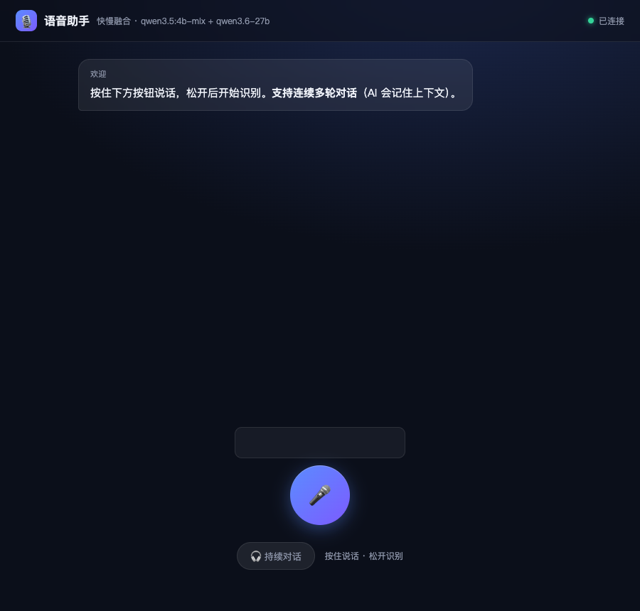
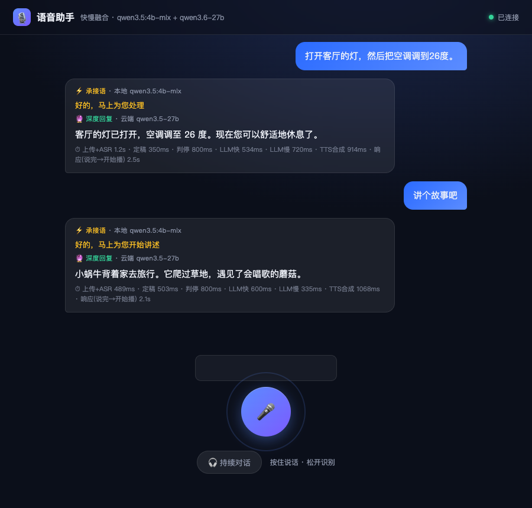

# duplex-voice · 快慢融合语音助手（Web 样机）

浏览器语音助手样机：**快慢融合**（本地 Ollama 承接语 + 云端大模型完整回复）+ **持续对话**（免按键，VAD 自动切段）+ **句子级 TTS 链式播放** + **barge-in 打断** + **全链路时延指标与日志**。

> 软件设计文档：[docs/软件设计.md](docs/软件设计.md)（原理 + 流程图 + 可指导开发）

## 界面截图

**主界面**（持续对话模式：波形横条 + 圆形按钮 + 状态提示）：



**对话过程**（快慢融合回复 + 分阶段时延行）：



## 核心特性

| 特性 | 说明 |
|------|------|
| 🎤 持续对话 | 一次唤醒多轮，免按键；Silero VAD 自动切段（能量门限 + 投票滞回 + 三重判停） |
| ⚡ 快慢融合 | 本地 qwen3.5:4b-mlx 先出 8-15 字过渡语（~1s 内出声），云端 qwen3.5-27b 生成完整回复无缝接播 |
| 🔗 无缝衔接 | 首句剥离（`_strip_leading_filler`）防内容重复；慢首句 ≤15 字压缩 TTS 合成时间防空洞 |
| 🗣 barge-in | 播放中说话立即打断 AI 回复并接管（耳机场景无回声误杀；回声由 server `_is_tts_echo` 兜底） |
| ⏱ 时延指标 | 上传+ASR / 定稿 / 判停 / LLM快 / LLM慢 / TTS合成 / 响应(说完→开始播) 分阶段统计 |
| 📊 全链路日志 | server `[voice]` 阶段日志 + 前端 vlog 自动上报（/api/log），问题定位靠数据不靠猜 |

## 快速开始

```bash
# 依赖（服务端）
pip install fastapi uvicorn httpx

# 启动（DashScope API Key 从环境变量注入）
cd web
export DASHSCOPE_API_KEY=xxx
python3 server.py          # 端口 8787，日志 tee 到 /tmp/voice_web.log

# 打开浏览器
open http://127.0.0.1:8787/
```

前置服务：

- **Ollama**（快通道）：`qwen3.5:4b-mlx`，`http://127.0.0.1:11434`
- **DashScope MaaS**（慢通道）：`qwen3.5-27b`（OpenAI 兼容端点）+ fun-asr 流式 ASR + Cherry TTS

## 时延指标（实测 2026-08-20）

```
⏱ 上传+ASR 489ms · 定稿 503ms · 判停 800ms · LLM快 534ms · LLM慢 720ms · TTS合成 914ms · 响应(说完→开始播) 2.5s
```

- **响应** = 人说完（判停）→ 首个音频开始播放（感知时延，目标 2-3s）
- 判停 800ms：中文口语停顿保护（500ms 会抢答）
- 慢通道 qwen3.5-27b：实测首字 454ms 稳定（qwen3.6-27b 冷实例 13s、qwen3.7-flash 5.1s 波动，均弃用）

## 结构

```
duplex-voice/
├── web/
│   ├── server.py          # FastAPI：ASR / 快慢融合 / TTS / SSE / 过滤 / 日志
│   ├── index.html         # 前端单文件：VAD 管道 / 播放链 / 时延统计 / vlog
│   └── vendor/            # onnxruntime-web + silero_vad.onnx
├── duplex_voice/          # Python 包（桌面版协议层，设计 v2.1 依据）
├── tests/                 # pytest 23 个测试
└── docs/软件设计.md       # 软件设计文档（原理 + 流程图）
```

## 测试

```bash
python3 -m pytest tests/ -q    # 23 passed
```

## 关键参数（调参入口，详见设计文档 §9）

| 参数 | 值 | 影响 |
|------|-----|------|
| `CONT_SILENCE_MS` | 800 | 静音判停（抢答/响应时延权衡） |
| `CONT_VOTE_MIN/EXIT` | 7 / 5 | 投票滞回（背景人声 vs 句中停顿） |
| `ENERGY_RATIO` | 4.0 | 帧能量门限（噪声底倍数） |
| `ENERGY_FLOOR_SEG` | 0.012 | 段级能量下限（背景人声过滤） |
| `_is_tts_echo` 阈值 | 0.7 | 回声过滤（真回声 0.8+，重复指令 0.4-0.5） |
