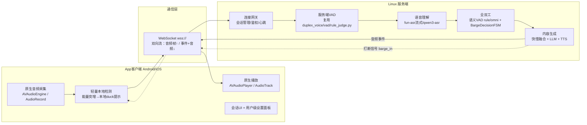

# duplex-voice App化架构方案（客户端 + 服务端）

> 版本：v1.0（2026-08-28）
> 范围：将当前浏览器端全双工语音助手（duplex-voice web 版）改造为 **App 客户端（Android + iOS）+ Linux 服务端** 分离架构的技术方案。
> 定位：**方案设计文档**，尚未进入编码实现阶段——用于架构评审与决策对齐。
> 关联文档：`docs/软件设计.md`（现有 Web 版五模块设计）、`docs/回声消除机制设计.md`（四层回声消除方案）、`docs/全双工状态机设计.md`、`docs/快慢融合设计.md`。
> 对应分支：从 `feat/audio-vad-judge`（HEAD，含最新 3 处 bug 修复）切出。

---

## 0. 现状与目标

| | 现状（Web 版） | 目标（App 版） |
|---|---|---|
| 客户端 | 浏览器（`web/index.html`，1858 行 JS：采集 + 声学VAD + 播放链 + 配置面板） | Android + iOS 双端 App |
| 服务端 | FastAPI 单进程（`web/server.py`），HTTP POST + SSE 单向流 | Linux 服务器常驻服务，协议升级为双向通信，支持多用户 |
| VAD | 浏览器端 Silero ONNX WASM（客户端本地切段后整段上传） | 待定，见 §3 方案对比 |
| 用户模型 | 单机演示，`client_id` 进程内存态，无鉴权 | 多用户，需鉴权 + 会话持久化 |

**结论先行**：这不是推倒重来，而是"**服务端管线复用 + 传输层升级 + 客户端原生重写**"的改造。语音理解 / 全双工 / 内容生成三大模块（ASR、语义 VAD、快慢融合、LLM、TTS，对应 `docs/软件设计.md` §3-5）代码可以原样搬进新架构；真正的新增工程量集中在"前端处理模块"的移动端原生化 + 通信协议改造。

---

## 1. 总体架构



**核心改动只有两处**，其余复用现有实现：

1. **传输协议**：HTTP POST + SSE（一问一答式）→ **WebSocket 双向流**（支持服务端主动打断通知、客户端主动 cancel、心跳保活），见 §4
2. **VAD 归属**：从"客户端切段后整段上传"改为"**服务端做切段决策**"（复用 `duplex_voice/vad/rule_judge.py`），客户端只做低延迟的本地能量触发（用于快速 duck，不做最终裁决），见 §3

---

## 2. 客户端技术选型

| 方案 | 优点 | 缺点 | 结论 |
|---|---|---|---|
| **Flutter** | 单代码库双端；音频插件生态成熟（`record`/`just_audio`/`audio_session`）；Dart FFI 可直接跑本地 ONNX（如需保留客户端 VAD）；对原生音频会话（AVAudioSession/AudioManager）的 platform channel 封装社区方案多 | 复杂原生音频实时管线仍需写 Swift/Kotlin 桥接层 | **推荐**（性价比最优） |
| React Native | 团队若已用 RN 更顺手 | 实时音频/原生桥接生态弱于 Flutter，同类语音助手参考项目更少 | 备选 |
| 原生双端（Swift + Kotlin） | 音频管线控制力最强、延迟最低、最贴近平台惯例 | 双倍工程量，两套代码库长期维护成本高 | 团队具备双端能力且对时延要求极致时选用 |

**推荐 Flutter**，理由：项目当前时延预算紧（说完→开始播 2~3s，见《软件设计.md》§7），核心瓶颈在服务端管线（ASR/LLM/TTS 网络调用）而非客户端框架开销；Flutter 已能满足"录音 + 播放 + WebSocket + 简单本地能量检测"的性能需求，双端一套代码显著降低维护成本。

---

## 3. 关键架构决策：VAD 放客户端还是服务端？

这是本方案中最重要的设计决策，直接决定客户端工程量与迭代成本。

| 方案 | 说明 | 工程量 | 时延/网络适应性 |
|---|---|---|---|
| **A. 客户端 VAD**（照搬 Web 模式） | 把 Silero ONNX + 双钳制 + 投票滞回逻辑（《软件设计.md》§2.3，约 400 行核心算法）移植到 Flutter（onnxruntime mobile 绑定），客户端切段后按段上传 | 大：需重新实现并在移动端做独立性能/准确率回归 | 蜂窝网络下每次切段=一次新请求，重连/鉴权开销累积；离线判停不受网络抖动干扰 |
| **B. 服务端 VAD**（推荐） | 客户端仅连续流式上传原始 PCM 帧（WS），服务端复用 `duplex_voice/vad/rule_judge.py`（已实现的 Silero + webrtcvad + 能量兜底 `_SileroInstance`）做切段 | 小：客户端只需最基础的录音 + 编码 + 发送，VAD 算法零重复开发 | 需长连接抗抖动（WS 本身支持重连）；集中式处理，未来调 VAD 参数 / 换语义模型不需要发 App 更新 |

**推荐方案 B**，核心理由：

- 复用现有 `RuleVadJudge` / `_SileroInstance` 的 Python 实现，**零算法移植成本**，且和现有 `OmniVadJudge` 语义判定管线天然衔接（本来就在服务端）
- 移动端不必维护两套独立实现（JS 版 + Dart 版）的双份调参与回归测试，日后调 VAD 参数只改服务端一处
- 代价是需要在服务端新增一个"连续帧流"入口（当前 `/api/chat` 假设客户端已切好整段音频，需要在 WS 网关层新增帧级接收 + 缓冲 + 分段逻辑）——工作量在服务端而非客户端

**客户端仍保留一层极轻量本地能量检测**（不做最终裁决），仅用于：

- 播放期检测到用户开口 → 立即本地 duck（音量降低），比等服务端判定打断更快，体验上与现有 Web 版"先 duck 不打断，语义确认才停播"的哲学一致（对应《回声消除机制设计.md》第 2 层/第 3 层）
- 最终"是否真的打断 / 是否该回复"仍由服务端语义 VAD + `BargeDecisionFSM` 裁决，逻辑不变

---

## 4. 通信协议改造

### 4.1 为什么必须从 SSE 换成 WebSocket

现有 `/api/chat` 是"一次 HTTP 请求 → 服务端流式 SSE 返回 → 结束"，天然只支持**服务端到客户端单向流**。App 场景下有两个新增需求 SSE 做不到：

1. **客户端主动打断服务端**：用户说话打断 AI 回复时，需要告诉服务端"停止当前这轮生成"，节省服务端算力与用户流量——现有 Web 版是靠"下一段音频到达"隐式打断，服务端旧请求其实仍在跑（`_is_tts_echo` 等只是事后过滤，不是主动取消）
2. **连续帧流上传**（方案 B 要求）：HTTP body 流式上传的兼容性和实现复杂度都不如 WS

### 4.2 新 WS 消息协议（草案）

```
↑ 客户端 → 服务端
  {type: "auth", token}                     // 建连鉴权
  {type: "audio_frame", seq, pcm_b64}       // 连续PCM帧（16k/30ms）
  {type: "local_duck", on: true}            // 客户端本地检测到插话，仅UX提示，不裁决
  {type: "cancel"}                          // 用户主动打断，服务端停止当前生成
  {type: "config_get" | "config_set", ...}  // 复用现有 /api/config 语义

↓ 服务端 → 客户端（对应现有SSE事件，语义不变，仅搬运方式变化）
  {type: "vad_state", state, latency_ms}
  {type: "asr_partial"|"asr", text, ...}
  {type: "fast"|"slow_first"|"slow_delta", ...}
  {type: "audio_chunk"|"audio_end", idx, b64}
  {type: "barge_in"}                        // 新增：服务端主动通知客户端"确认打断，请停止播放"
  {type: "done"|"error", ...}
```

**迁移策略**：`/api/chat`（SSE）保持不动继续服务 Web 端；新增 `/ws/app`，内部**复用同一套 pipeline 函数**（把现有生成器中 `yield` 的事件对象抽成公共函数，SSE 端与 WS 端各自适配输出格式），不写两份业务逻辑，避免后续双份维护漂移。

---

## 5. 服务端改造清单（Linux 部署）

| 项目 | 现状 | 需要新增/改造 |
|---|---|---|
| 传输层 | 仅 HTTP + SSE | 加 WebSocket 网关（FastAPI 原生支持 `@app.websocket`） |
| 会话状态 | `HISTORIES` / `LAST_REPLY` 进程内存 dict（《软件设计.md》§6.4），重启即丢 | 引入 Redis（多用户持久化 + 为未来多实例横向扩展打基础） |
| 鉴权 | 无 | Token/JWT 鉴权（App 登录态），按 `user_id` 隔离会话与配额 |
| 音频入口 | 假设客户端已切好整段 | 新增连续帧接收 + 缓冲 + 调用 `RuleVadJudge` 做分段（方案 B） |
| 部署方式 | 本地 `start.py` 跑 uvicorn | Linux 服务器：`systemd` 常驻 + `nginx` 反代终止 TLS（`wss://` 走 443，规避运营商对非常规端口的拦截）+ 域名证书（Let's Encrypt） |
| 多租户成本 | 单人自用，DashScope key 走 config.yaml | 需评估多用户并发下的 ASR/LLM/TTS 调用配额与计费隔离 |
| 配置面板 | Web 前端 ⚙️ 面板直接改热生效配置（`_apply_config`） | 拆分：面向管理员保留独立后台（Web，沿用现有 `/api/config`），App 内只暴露用户级设置（音色/语速等），避免普通用户误改模型端点 |

**已有代码复用比例**：`duplex_voice/adapter/{asr,llm,fusion,tts,tts_stream}.py`、`web/server.py` 中 `VadJudge` / `FusionPolicy` / `_is_tts_echo` / `_split_clauses` 等核心逻辑**可直接复用，无需重写**，只是调用方从"SSE 生成器"变为"WS 事件发送"。

---

## 6. 移动端音频关键难点

### 6.1 iOS 后台录音——需要明确降级预期

Apple 对连续后台麦克风采集限制极严：普通 App 声明 `UIBackgroundModes: audio` 只能维持"后台播放"，**连续后台录音 + 双工交互基本不被允许**（除非用 VoIP/PushToTalk 特殊 entitlement，且需符合其应用场景，语音助手类大概率申请不到，或上架审核会被拒）。

**建议**：MVP 明确定义为"**前台交互**"模式（类似业界同类语音助手 App 的语音模式：App 需在前台、屏幕常亮时可用），锁屏/切后台后暂停录音，回到前台恢复。这是行业内同类 App 的普遍现状，不是本项目独有限制。

### 6.2 Android 后台相对宽松，但仍需处理

- 需要**前台服务**（`foregroundServiceType="microphone"`）+ 常驻通知，Android 14+ 对该类型审核趋严
- 部分国产 ROM（小米/华为/OPPO 等）有激进的后台省电策略，需引导用户加白名单，这是常见适配痛点，需提前纳入测试计划

### 6.3 意外收获：原生音频会话可能优于浏览器 AEC

iOS `AVAudioSession` 的 `.voiceChat` 模式、Android `AudioManager.MODE_IN_COMMUNICATION` + `AcousticEchoCanceler` 都是系统级硬件辅助回声消除，专为"边录边放"设计，通常效果优于浏览器 WebRTC AEC3（尤其是移动设备扬声器-麦克风距离固定、传播路径更可预测）。

**建议**：App 版优先启用平台原生通话音频模式。参照《回声消除机制设计.md》的四层兜底方案（① AEC → ② duck → ③ isReplying 保护 → ④ 语义过滤），App 版**第①层质量预期会提升**，但第②-④层仍建议保留作为兜底——不能假设硬件 AEC 在所有手机型号上都表现一致。

---

## 7. 分阶段路线图（建议，非强制排期）

| 阶段 | 目标 | 关键产出 |
|---|---|---|
| **Phase 1 · MVP** | 打通端到端链路，前台可用 | 服务端加 `/ws/app`（先按方案 A 简化：客户端仍整段切段上传，快速复用现有前端 VAD 思路降低初期风险）；Flutter 客户端：录音 + 播放 + WS + 基础 UI；Linux 部署（nginx + TLS + systemd） |
| **Phase 2 · VAD 服务端化** | 切换到方案 B，简化客户端 | 服务端接入连续帧流 + `RuleVadJudge` 分段；客户端本地 duck 优化；引入鉴权 + Redis 会话持久化 |
| **Phase 3 · 打磨与合规** | 生产可用 | Android 前台服务/耗电适配；iOS 前后台切换体验优化；App 内设置面板；隐私政策/权限说明；应用商店上架材料 |

---

## 8. 主要风险清单

1. **iOS 后台录音策略风险**——可能导致"真全双工"在后台不可用，需提前和产品口径对齐预期
2. **蜂窝网络时延**——现有 2~3s 响应时延基于 Wi-Fi 局域网实测，4G/5G 环境需重新压测，弱网下 WS 重连策略需设计（断线自动重连 + 当前轮次续传或放弃重来）
3. **多用户并发成本**——DashScope ASR/LLM/TTS 调用是按量计费的云 API，从"单人 demo"到"多用户 App"需评估并发配额与成本模型
4. **国产 Android ROM 后台限制**——适配成本不可忽视，需纳入测试矩阵
5. **应用商店审核**——语音采集 + 联网转录类 App 需要完整隐私合规材料（麦克风权限说明、数据处理政策）

---

## 9. 待决策事项（需与产品/团队进一步对齐）

- [ ] 客户端技术栈最终选型（Flutter / RN / 原生双端）
- [ ] MVP 阶段 VAD 归属（方案 A 快速上线 or 直接方案 B 一步到位）
- [ ] 多用户会话持久化的存储选型（Redis / 数据库）与鉴权体系（自建 or 三方 OAuth）
- [ ] iOS 后台交互能力的产品预期（是否接受"仅前台可用"的 MVP 范围）
- [ ] Linux 服务端的多实例横向扩展时间表（是否 MVP 阶段就需要支持）

（完）
