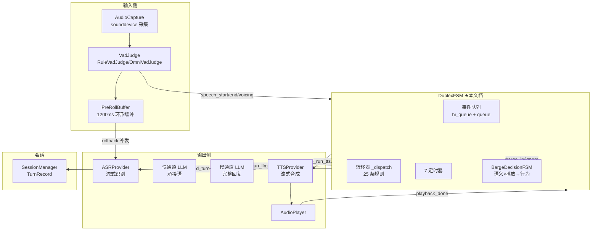
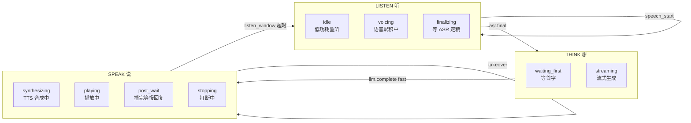
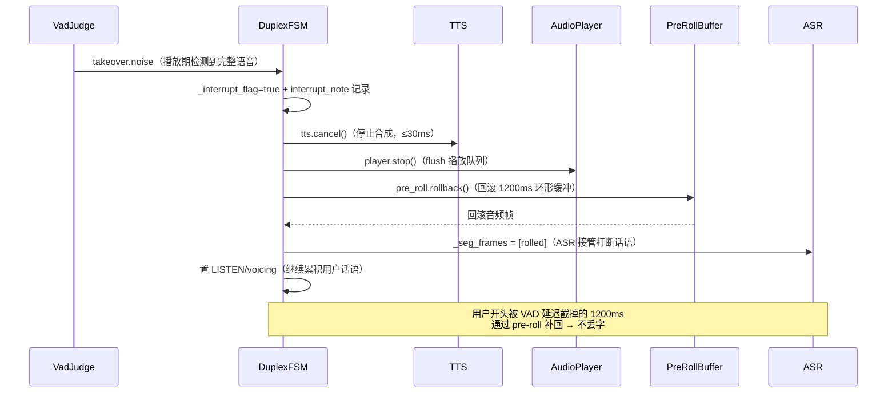
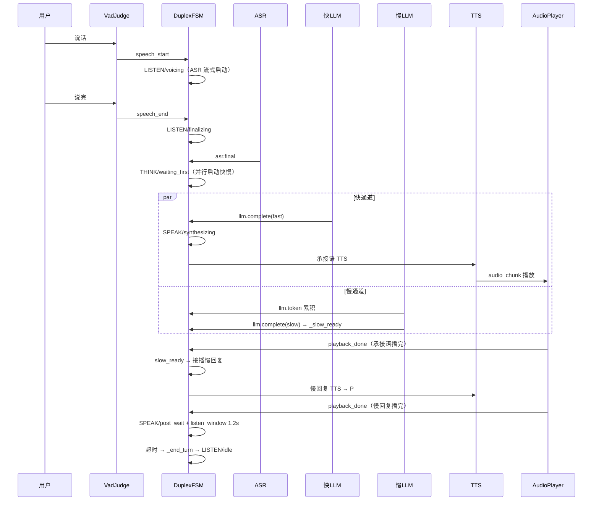
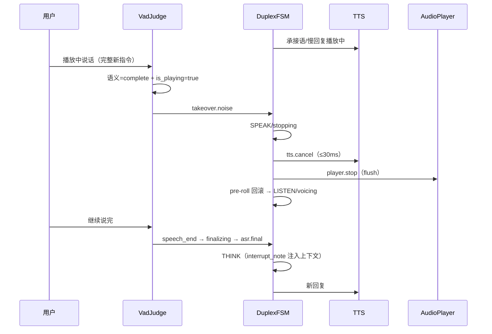

# duplex-voice 全双工状态机设计

> 版本：v1.0（2026-08-26）
> 范围：聚焦**全双工状态机**（DuplexFSM 四态+子状态、25 条转移表、7 定时器、打断裁决链路、BargeDecisionFSM 裁决表）的完整设计。
> 代码：`~/duplex-voice/duplex_voice/fsm/fsm.py`（DuplexFSM 核心）+ `duplex_voice/fsm/barge_decision.py`（打断裁决）+ `duplex_voice/events.py`（事件定义）+ `duplex_voice/config.py`（定时器参数）。
> 本文档为**自包含深度设计**——允许与《软件设计.md》等总览文档重复，保障每一章独立可读、可验证。
> 对应分支：`feat/audio-vad-judge`（实验分支，未合并 main）。

---

## 1. 概览与定位

### 1.1 解决的问题

全双工语音对话的核心难点：**系统在同一时刻既可能在听（采集用户语音）、又可能在说（播放 TTS）**。没有明确的状态机，会出现：
- 播放中用户说话 → 不知道是打断还是背景声 → 回复重叠/漏听
- 说完话后不知道系统该等什么 → 死等或误触发
- 打断后 pre-roll 音频丢失 → 用户开头几个字被截掉

**DuplexFSM** 用**四主态 + 子状态 + 事件驱动转移表**统一描述系统行为，把"听/想/说/让"的完整生命周期变成确定性状态转移。

### 1.2 设计目标

1. **确定性**：25 条转移表（事件×状态→动作+新状态），无隐式分支
2. **低时延**：事件循环 <5ms 处理（超标告警），高优先级事件插队
3. **可打断**：播放期用户说话 → TTS 停止（≤30ms）→ pre-roll 回滚 → ASR 接管，不丢开头
4. **免唤醒**：wake_window 超时自动低功耗（LISTEN/IDLE），不耗电常听
5. **可观测**：状态变化回调 on_state_change + 全量日志 `[STATE/SUB] <- event`

### 1.3 术语表

| 术语 | 含义 |
|------|------|
| State（主态） | LISTEN（听）/ THINK（想）/ SPEAK（说）/ YIELD（让） |
| Sub（子状态） | idle/voicing/finalizing/waiting_first/streaming/synthesizing/playing/post_wait/stopping |
| Event | 统一事件结构（type/domain/ts/payload/priority） |
| hi_queue | 高优先级事件队列（打断/取消类插队，不被普通事件阻塞） |
| pre-roll | 采集侧环形缓冲（1200ms）——VAD 判定延迟截掉的开头可回滚补发 |
| takeOver | 打断接管：TTS.stop → player.stop → pre-roll 回滚 → ASR prefill |
| BargeDecisionFSM | 语义状态 × 播放状态 → 行为（打断/回复/忽略）的二级裁决 |
| wake_window | 免唤醒窗口（8s）——对话中持续监听，超时回低功耗 |
| listen_window | 播放后倾听窗口（1.2s）——慢回复播完给用户接话机会 |

---

## 2. 总体架构

### 2.1 状态机在系统中的位置



**单向依赖**：采集帧 → VAD 判定 → 事件入队 → FSM 消费 → 动作（ASR/LLM/TTS/播放）。**帧收集不依赖 FSM 事件**（judge 内部 `_in_speech` 或状态在 voicing/finalizing 都收集）——避免事件循环滞后丢帧。

### 2.2 事件体系（events.py）

统一事件结构：`Event(type, domain, ts, payload, priority)`。事件按**域**组织：

| 事件 | 域 | 触发源 | 优先级 |
|------|-----|--------|--------|
| speech_start / speech_end | vad | VadJudge | 普通 |
| asr.final / asr.partial / asr.timeout | asr | ASR 流式 | 普通 |
| llm.first_token / llm.token / llm.complete / llm.error | llm | 快/慢通道 | 普通 |
| tts.audio_chunk / tts.playback_done / tts.cancelled | tts | TTS/播放器 | 普通 |
| user.cancel | sys | 用户取消 | **高优先** |
| system.error | sys | 异常兜底 | 普通 |
| takeover.noise | vad | 打断检测 | 普通 |

**高优先级队列**：`on_event()` 按 `evt.is_hi_priority` 分流到 hi_queue——打断/取消类事件**不被普通事件队列阻塞**（双队列 `asyncio.wait` 同时等，0.5s 超时防阻塞）。

### 2.3 事件循环（run）

```python
while not self._stopped:
    hi_task = asyncio.create_task(self._hi_queue.get())
    lo_task = asyncio.create_task(self._queue.get())
    done, pending = await asyncio.wait({hi_task, lo_task},
                                       timeout=0.5, return_when=asyncio.FIRST_COMPLETED)
    for t in pending: t.cancel()
    if not done: continue                    # 超时回循环头检查 _stopped
    evt = hi_task.result() if hi_task in done else lo_task.result()
    t0 = time.perf_counter()
    await self._dispatch(evt)                # 转移表分发
    dt = (time.perf_counter() - t0) * 1000
    if dt > 5: log.warning("FSM dispatch 超 5ms")   # 超标告警
```

**性能约束**：单事件 dispatch ≤5ms（超标告警）——保证全双工低时延。

---

## 3. 状态定义

### 3.1 四主态 + 九子状态



| 主态 | 含义 | 子状态 | 子状态含义 |
|------|------|--------|-----------|
| **LISTEN** | 听（采集+VAD+ASR） | `idle` | 低功耗监听（无对话） |
| | | `voicing` | 检测到语音，帧累积/上行中 |
| | | `finalizing` | 语音结束，等 ASR 定稿 |
| **THINK** | 想（LLM 生成） | `waiting_first` | 等首字（llm_first_token 5s 兜底） |
| | | `streaming` | 流式生成中（token 累积） |
| **SPEAK** | 说（TTS+播放） | `synthesizing` | TTS 合成中 |
| | | `playing` | 音频播放中 |
| | | `post_wait` | 承接语播完等慢回复 / 播完倾听窗口 |
| | | `stopping` | 打断裁决执行中 |
| **YIELD** | 让（保留） | — | 预留（未来并发场景） |

### 3.2 状态语义约束

- **LISTEN 是唯一"可被语音唤醒"的状态**：speech_start 只在 `LISTEN/idle` 转移
- **THINK 是唯一"可接快慢通道"的状态**：fast 先到 → SPEAK/synthesizing；slow 先到 → SPEAK
- **SPEAK 是唯一"可被打断"的状态**：takeover 只对 SPEAK 生效
- **播放中永不离开 SPEAK**（除非打断/播完）——保证播放链连续

---

## 4. 转移表（25 条规则）

### 4.1 完整转移表

| # | 事件 | 前置状态 | 动作 | 新状态 |
|---|------|---------|------|--------|
| 1 | speech_start | LISTEN/idle | 置 voicing；起 ASR 流式（真流式 pre-roll 补发）；启动 wake_window | LISTEN/voicing |
| 2 | speech_end | LISTEN/voicing | 置 finalizing；关 ASR 上行队列→服务端 finalize；启动 final 兜底 2s | LISTEN/finalizing |
| 3 | asr.final | LISTEN/finalizing | 存 user_text；turn_id++；置 waiting_first；启动 llm_first 5s；**并行启动快+慢 LLM** | THINK/waiting_first |
| 4 | asr.timeout | LISTEN | 放弃该段 | LISTEN/idle |
| 5 | llm.first_token(slow) | THINK | 取消 llm_first 定时器 | THINK/streaming |
| 6 | llm.token(slow) | THINK/SPEAK | 累积 _slow_text（播放中也累积） | 不变 |
| 7 | llm.complete(fast) | THINK | 存 fast_text；取消定时器；启动承接语 TTS | SPEAK/synthesizing |
| 8 | llm.complete(slow) | THINK | 存 slow_text；直接播慢回复（无承接语路径） | SPEAK/synthesizing |
| 9 | llm.complete(slow) | SPEAK/post_wait | 存 slow_text；接播慢回复 | SPEAK/synthesizing |
| 10 | llm.complete(slow) | SPEAK/其他 | 存 slow_text；置 _slow_ready（playback_done 时接播） | 不变 |
| 11 | takeover.noise | SPEAK | **打断裁决**（§6） | SPEAK/stopping→LISTEN/voicing |
| 12 | tts.playback_done | SPEAK | slow_ready→接播慢回复；否则 playing_slow→倾听窗口；否则 post_wait 等慢回复 | SPEAK/synthesizing / post_wait |
| 13 | session.timeout(listen_window) | SPEAK/post_wait | _end_turn 记会话 | LISTEN/idle |
| 14 | llm.error | SPEAK/post_wait | _end_turn（承接语已播收尾） | LISTEN/idle |
| 15 | session.timeout(wake_window) | LISTEN/idle,voicing | 清 seg_frames；免唤醒关闭 | LISTEN/idle |
| 16 | user.cancel | 任意 | tts.cancel + player.stop + end_turn | LISTEN/idle |
| 17 | system.error | 任意 | 兜底复位 | LISTEN/idle |
| — | 其余组合 | — | 日志"未匹配转移"（不崩溃） | 不变 |

### 4.2 关键转移详解

**① speech_start（进入语音）**：
```
speech_start + LISTEN/idle → LISTEN/voicing
  ├─ 真流式 ASR：_asr_queue 建队 + pre-roll 回滚补发（开头 1200ms 被 VAD 延迟截掉的字）
  │    └─ for i in range(0, len(rolled), 480): 补发 480 帧（30ms/块）
  ├─ _turn_start_ms = evt.ts（回合计时基准）
  └─ 启动 wake_window 8s（免唤醒）
```

**③ asr.final（进入思考）**：
```
asr.final + LISTEN/finalizing → THINK/waiting_first
  ├─ 并行启动：create_task(_run_llm_fast) + create_task(_run_llm_slow)
  └─ 启动 llm_first 5s 兜底（慢通道首字超时）
```

**⑦⑧⑨⑩ llm.complete（接管播放）**——快慢竞争三条路径：

```
fast complete + THINK          → 播承接语（TTFA ≤400ms）
slow complete + THINK          → 无承接语，直接播慢回复
slow complete + SPEAK/post_wait → 承接语播完在等 → 接播慢回复
slow complete + SPEAK/其他      → 承接语播放中 → _slow_ready 置位，播完接播
```

**⑫ tts.playback_done（播放完成三分支）**：
```
playback_done + SPEAK
  ├─ _slow_ready && slow_text → 接播慢回复（承接语→慢回复无感切换）
  ├─ _playing_slow            → 慢回复播完（最后一棒）→ 倾听窗口 1.2s → 回 LISTEN
  └─ 其他                    → 承接语播完慢未到 → post_wait + slow_wait 12s 兜底
```

---

## 5. 定时器（7 个）

| 定时器 | 默认值 | 启动时机 | 超时事件 | 用途 |
|--------|--------|---------|---------|------|
| wake_window | 8000ms | speech_start | session.timeout | 免唤醒窗口——超时回低功耗 |
| final | 2000ms | speech_end | asr.timeout | ASR 定稿兜底（流式挂死） |
| llm_first | 5000ms | asr.final | session.timeout | 慢通道首字兜底 |
| slow_wait | 12000ms | 承接语播完 | session.timeout | 等慢回复兜底（27b 首 token ~5s） |
| listen_window | 1200ms | 慢回复播完 | session.timeout | 播放后倾听窗口 |
| （pre-roll） | 1200ms | 采集侧 | — | 环形缓冲回滚时长（非定时器） |
| （dispatch 告警） | 5ms | 每事件 | 日志告警 | 性能约束 |

**定时器实现**：`_start_timer(name, ms)` → `asyncio.sleep` 任务 → 超时发 `session.timeout(kind=timer名)` → 转移表按 `(state, sub, kind)` 匹配。`_cancel_timer` 先取消旧任务再建新（防重复触发）。

---

## 6. 打断裁决（takeover 链路）

### 6.1 打断裁决状态机（BargeDecisionFSM）

**分工原则**：VadJudge 只判断**语义状态**；打断与否由**确定性事实**——AI 是否正在播放 TTS（前端 is_replying 上报）决定。

```python
class BargeDecisionFSM:
    RESPOND / BARGE_IN / WAIT / IGNORE / REJECT

    def decide(self, semantic: str, is_playing: bool) -> tuple[str, str]:
        if semantic == COMPLETE:
            return (BARGE_IN, BARGE_IN) if is_playing else (RESPOND, COMPLETE)
        if semantic == INCOMPLETE:
            return WAIT, INCOMPLETE
        if semantic == REJECT:
            return (IGNORE, REJECT) if is_playing else (REJECT, REJECT)
        return IGNORE, semantic      # backchannel/noise/tts_echo 一律忽略
```

| 语义状态 | is_playing=True（AI 在播） | is_playing=False（AI 在听） |
|----------|---------------------------|----------------------------|
| complete（完整指令） | **barge_in**（打断接管） | **respond**（正常回复） |
| incomplete（未完） | wait（等续说） | wait |
| backchannel（嗯/对） | ignore（继续播，无感） | ignore |
| noise（噪声） | ignore | ignore |
| tts_echo（回声） | ignore（继续播） | ignore |
| reject（拒识） | ignore（播放中不澄清） | **reject**（澄清"再说一遍"） |

**关键设计**：backchannel 在播放中**不打断**（用户应声 AI 继续播——避免"嗯"就停）；只有 complete（完整新指令）才打断。

### 6.2 打断执行链路（_takeover）



```python
async def _takeover(self, evt):
    self._interrupt_flag = True
    self._interrupt_note = (f"[Note: user interrupted the previous response at {evt.ts} ms; "
                            f"pre-roll audio rolled back. Respond to the new request.]")
    self._set(State.SPEAK, Sub.STOPPING)
    await self.tts.cancel()                # ① 停 TTS（≤30ms）
    self.player.stop()                     # ② flush 播放
    rolled = self.pre_roll.rollback()      # ③ pre-roll 回滚（采集侧）
    self._seg_frames = [rolled] if rolled.size else []
    self._user_text = ""
    self._set(State.LISTEN, Sub.VOICING)   # ④ 继续累积打断话语
```

**四步裁决**：`TTS.stop → pre-roll 回滚 → ASR begin_segment(prefill) → note_interrupt → LISTEN/voicing`。

**打断时延**：检测（语义确认 ~400ms）→ tts.cancel（≤30ms）→ player.stop（毫秒级）→ **总计 ~430ms**（检测是瓶颈，见《声学VAD与规则打断设计》）。

### 6.3 打断后的 LLM 上下文

```python
interrupt_note = "[Note: user interrupted the previous response at {ts} ms; pre-roll audio rolled back. Respond to the new request.]"
# 下一轮 _run_llm_slow 时注入：
messages = self.session.build_messages(user_text, self._interrupt_note)
self._interrupt_note = None   # 用完即清
```

被打断的上一轮 `_end_turn()` 记录 `interrupt=True + interrupt_note` 进 TurnRecord——会话可追溯。

---

## 7. 完整生命周期时序

### 7.1 正常对话（快慢融合）



### 7.2 打断场景



---

## 8. 关键代码实现

### 8.1 feed_audio（采集入口——帧收集不依赖事件循环）

```python
def feed_audio(self, frame) -> None:
    """采集帧入口：VAD 判定 → pre-roll → 帧收集（judge 语音态）→ 事件。"""
    self.pre_roll.push(frame.pcm)   # 始终入环形缓冲（打断回滚用）
    decisions = self.judge.feed(frame, self.state.value.lower())
    # 帧收集不依赖状态机事件（事件循环有滞后）：judge 内部 _in_speech
    # 或状态在 voicing/finalizing 都收集，避免 speech_start 未处理时丢帧
    if (isinstance(self.judge, RuleVadJudge) and self.judge.is_voicing()) or \
       (self.state is State.LISTEN and self.sub in (Sub.VOICING, Sub.FINALIZING)):
        self._seg_frames.append(frame.pcm)
        if self._asr_queue is not None:   # 真流式：帧实时上行
            try: self._asr_queue.put_nowait(frame.pcm)
            except Exception: pass
    for d in decisions:
        self.on_event(self._to_event(d, frame))
```

**核心洞见**：VAD 判定（同步、逐帧）与状态机事件（异步、有滞后）分离——帧收集由 **judge 内部语音态** 驱动，不等事件循环处理 speech_start，**杜绝丢帧竞态**。

### 8.2 _run_asr_stream（真流式：帧实时上行）

```python
async def _run_asr_stream(self) -> None:
    async def gen():
        q = self._asr_queue
        if q is None: return
        while True:
            f = await q.get()
            if f is None: break      # speech_end 关队列信号
            yield f
    try:
        async for evt in self.asr.stream_recognize(gen()):
            if evt.type == "asr.partial": log.debug(...)
            self.on_event(evt)
    except Exception as e:
        ...
    finally:
        await self.asr.end_segment()
```

**pre-roll 补发**（丢字修复）：VAD 判定延迟截掉开头 ~1200ms → speech_start 时回滚补发：
```python
rolled = self.pre_roll.rollback()
for i in range(0, len(rolled), 480):
    seg = rolled[i:i + 480]
    if len(seg) == 480:
        self._asr_queue.put_nowait(seg)   # 480 帧 = 30ms 块
```

### 8.3 _run_tts（播放阶段切换）

```python
async def _run_tts(self, text: str) -> None:
    try:
        self.capture.set_speak_phase(True)   # 采集侧：播放期（AEC/增益切换）
        self.judge.set_phase("speak") if isinstance(self.judge, RuleVadJudge) else None
        async for evt in self.tts.stream_synthesize(text):
            if evt.type == "tts.audio_chunk":
                self.player.play(evt.payload["pcm"])
            elif evt.type == "tts.cancelled":
                self.on_event(Event(type=E_TTS_PLAYBACK_DONE, ...))   # 取消→视为播完（走接播/收尾）
                return
            else:
                self.on_event(evt)
    finally:
        self.capture.set_speak_phase(False)
```

---

## 9. 配置参数

| 参数 | 默认 | 位置 | 说明 |
|------|------|------|------|
| pre_roll_ms | 1200 | config.fsm | pre-roll 回滚时长（采集侧 AEC 后） |
| wake_window_ms | 8000 | config.fsm | 免唤醒窗口 |
| final_fallback_ms | 2000 | config.fsm | ASR final 兜底 |
| listen_window_ms | 1200 | config.fsm | 播放后倾听窗口 |
| llm_first_token_ms | 5000 | config.fsm | 慢通道首字兜底 |
| slow_wait_ms | 12000 | config.fsm | 承接语播完后等慢回复兜底 |

---

## 10. 异常与边界处理

| 场景 | 处理 |
|------|------|
| ASR 流式挂死 | final 2s 兜底 → asr.timeout → 放弃该段回 idle |
| 慢通道首字超时 | llm_first 5s → session.timeout → 转移表按状态处理 |
| 承接语播完慢未到 | post_wait + slow_wait 12s 兜底 |
| 慢通道失败（承接语已播） | llm.error + post_wait → end_turn 收尾回 LISTEN |
| 快通道失败 | 慢通道兜底（无承接语，slow complete + THINK 直接播） |
| 打断时 TTS 合成中 | tts.cancel → playback_done 事件 → 走接播逻辑 |
| 未匹配转移 | 日志 debug（不崩溃，状态保持） |
| 免唤醒超时 | wake_window 8s → 清 seg_frames 回低功耗 idle |
| 用户取消 | user.cancel（高优先级）→ tts.cancel + player.stop + end_turn |

---

## 11. 已知边界与演进

1. **YIELD 态预留未用**：当前打断直接回 LISTEN/voicing；YIELD 态设计用于"让出麦克风给外部"场景（未来）。
2. **慢回复接播只有一条路径**（playback_done 触发）：若承接语 TTS 取消（打断），慢回复 _slow_ready 状态需重新评估。
3. **单事件 dispatch ≤5ms 告警**：LLM token 高频事件在极端负载可能触发告警——不影响正确性，可观测。
4. **pre-roll 固定 1200ms**：VAD 判定延迟若超此值（如换重模型）会截字——参数需随检测器校准。
5. **BargeDecisionFSM 是纯函数**（语义×播放→行为）：未来可加"语义置信度"维度（如 0.7 阈值）做软裁决。

---

（完）
