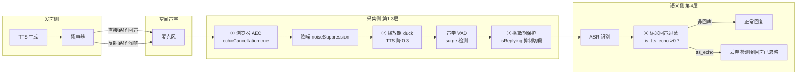
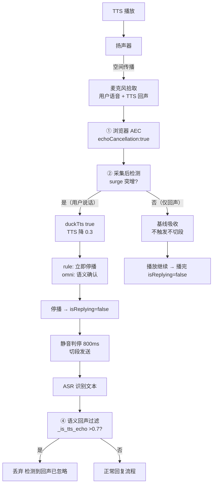

# duplex-voice 回声消除机制设计

> 版本：v1.0（2026-08-26）
> 范围：聚焦**回声消除（Echo Cancellation）**的完整机制设计——四层组合方案（浏览器 AEC → 播放期 duck → 播放期保护 → 语义回声过滤）的信号流、算法原理、场景参数、实测数据。
> 代码：`web/index.html`（MIC_OPTS / duckTts / isReplying / surge 检测 / sceneBehavior）+ `web/server.py`（_is_tts_echo / 语义 VAD tts_echo 状态）。
> 本文档为**自包含深度设计**——允许与《软件设计.md》等总览文档重复，保障每一章独立可读、可验证。
> 对应分支：`feat/audio-vad-judge`（实验分支）；仓库：Xudream/duplex-voice（私有）。

---

## 1. 概览与定位

### 1.1 问题定义

全双工语音助手的核心声学难题：**AI 播放 TTS（扬声器）→ 空间声学传播 → 被麦克风拾取 → 与用户真实语音混叠**。若不加处理：
- TTS 回声被 ASR 识别成"用户指令" → 触发新回复 → 无限回声循环（啸叫/自激）
- 播放期用户说话时，回声污染 VAD 判定 → 误打断/误判停
- speaker 外放场景最严重（声压大、传播路径长），headset 场景轻（无漏音）

### 1.2 方案定位

**无独立 DSP/AEC 芯片**（非科胜讯/高通 cVc 等硬件方案），采用**纯软件四层组合**：

```
第 1 层 浏览器原生 AEC（echoCancellation:true）——物理源头消除
第 2 层 播放期音量 duck（TTS 降 0.3）——降低回声强度
第 3 层 播放期保护（isReplying 抑制切段）——回声不当指令
第 4 层 语义回声过滤（tts_echo 相似度 >0.7）——最后兜底
```

**设计哲学**：任何单层都不完美（浏览器 AEC 对 TTS 音色消除不彻底、duck 降强度不消除、规则可能误杀），**四层串行兜底**保证端到端无回声自激。

### 1.3 术语表

| 术语 | 含义 |
|------|------|
| AEC | Acoustic Echo Cancellation 声学回声消除（浏览器内置） |
| duck | 播放期检测到用户语音时临时降低 TTS 音量 |
| isReplying | AI 回复播放中标记（前端全局）——抑制切段发送 |
| tts_echo | 语义状态：ASR 文本与刚播放内容逐字相似（回声） |
| LAST_REPLY | server 端记录最近实际播放文本（[承接语, 完整回复]） |
| surge | 播放期能量突增检测（用户插话的声学特征） |
| SequenceMatcher | difflib 序列相似度算法（0-1，逐字比对） |

---

## 2. 总体架构

### 2.1 四层回声消除在信号链中的位置



**信号流**：TTS 声 → 扬声器 → 空间传播 → 麦克风 → ①AEC 消除 → ②duck 降强度 → ③播放期保护 → ④语义过滤。**每一层处理不同层面的残余**。

### 2.2 四层职责分工

| 层 | 位置 | 机制 | 消除什么 | 局限 |
|----|------|------|---------|------|
| ① 浏览器 AEC | 采集约束 | echoCancellation:true | 直接路径回声（物理） | TTS 音色匹配不完美，外放残留 |
| ② 播放期 duck | 前端播放链 | TTS 音量 0.3 | 回声强度（源头降 ~70%） | 降低不消除；耳机场景不需要 |
| ③ 播放期保护 | 前端 VAD | isReplying 抑制切段 | 回声→误触发回复 | 播放中用户真说话会被延迟处理 |
| ④ 语义过滤 | server | 相似度 >0.7 丢弃 | 残留回声（逐字复制） | 阈值边缘可能误杀/漏放 |

---

## 3. 第 1 层：浏览器原生 AEC

### 3.1 实现

```javascript
const MIC_OPTS = { audio: {
  noiseSuppression: true,      // 降噪（背景噪声）
  echoCancellation: true,       // 浏览器 AEC（Chrome/Edge 内置）
  autoGainControl: false        // 关自动增益（保音量一致，防 AGC 抬噪声）
}};
```

### 3.2 原理

浏览器（Chrome/Edge）内置 **WebRTC AEC3 算法**：系统将**播放音频流（参考信号）**与麦克风采集信号做自适应滤波，估计回声路径（房间冲激响应）并从采集信号中减去。

```
采集信号 d(n) = s(n) + h(n) * x(n)   （用户语音 + 回声路径卷积播放信号）
AEC 输出 e(n) = d(n) - ĥ(n) * x(n)   （减去估计的回声）
```

### 3.3 已知局限（实测）

- **TTS 音色消除不彻底**：AEC3 参考信号是浏览器播放的音频，但 TTS 经系统音频管线/声卡可能有额外非线性（音量/均衡），估计不精确 → speaker 外放残留
- **双讲（double-talk）性能**：用户说话同时有 TTS 在播，AEC 自适应滤波器可能发散
- **headset 场景**：无漏音，AEC 基本无感（TTS 声不达 mic）

> 结论：AEC 是**第一道但不是最后一道**——后续三层兜底残余。

---

## 4. 第 2 层：播放期音量 duck

### 4.1 实现

```javascript
function duckTts(on) {
  // on=true：TTS 音量降到 0.3（检测到用户语音瞬间）
  // on=false：恢复场景音量（headset 1.0 / speaker 0.6）
  Object.keys(playQueue).forEach(k => {
    try { playQueue[k].volume = on ? 0.3 : (sceneBehavior().ttsVolume || 1); } catch (e) {}
  });
}
```

### 4.2 触发时机

- **surge 检测到用户插话**（播放期能量突增）→ `duckTts(true)`
- **播放结束/打断恢复** → `duckTts(false)`
- **omni 语义模式**：检测到语音先 duck（不打断），等语义确认 barge_in 才停播；backchannel/noise → 恢复音量继续播

### 4.3 原理

**从源头降低回声强度**：回声幅度 ∝ TTS 播放幅度。TTS 音量降 0.3（-10dB）→ 进 mic 的回声同步降 ~70% → AEC 残余更小、VAD 更不易误触发。

### 4.4 场景差异化（sceneBehavior）

| 场景 | ttsVolume | 理由 |
|------|-----------|------|
| headset | 1.0 | 耳机不漏音 → 无回声 → 满音量 |
| speaker | 0.6 | 外放进 mic → 降播放音量减回声（实测三轮迭代：0.5 更差——音量降→基线低→1.6 倍 surge 更易误触发） |

> **关键权衡**：duck 幅度不是越小越好——TTS 音量过低 → 播放基线低 → surge 突增阈值相对更敏感 → 误触发。speaker 0.6 是实测平衡点（2026-08-22 用户实测"不如刚才"纠正回 0.6）。

---

## 5. 第 3 层：播放期保护（isReplying 抑制切段）

### 5.1 实现

```javascript
let isReplying = false;   // AI 回复播放中（抑制 VAD 切段发送，防回声串扰）
// 播放开始（pumpStream / playQueue 首个）→ isReplying = true
// 全部播完（finishStream / queue 空）→ isReplying = false
```

### 5.2 原理

**防止回声被当成用户指令**：播放中 TTS 回声即便被 ASR 识别出文本，`isReplying=true` 时**抑制切段发送**（不触发新回复）——从语义层面阻断"回声→回复→更多回声→更多回复"的自激循环。

### 5.3 与打断检测的配合

- 播放中用户**真说话**（surge 突增持续 ≥surgeMs）→ 停播（rule immediate / omni 语义确认）→ `isReplying=false` → 恢复切段能力
- 播放中**仅回声**（无真实语音叠加）→ 不触发 surge（基线吸收）→ 不切段 → 播放正常完成

> 声学层面区分：**TTS 回声是稳定的基线信号**（逐帧相似），**用户语音是叠加的突增信号**——surge 检测（基线×阈值）天然对回声不敏感，只对叠加的人声响应。

---

## 6. 第 4 层：语义回声过滤（tts_echo）

### 6.1 实现（server 端）

```python
def _is_tts_echo(text: str, history: list[dict], last_replies=()) -> bool:
    """残余回声过滤：AEC 不完美时 AI 播放声音被拾取，ASR 文本与最近播放内容
    逐字高度相似（>0.7）→ 丢弃。
    阈值 0.7：真回声是播放音频的逐字复制（0.8-1.0）；用户重复指令与上轮回复
    仅部分重叠（实测 0.4-0.5）→ 放行。历史只查最近几轮（防跨轮误杀）。"""
    import difflib
    for cand in last_replies:   # LAST_REPLY：最近实际播放 [承接语, 完整回复]
        if cand and difflib.SequenceMatcher(None, text, cand).ratio() > 0.7:
            return True
    for m in reversed(history[-4:]):   # 近 4 轮 assistant 回复（防跨轮误杀）
        if m.get("role") == "assistant":
            prev = m.get("content", "")
            if prev and difflib.SequenceMatcher(None, text, prev).ratio() > 0.7:
                return True
    return False
```

### 6.2 算法原理

**difflib.SequenceMatcher**：字符级最长公共子序列（LCS）相似度，0-1。

```
相似度 = 2 × 匹配字符数 / (len(a) + len(b))
```

**判定逻辑**：
1. 比对对象：`LAST_REPLY[client_id]`（本轮实际播放的承接语+完整回复）——回声一定来自**刚播过**的内容
2. 历史回看：近 4 轮 assistant 回复（防跨轮回声——上一轮播完用户没说话，残留回声这轮才被识别）
3. 阈值 0.7 的设计依据（实测分布）：

| 相似度区间 | 含义 | 判定 |
|-----------|------|------|
| 0.8-1.0 | 真回声（播放音频逐字复制） | 丢弃 ✅ |
| 0.4-0.5 | 用户重复指令与上轮回复部分重叠 | 放行 ✅（不误杀） |
| ~0.7 | 边界（回声 vs 有意的重复提问） | 保守丢弃（宁丢勿扰） |

### 6.3 触发后的行为

```python
if vreason == "tts_echo":
    log.warning("FILTER cid=%s reason=tts_echo(%s) text=%r", ...)
    yield 'data: {"type":"error","msg":"检测到回声，已忽略"}\n\n'
```

前端收到 error → 静默忽略（不显示回复气泡、不触发 TTS）——**回声零副作用**。

### 6.4 与语义 VAD 的双保险

- **rule 模式**：`_is_tts_echo` 确定性规则（零成本、可兜底）
- **omni 模式**：语义 VAD prompt 内置 `tts_echo` 状态（模型判断"内容与 AI 刚播放的回复几乎逐字一致"）→ 规则先行 + 模型补充
- 配置：`frontend.vad.echo_sim = 0.7`（界面可调）

---

## 7. 场景差异（headset vs speaker）

### 7.1 回声严重度与参数

| 参数 | headset（耳机近讲） | speaker（扬声器外放） |
|------|---------------------|----------------------|
| 回声漏音 | 无（不漏音） | 严重（TTS 声进 mic） |
| ttsVolume | 1.0（满音量） | 0.6（降音量减回声） |
| surgeThreshold | 2.2（高门槛） | 1.6（低门槛——回声残余中抓真语音） |
| surgeMs | 400ms | 200ms |
| cutOnSurge | false（不主动切段） | true（主动切段——静音判停永不触发） |
| AEC 依赖 | 低（基本无回声） | 高（第一道防线） |
| duck 依赖 | 无感 | 关键（源头降强度） |

### 7.2 为什么 speaker 需要主动切段

speaker 场景：TTS 声持续进 mic → **静音判停（800ms 静音）永不触发**（mic 永远有 TTS 声）→ 无法自然切段。所以：
- 检测到用户插话（surge）→ 立即停播 + **主动切段发送**（cutOnSurge=true）
- 停播后 TTS 回声消失 → 静音判停恢复可用（后续正常流程）

### 7.3 迭代实测（speaker 参数三轮定稿）

| 版本 | 参数 | 结果 |
|------|------|------|
| 初版 | surgeMs=120 / preRoll=100 / vol=0.5 | 全更差：120ms 被 TTS 声起伏误停播；pre-roll 100ms 丢用户开头；vol 0.5 基线低→1.6 倍更易误触发 |
| 二版 | surgeMs=200 / preRoll=250 / vol=0.6 | 用户实测"不如刚才"（2026-08-22）→ 回退 |
| **定稿** | surgeMs=200 / preRoll=4000(250ms) / vol=0.6 | 平衡：抓真语音不误触发、不丢开头 |

---

## 8. 完整回声处理流程



---

## 9. 关键代码实现

### 9.1 前端采集 + duck + 保护

```javascript
// 采集约束（第1层）
const MIC_OPTS = { audio: {
  noiseSuppression: true, echoCancellation: true, autoGainControl: false
}};

// 播放期 duck（第2层）——surge 检测到插话即触发
function duckTts(on) {
  Object.keys(playQueue).forEach(k => {
    try { playQueue[k].volume = on ? 0.3 : (sceneBehavior().ttsVolume || 1); } catch (e) {}
  });
}

// 播放期保护（第3层）——isReplying 抑制切段
// pumpStream / playQueue 播放中 → isReplying = true
// finishStream / 队列空 → isReplying = false
```

### 9.2 server 语义过滤（第4层）

```python
def _is_tts_echo(text, history, last_replies=()) -> bool:
    import difflib
    for cand in last_replies:
        if cand and difflib.SequenceMatcher(None, text, cand).ratio() > 0.7:
            return True
    for m in reversed(history[-4:]):
        if m.get("role") == "assistant":
            prev = m.get("content", "")
            if prev and difflib.SequenceMatcher(None, text, prev).ratio() > 0.7:
                return True
    return False

# 调用点（语义 VAD rule 实现）：
if _is_tts_echo(text, history, last_replies):
    return VadState.TTS_ECHO, "tts_echo sim>0.7"
# → 丢弃（error 事件"检测到回声，已忽略"）
```

---

## 10. 异常与边界

| 场景 | 行为 |
|------|------|
| 回声相似度 0.7 边界（用户有意重复提问） | 保守丢弃（宁丢勿扰）——下轮可再问 |
| 跨轮残留回声 | history[-4:] 回看（4 轮内 assistant 回复） |
| 用户说话 + TTS 在播（双讲） | surge 检测 → duck → 停播/语义确认 → 回声随停播消失 |
| 背景音乐/环境噪声 | ①降噪 ②surge 基线吸收（不误触发） |
| omni 模式误判回声 | rule 规则先行（确定性兜底）+ omni 模型补充 |
| speaker 场景静音判停失效 | cutOnSurge=true 主动切段（停播后回声消失判停恢复） |

---

## 11. 已知边界与演进

1. **无独立 DSP/AEC**：浏览器 AEC3 是唯一物理层，TTS 音色匹配不完美 → speaker 场景依赖三层软件兜底。演进：接入 WebRTC AEC3 独立模块（aec3-node）增强参考信号对齐。
2. **duck 是强度妥协**：降音量保识别，但降幅受 surge 误触发约束（0.6 平衡点）。演进：回声路径在线估计（自适应增益补偿）替代固定 duck。
3. **相似度过滤是文本级**：回声的声学特征（同一声源重复）未利用。演进：声纹/音频指纹比对（比对 TTS 波形与 mic 波形相关性）。
4. **双讲性能**：AEC 自适应滤波器在双讲时可能发散。演进：双讲检测（double-talk detector）冻结滤波器系数。
5. **回声路径时变**：房间/设备移动改变冲激响应。演进：AEC 持续自适应 + 泄漏检测。

---

（完）
