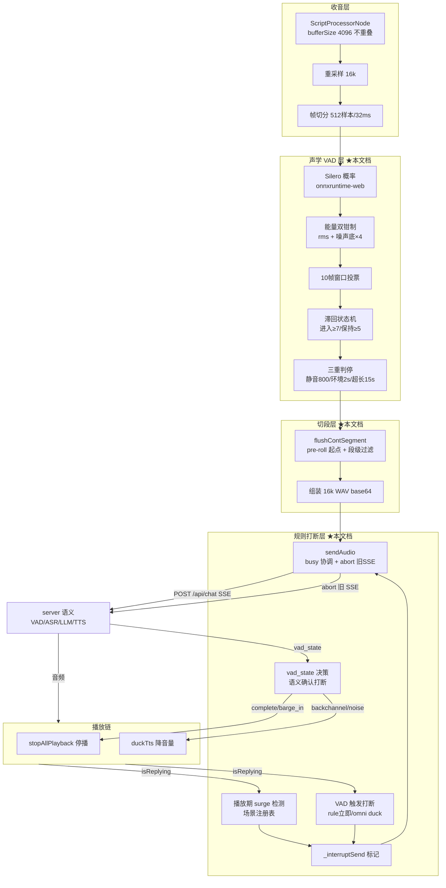
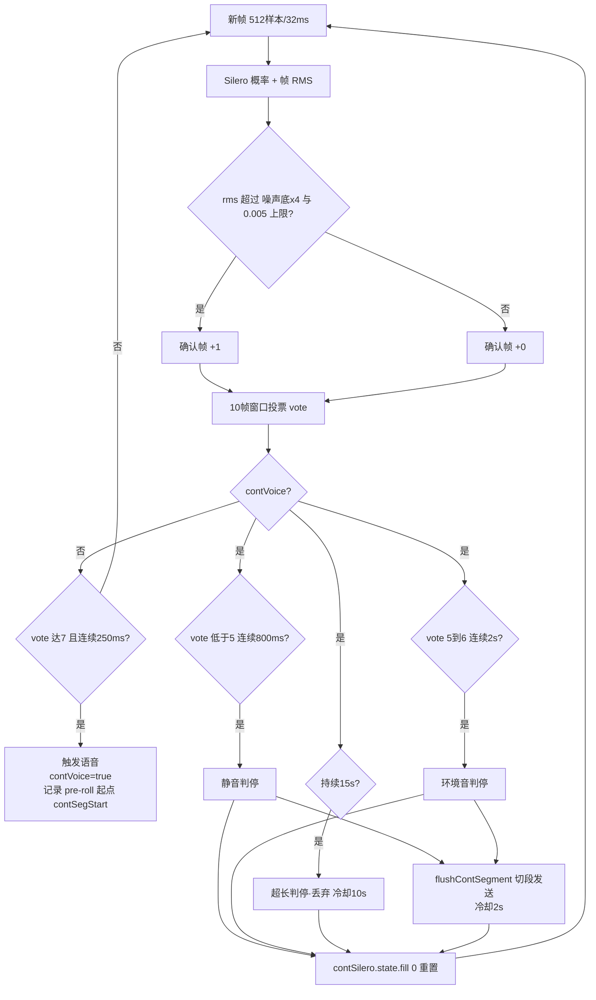
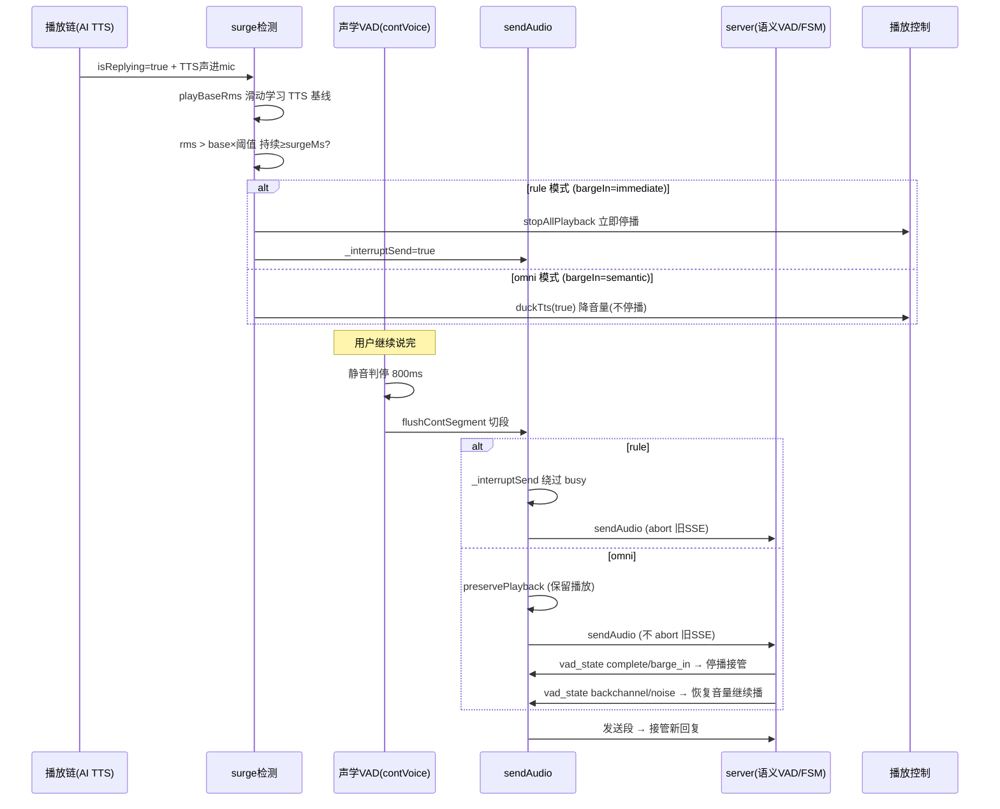

# duplex-voice 声学 VAD 与规则打断设计

> 版本：v1.0（2026-08-26）
> 范围：聚焦**声学 VAD**（浏览器端 Silero 语音活动检测 + 能量双钳制 + 投票滞回 + 三重判停 + 切段）与**规则打断**（rule 模式下播放期插话检测 / 停播 / 打断标记 / busy 协调）的完整设计。
> 代码：`~/duplex-voice/web/index.html`（前端声学 VAD + 打断）+ `web/server.py`（RuleVadJudge 语义兜底 + BargeDecisionFSM）。
> 本文档为**自包含深度设计**——允许与《软件设计.md》等总览文档内容重复，以保障每一章独立可读、可验证。
> 对应分支：`feat/audio-vad-judge`（实验分支，未合并 main）。

---

## 1. 概览与定位

### 1.1 解决的问题

语音助手的"**听**"与"**打断**"是体验的地基：

- **听**：免唤醒场景下，浏览器需要持续识别"用户是否在说话"、并在用户说完时**准确切段**（截取一段完整语音），交给 ASR。错切（抢答/切半截）、漏切（一直聆听）、误切（环境音当人声）都会直接摧毁对话体验。
- **打断**：AI 正在播放回复时用户插话，系统要**及时停播并接管**（barge-in）。打断太慢用户觉得"迟钝"、打断太激进（把附和声当打断）用户觉得"烦躁"。

本设计文档完整刻画这两条链路的**算法原理**、**状态机**、**关键代码实现**与**实测参数**。

### 1.2 核心设计原则

1. **双钳制判定**：Silero 概率对任何语音（含远场人声）都高——单靠概率分不清"谁在说话"。叠加**能量门限** + **窗口投票**，用物理能量区分近场用户语音与远场背景。
2. **滞回状态机**：进入语音严格（vote≥7/10），语音中保持宽松（vote≥5）——容忍句中 300ms 停顿不中断。
3. **三重判停**：静音 800ms / 环境音 2s / 超长 15s，兜住一切"说完了但判停条件未满足"的场景（环境音卡死、持续音卡死）。
4. **打断三层决策链**：触发（声学检测）→ 发送（sendAudio）→ 语义确认（vad_state）。每层按 VAD 模式（rule/omni）分流，漏一层就会有一层无条件停播。
5. **打断标记绕过 busy**：`_interruptSend` 一次性语义（打断轮次内保持）——播放期插话优先于"回复生成中"的 busy 缓存。

### 1.3 术语表

| 术语 | 含义 |
|------|------|
| VAD | Voice Activity Detection，语音活动检测 |
| Silero | 开源 VAD 模型（v6，16kHz，onnxruntime-web 浏览器推理） |
| 帧 | 512 样本 / 16000Hz = 32ms 音频（前端处理最小单元） |
| vote | 10 帧窗口内"确认帧"计数（确认帧 = Silero>0.5 且能量过门限） |
| contVoice | 前端 VAD 状态机的"语音中"布尔态 |
| 判停 | 判定用户说完（切段条件） |
| surge | 播放期能量突增检测（TTS 回声基线上的人声叠加） |
| barge-in | 打断：播放中检测到语音 → 停播接管 |
| busy | 回复生成中（前后端共享状态，防重入） |
| isReplying | AI 播放 TTS 中（前端播放链状态） |

---

## 2. 总体架构

### 2.1 声学 VAD 与规则打断在系统中的位置



**数据流（正向）**：收音 → 重采样 → Silero+能量+投票 → 滞回 → 判停 → 切段 wav → sendAudio → 服务端。
**反馈流（反向）**：播放状态（isReplying）→ 声学 VAD 的播放期检测（surge）与规则打断；打断决策（vad_state）→ 停播/降音量。

### 2.2 三层打断决策链（核心抽象）

打断不是"检测到语音就停播"这么简单。它是三层决策，每层都有独立职责，且每层都按 VAD 模式分流：


- **第 1 层 触发层**（前端声学）：`surge`（播放期能量突增）与 `contVoice`（普通 VAD 触发）两条路径。rule 模式→立即停播；omni 模式→duck（降音量）等语义确认。**2026-08-26 修复**：surge 路径曾无条件停播绕过 omni 语义——现按 mode 分流。
- **第 2 层 发送层**（前端 sendAudio）：`_interruptSend` 标记绕过 busy 缓存；abort 旧 SSE（server 侧生成器自动停止）。**2026-08-26 修复**：omni 插话走 `preservePlayback`——发送但保留播放，等第 3 层确认。
- **第 3 层 语义确认层**（server vad_state + 前端决策）：rule 模式第 1 层已停播（本层只显示）；omni 模式本层才做最终打断/不打断决策。

> **核心教训**：任何一层漏了"按模式分流"都会无条件停播。排查"omni 附和被砍播放"要按 1→2→3 逐层查（见第 7 章）。

---

## 3. 收音与声学预处理

### 3.1 收音双模式

| 模式 | 采集 | 输出 | 用途 |
|------|------|------|------|
| 持续模式 | ScriptProcessorNode（bufferSize 4096）**不重叠**取 PCM | 16k PCM 直采（免解码） | 免按键多轮对话（默认） |
| 按住模式 | MediaRecorder（webm/mp4）→ decodeAudioData | 16k WAV（解码后重采样） | 单次指令（松开发送） |

- **重采样**：`ratio = audioCtx.sampleRate / 16000` 抽取（48k→3:1；44.1k→2.756:1，自适应浏览器实际采样率），`out[i] = ch[Math.floor(i * ratio)]`。
- **帧组织**：16k 样本按 **512 样本/帧（32ms）** 切帧入队（`contVadQueue`），`requestAnimationFrame` 循环消费。

> ⚠️ **铁律**：Silero v6 是 **16k 模型，必须喂 16k 数据**。麦克风 48k 原始数据直接喂 → 概率被压到 0.5-0.62 阈值边缘 → 永远不触发。
> ⚠️ `AnalyserNode.getFloatTimeDomainData` 是**滑动窗口**（帧间重叠 87.5%）→ 流式 VAD 输入会重复帧、state 混乱 → 不可用。波形显示才用 Analyser。

### 3.2 声学预处理（AEC / 降噪 / AGC 决策）

```javascript
const MIC_OPTS = { audio: { noiseSuppression: true, echoCancellation: true, autoGainControl: false } };
```

| 开关 | 值 | 决策依据 |
|------|-----|---------|
| noiseSuppression | true | 浏览器降噪（不影响增益关系） |
| echoCancellation | true | 浏览器 AEC（外放回声基础抑制） |
| autoGainControl | **false** | AGC 会把远场背景人声放大到近场同能量，**抹平能量门限的物理基础** |

- **ScriptProcessor 输出静音**：`e.outputBuffer.getChannelData(0).fill(0)`——防麦克风回授啸叫。
- **代价权衡**：AGC 关闭后用户语音电平可能过低 → 先加日志实测能量分布再调门限（能量门限才有物理意义的前提是 AGC 关闭）。

### 3.3 播放期检测策略（VAD 行为注册表）

声学 VAD 在**播放期**的行为由 `VAD_BEHAVIOR` 注册表决定（可插拔——新增 VAD 只注册一行）：

```javascript
let VAD_BEHAVIOR = {
  rule: { bargeIn: 'immediate', silenceMs: 800 },   // 声学 VAD：检测到语音立即打断
  omni: { bargeIn: 'semantic', silenceMs: 800 },    // 语义 VAD：duck 等语义确认，backchannel 不打断
  soulx: { bargeIn: 'semantic', silenceMs: 800 },   // 预留
};
const vadBehavior = () => VAD_BEHAVIOR[vadMode] || VAD_BEHAVIOR.rule;   // null/未知 → rule 保守
```

---

## 4. 声学 VAD 算法原理

### 4.1 Silero 语音概率

- 模型：`silero_vad.onnx`（v6，16k），onnxruntime-web 推理。
- 阈值：`SILERO_THRESHOLD = 0.5`（与桌面 RuleVadJudge 对齐）。
- 状态：`state` 跨帧传递（Silero 是有状态 RNN），**切段后 `fill(0)` 重置**（与桌面 `end_segment` 一致）——保证每段从干净状态开始。

### 4.2 能量双钳制（帧级判定）

Silero 对任何语音（含远场人声）都高概率——叠加**能量门限**：

```javascript
// 帧 RMS（512 样本能量均方根）
let rms = 0;
for (let i = 0; i < 512; i++) rms += buf[i] * buf[i];
rms = Math.sqrt(rms / 512);

// 帧级能量门限：rms > max(噪声底 × 4, 绝对下限 0.005)
const energyOk = rms > Math.max(contNoiseFloor * ENERGY_RATIO, ENERGY_FLOOR_FRAME);

// 确认帧 = Silero 概率 > 0.5 且能量过门限
contVoteWin.push((prob > SILERO_THRESHOLD && energyOk) ? 1 : 0);
```

**为什么需要能量钳制**：Silero 概率是"这是不是语音"，能量门限是"这是不是**近场**语音"。远场人声衰减 20 倍后能量（0.001-0.008）远低于近场语音（0.03-0.15），能量门限把远场人声挡在投票之外。

**实测分离度**：近场语音 rms 0.03-0.15 vs 远场/20 衰减 0.001-0.008；语音中停顿 160ms 不误判。

### 4.3 噪声底自适应学习

```javascript
// min 跟踪 + 极慢上升（防背景人声拉高门限）
contNoiseFloor = Math.min(contNoiseFloor * 1.0002, rms);
```

- **min 跟踪**：噪声底只降不升（跟随环境最低能量）。
- **×1.0002/帧**：极慢上升（防背景人声持续时拉高门限导致真语音能量不过线）。
- 初始化：`contNoiseFloor = 0.005`（安静环境底）。

### 4.4 投票滞回状态机

#### 4.4.1 投票

10 帧窗口（`CONT_VOTE_WIN=10`）内确认帧计数，窗口滑动：

```javascript
if (contVoteWin.length > CONT_VOTE_WIN) contVoteWin.shift();
const vote = contVoteWin.reduce((a, b) => a + b, 0);
```

#### 4.4.2 滞回判定

```javascript
// 未激活时严格（vote≥7 才进入语音），语音中宽松（vote<5 才退出）
const isSpeech = contVoice ? (vote >= CONT_VOTE_EXIT) : (vote >= CONT_VOTE_MIN);
```

| 状态转移 | 条件 | 说明 |
|---------|------|------|
| 静音 → 语音 | `vote >= 7`（70%）且连续 250ms | 严格：防背景人声断续进入 |
| 语音中 → 静音 | `vote < 5`（50%）| 宽松：容忍 ≤300ms 句中停顿 |

**滞回的意义**：若进入/退出阈值相同（如都 7），语音中一个 200ms 的自然停顿（vote 掉到 6）就退出语音 → 被当"说完" → 抢答。宽松退出阈值让短停顿不断开。

### 4.5 三重判停

| 判停 | 条件 | 用途 |
|------|------|------|
| 静音判停 | 语音中 `vote < 5` 连续 **800ms** | 正常说完 |
| 环境音判停 | 语音中 `vote` 5-6 持续 **2s** | 用户说完后环境音不退（vote 卡在 5-6，既不到 7 也下不到 5） |
| 超长兜底 | 触发后持续 **15s** | 环境持续音（vote≥7 永不静音）防卡死 |

```javascript
// 判停检查必须在 isSpeech=true 分支！
if (isSpeech) {
  if (contVoice) {
    const forceCut = (Date.now() - contVoiceSince > VAD_MAX_SEG_MS);   // 15s
    if (contLowVoteMs >= VAD_ENV_SILENCE_MS || forceCut) {
      // 环境音 2s 判停 或 超长 15s 判停
      contVoice = false; ...
      if (forceCut) { /* 超长段直接丢弃 */ }
      else { flushContSegment(); }
    }
  }
} else {
  if (contVoice) {
    contSilenceMs += dt;
    if (contSilenceMs >= CONT_SILENCE_MS) {   // 静音 800ms
      flushContSegment();   // 正常说完
    }
  }
}
```

> ⚠️ **判停检查位置铁律**：超长兜底必须放 `isSpeech=true` 分支。若放 else 分支，环境音 vote≥7 持续时 else 永不执行 → 超长兜底永不触发 → "聆听中"无限卡死。

**判停后处理**：
- `speechEndEpoch = Date.now()`（"人说完话"基准时刻，供时延统计）。
- **冷却**：正常判停 2s、超长判停 10s 内不重新触发（防环境音循环）。
- **超长段直接丢弃**：15s 段发出去会被 ASR 识别→回复→播放→再触发（循环）；用户正常指令 <15s，丢弃安全。
- 触发 5s 未判停 → 显示降级（环境音场景不一直误导显示"检测到语音"）。

### 4.6 段级过滤（flushContSegment）

切段后的过滤链（按序）：

1. **段长 < 100ms**（1600 样本）→ 丢弃（噪声段）。
2. **语音占比过滤**：**仅段长 ≥50 帧（1.6s）** 且确认帧占比 < 35% → 丢弃（背景人声断续段）。短指令（1-2 词，段 1-1.3s）全放行，由 server ASR 噪声过滤兜底。
3. **段级能量**：**段内最大 50ms 块 RMS** < max(噪声底×4, 0.012) → 丢弃。
   - ⚠️ 绝不用整段平均——整段平均会被 pre-roll 250ms 静音 + 判停 800ms 尾静音稀释（实测真实语音段平均 0.0159 < 门限 0.02 被误杀）。

```javascript
// 段级能量：段内最大 50ms 块 rms（不被 pre-roll/尾静音稀释）
let segBest = 0;
for (let i = contSegStart; i + 1600 <= contPcm.length; i += 1600) {
  let s = 0;
  for (let j = i; j < i + 1600; j++) s += contPcm[j] * contPcm[j];
  segBest = Math.max(segBest, s / 1600);
}
segBest = Math.sqrt(segBest);
if (segBest < segRmsMax) { /* 丢弃 */ }
```

---

## 5. 声学 VAD 状态机（完整流程图）



---

## 6. 规则打断设计

### 6.1 打断的完整状态与流程



### 6.2 播放期检测：surge 能量突增（场景注册表）

播放期（isReplying）的收音策略按**场景注册表** `SCENE_BEHAVIOR` 参数化——headset（耳机）与 speaker（外放）是完全不同的声学问题，必须隔离：

```javascript
let SCENE_BEHAVIOR = {
  headset: { surgeThreshold: 2.2, surgeFloor: 0.003, rmsFloor: 0.02,
             surgeMs: 400, cutOnSurge: false, preRollMs: 4000, ttsVolume: 1.0 },
  speaker: { surgeThreshold: 1.6, surgeFloor: 0.006, rmsFloor: 0.015,
             surgeMs: 200, cutOnSurge: true, preRollMs: 4000, ttsVolume: 0.6 },
};
```

**surge 算法**（播放期能量突增检测）：

```javascript
if (isReplying && !userInterrupting) {
  const sc = sceneBehavior();
  // 滑动学习 TTS 声基线（0.92/0.08 滑窗，~1.3s 收敛）
  playBaseRms = playBaseRms * 0.92 + rms * 0.08;
  // 突增 = 基线>下限 且 rms > 基线×阈值 且 rms > 绝对下限
  const surged = playBaseRms > sc.surgeFloor && rms > playBaseRms * sc.surgeThreshold && rms > sc.rmsFloor;
  if (surged) {
    if (!surgeSince) {
      surgeSince = Date.now();
      if (sc.cutOnSurge) contSegStart = Math.max(0, contPcm.length - sc.preRollMs);
    }
    if (Date.now() - surgeSince >= sc.surgeMs) {
      // 持续 ≥surgeMs → 真语音
      userInterrupting = true; surgeSince = 0;
      if (vadBehavior().bargeIn === 'immediate') {
        window._interruptSend = true;
        stopAllPlayback();
      } else if (!ttsDucked) {
        duckTts(true);   // omni: 只降音量，等语义确认
      }
    }
  } else {
    surgeSince = 0;   // 突增结束（短促"嗯/对"应声）→ 重置，不停播
  }
}
```

**为什么用能量突增而不是 Silero**：
- 播放期 TTS 声进 mic（speaker 外放）会持续撑高 Silero 概率——Silero 分不清"TTS 声"还是"用户语音"。
- 用户说话 = TTS 声 + 人声**叠加** → rms 相对 TTS 基线**突增**。这是可靠区分。
- TTS 声自身被滑动基线吸收 → 不误触发；短促附和（<surgeMs）→ 不误停。

**surge 持续时长门槛的意义**：短促"嗯/对/好的"应声（200-300ms）也是人声叠加，能量同样突增——用 `surgeMs`（持续时长）过滤短促应声，只有真打断（持续 ≥surgeMs）才停播。

### 6.3 VAD 触发打断（contVoice 触发时的播放期分派）

用户说话触发 `contVoice=true` 时，若播放中，按模式分派：

```javascript
if (!contVoice && contVoiceMs >= CONT_MIN_SPEECH_MS && Date.now() > contCoolUntil) {
  contVoice = true; ...
  if (isReplying && !userInterrupting) {
    if (vadBehavior().bargeIn === 'immediate') {
      // rule：立即停播（不等判停——用户感知打断响应快）
      userInterrupting = true;
      window._interruptSend = true;
      stopAllPlayback();
    } else if (!ttsDucked) {
      duckTts(true);   // omni：TTS 音量降低，等语义确认
    }
  }
}
```

**duck-then-cut 体验优化**（2026-08-24 用户方案）：omni 模式检测到用户语音先**降低 TTS 音量**（不打断）——等语义确认。backchannel/附和声 → 恢复音量继续播；真打断 → 才停播。

### 6.4 打断标记 `_interruptSend` 与 busy 协调

**核心矛盾**：播放期 = 回复生成中（busy=true）。若 busy 先拦截插话，打断指令会被缓存等"回复生成完"才处理（用户感知"播放完才处理"）。打断标记 `_interruptSend` 让打断指令绕过 busy：

```javascript
// flushContSegment 发送判定（busy 缓存 vs 打断优先级）
if (busy && !isReplying && !window._interruptSend) {
  pendingBusy = { pcm, ts: Date.now() };   // busy 期非打断语音 → 缓存
  return;
}
// 打断标记存在 → 直接发送（绕过 busy）
```

**打断标记的消费时机**（关键）：

```javascript
// sendAudio 开头：读标记但【不消费】
const isInterrupt = !!window._interruptSend;
if (busy && !isReplying && !isInterrupt) return;   // 非打断且 busy → 拦截
// 打断轮次内保持：surge 碎片切段后用户继续说（同一打断意图）不再缓存
// 清点统一：endBusy（done）/ busy 看门狗 / 超长丢弃（轮次结束才清）
```

- **发送不消费**：打断轮次内多次发送都绕过 busy（最新打断意图胜出）。
- **轮次结束才清**：`endBusy()`（done）/ busy 看门狗 40s / 超长丢弃——防残留误放行。

### 6.5 发送层：sendAudio（busy 协调 + abort 旧 SSE）

```javascript
async function sendAudio(b64, opts) {
  const preserve = !!(opts && opts.preservePlayback);   // omni 插话：保留播放等语义确认
  const isInterrupt = !!window._interruptSend;
  if (busy && !isReplying && !isInterrupt) return;   // busy 且非播放期且非打断 → 拦截

  busy = true; ...
  if (window._chatAc && !preserve) {
    window._chatStale = true;   // 标记旧请求"被打断"→ 其 catch/finally 静默退出
    window._chatAc.abort(); window._chatAc = null;   // abort 旧 SSE（server 生成器自动停止）
  }
  if (!preserve) {
    stopAllPlayback();   // 新轮无条件停旧播放
    isReplying = false;
  }
  // preserve：保留播放链 + isReplying——等 vad_state 语义确认
  ...
  const ac = new AbortController();
  if (!preserve) window._chatAc = ac;
  const timer = setTimeout(() => ac.abort(), 30000);   // 30s 超时保护
  const resp = await fetch('/api/chat', {
    body: JSON.stringify({
      audio_b64: b64, client_id: clientId,
      speech_start_ms: speechStartEpoch,
      speech_end_ms: speechEndEpoch,
      is_replying: isReplying,   // 语义 VAD 判断 barge_in 的关键输入
    }),
    signal: ac.signal,
  });
  // SSE 读取循环 → handleEvent(d) → vad_state 决策
}
```

**两个关键机制**：
1. **abort 旧 SSE**：播放期插话/打断时 `window._chatAc.abort()`——server 侧 client 断开 → 生成器 `GeneratorExit` 自动停止旧回复生成，防双回复。
2. **`_chatStale` 标记**：旧请求被打断后其 `catch/finally` 静默退出——不误报"超时(30s)"、不 `endBusy` 破坏新请求的 busy 状态。

### 6.6 preservePlayback（omni 插话保留播放）

**2026-08-26 修复**：omni 插话若走 sendAudio 默认路径，开头 `stopAllPlayback()` 会在语义判断回来前砍掉播放（用户实测"附和声打断播放"）。`preservePlayback` 让 omni 插话**先发送、保留播放**，等 vad_state 确认：

```javascript
// flushContSegment 里：
const omniInterrupt = isReplying && vadBehavior().bargeIn === 'semantic';
await sendAudio(pcmToWavBase64(pcm), omniInterrupt ? { preservePlayback: true } : undefined);
```

**vad_state 决策**（第 3 层，前端 handleEvent）：

```javascript
case 'vad_state':
  if (preserve && vadBehavior().bargeIn === 'semantic') {
    if (d.state === 'complete' || d.state === 'barge_in') {
      // 真实打断：abort 旧 SSE + 接管新轮
      if (window._chatAc && window._chatAc !== ac) {
        window._chatStale = true; window._chatAc.abort();
      }
      window._chatAc = ac;
      metrics = { turn: ++turnId }; latRow = null;   // 真正打断轮次才重置
      userInterrupting = false; playBaseRms = 0; surgeSince = 0; fastStreamActive = false;
    } else {
      // backchannel/noise/echo/reject/incomplete：恢复音量继续播（不打断）
      duckTts(false);
      preserveQuiet = true;   // 静默退出（不显示 error）
    }
  }
  // 通用语义打断决策：
  if (ttsDucked && bargeIn==='semantic' && (backchannel/noise/echo/reject/incomplete)) duckTts(false);
  if (bargeIn==='semantic' && (complete/barge_in) && isReplying) stopAllPlayback();
  break;
case 'error':
  if (preserveQuiet) break;   // omni 插话非打断：不显示 error
  setStage('❌ ' + (d.msg || '错误'));
  break;
```

---

## 7. 关键代码实现（完整版）

### 7.1 contLoop 核心（声学 VAD 主循环）

```javascript
async function contLoop() {
  if (!contMode || !contAnalyser) return;
  contAnimId = requestAnimationFrame(contLoop);
  while (contVadQueue.length > 0) {
    const buf = contVadQueue.shift();   // 512 样本 16k PCM
    let prob = 0;
    try { prob = await sileroProb(buf); } catch (e) { /* 推理失败跳过 */ }

    // 1. 帧能量 RMS + 自适应噪声底
    let rms = 0;
    for (let i = 0; i < 512; i++) rms += buf[i] * buf[i];
    rms = Math.sqrt(rms / 512);
    contNoiseFloor = Math.min(contNoiseFloor * 1.0002, rms);   // min 跟踪 + 极慢上升
    const energyOk = rms > Math.max(contNoiseFloor * ENERGY_RATIO, ENERGY_FLOOR_FRAME);

    // 2. 双钳制投票（Silero 概率 + 能量 → 10 帧窗口）
    contVoteWin.push((prob > SILERO_THRESHOLD && energyOk) ? 1 : 0);
    if (contVoteWin.length > CONT_VOTE_WIN) contVoteWin.shift();
    const vote = contVoteWin.reduce((a, b) => a + b, 0);
    const dt = 32;   // 512/16000 = 32ms

    // 3. 播放期 surge 检测（详见 6.2）
    if (isReplying && !userInterrupting) { /* surge 逻辑 */ }

    // 4. 滞回判定
    const isSpeech = contVoice ? (vote >= CONT_VOTE_EXIT) : (vote >= CONT_VOTE_MIN);
    if (contVoice) { contSegTotal++; if (isSpeech) contSegSpeech++; }

    if (isSpeech) {
      contVoiceMs += dt; contSilenceMs = 0;
      contLastSpeechTs = Date.now();
      if (vote < CONT_VOTE_MIN) contLowVoteMs += dt; else contLowVoteMs = 0;

      // 判停（必须在此分支）：
      if (contVoice) {
        const forceCut = (Date.now() - contVoiceSince > VAD_MAX_SEG_MS);
        if (contLowVoteMs >= VAD_ENV_SILENCE_MS || forceCut) {
          contVoice = false; contSilenceMs = 0; contLowVoteMs = 0;
          contCoolUntil = Date.now() + 2000;
          contJudgeMs = Date.now() - contLastSpeechTs;
          speechEndEpoch = Date.now();
          contSilero.state.fill(0);
          if (forceCut) {
            contPcm = []; window._interruptSend = false;
            contCoolUntil = Date.now() + VAD_COOLDOWN_MS;   // 10s
            // 超长段丢弃
          } else {
            flushContSegment();   // 环境音 2s 切段
          }
        }
      }
      // 触发语音
      if (!contVoice && contVoiceMs >= CONT_MIN_SPEECH_MS && Date.now() > contCoolUntil) {
        contVoice = true; contVoiceMs = 0;
        if (isReplying && !userInterrupting) {
          if (vadBehavior().bargeIn === 'immediate') {
            userInterrupting = true; window._interruptSend = true;
            stopAllPlayback();   // rule 立即打断
          } else if (!ttsDucked) {
            duckTts(true);   // omni duck
          }
        }
        contSegSpeech = 0; contSegTotal = 0;
        contSegStart = Math.max(0, contPcm.length - VAD_PRE_ROLL_FRAMES);   // pre-roll
        contVoiceSince = Date.now();
        speechStartEpoch = Date.now();
      }
    } else {
      contVoiceMs = 0; contLowVoteMs = 0;
      if (contVoice) {
        contSilenceMs += dt;
        if (contSilenceMs >= (isReplying ? vadBehavior().silenceMs : CONT_SILENCE_MS)) {
          contVoice = false; contSilenceMs = 0;
          contCoolUntil = Date.now() + 2000;
          contJudgeMs = Date.now() - contLastSpeechTs;
          speechRealEndEpoch = contLastSpeechTs;   // 人实际说完（响应基准）
          speechEndEpoch = Date.now();
          contSilero.state.fill(0);
          flushContSegment();   // 静音判停切段
        }
      }
    }
    // busy 看门狗 40s
    if (busy && busySince && Date.now() - busySince > 40000) { /* 强制恢复 */ }
  }
}
```

### 7.2 flushContSegment（切段 + 过滤 + 发送）

```javascript
async function flushContSegment(skipRatioCheck) {
  const segLen = contPcm.length - contSegStart;
  if (segLen < 1600) { contPcm = []; return; }   // <100ms 丢弃

  // 语音占比过滤（仅长段 ≥50 帧检查）
  if (!skipRatioCheck && contSegTotal >= 50 && contSegSpeech / contSegTotal < SEG_SPEECH_MIN_RATIO) {
    contPcm = []; contSegSpeech = 0; contSegTotal = 0;
    return;
  }
  // 段级能量（段内最大 50ms 块 rms）
  const segRmsMax = Math.max(contNoiseFloor * ENERGY_RATIO, ENERGY_FLOOR_SEG);
  let segBest = 0;
  for (let i = contSegStart; i + 1600 <= contPcm.length; i += 1600) {
    let s = 0;
    for (let j = i; j < i + 1600; j++) s += contPcm[j] * contPcm[j];
    segBest = Math.max(segBest, s / 1600);
  }
  segBest = Math.sqrt(segBest);
  if (segBest < segRmsMax) { contPcm = []; return; }

  const pcm = new Float32Array(segLen);
  pcm.set(contPcm.slice(contSegStart));   // slice（普通数组无 subarray）
  contPcm = []; contSegSpeech = 0; contSegTotal = 0;
  if (!contMode) return;

  // busy 协调：非打断且非播放期 → 缓存；否则发送
  if (busy && !isReplying && !window._interruptSend) {
    pendingBusy = { pcm, ts: Date.now() };
    return;
  }
  if (isReplying) {
    if (vadBehavior().bargeIn === 'semantic') {
      // omni：发送待语义判断（不本地停播）
    } else {
      window._interruptSend = true;
      stopAllPlayback();   // rule barge-in
    }
  }
  // omni 插话 → preservePlayback（保留播放等语义确认）
  const omniInterrupt = isReplying && vadBehavior().bargeIn === 'semantic';
  await sendAudio(pcmToWavBase64(pcm), omniInterrupt ? { preservePlayback: true } : undefined);
}
```

### 7.3 RuleVadJudge（server 语义兜底）

```python
class RuleVadJudge(VadJudge):
    """规则实现（零成本、确定、可作兜底）：纯语气词→noise；回声相似度>0.7→tts_echo；否则 complete。"""
    async def judge(self, text, history, last_replies=(), is_replying=False):
        if _is_noise_text(text):
            return VadState.NOISE, "noise_text"
        if _is_tts_echo(text, history, last_replies):
            return VadState.TTS_ECHO, f"tts_echo sim>0.7"
        return VadState.COMPLETE, "ok"
```

**`_is_noise_text`**：纯语气词（`("嗯","啊","哦","呃","emm","hmm","哼","哈","嘿")`）或过短无意义文本 → noise。
**`_is_tts_echo`**：ASR 文本与最近播放内容**逐字相似度 >0.7** → tts_echo（真回声是逐字复制 0.8+；用户重复指令部分重叠只有 0.4-0.5）。

### 7.4 BargeDecisionFSM（server 打断决策状态机）

模型只判断"语义状态"，打断与否由"AI 是否在播放"（确定性事实）决定：

```python
# duplex_voice/fsm/barge_decision.py（12 场景全转移表，pytest 固化）
# semantic状态 × is_playing → (action, label)
# complete+播放中→barge_in；complete+非播放→respond；incomplete→wait
# backchannel/noise/tts_echo→ignore；reject+播放中→ignore；reject+非播放→reject
```

---

## 8. 参数表（实测定稿）

### 8.1 声学 VAD 参数（config frontend.vad）

| 参数 | 值 | 说明 |
|------|-----|------|
| silero_threshold | 0.5 | Silero 概率阈值 |
| vote_in | 7 | 进入语音 ≥70% |
| vote_exit | 5 | 退出语音 <50%（滞回） |
| vote_win | 10 | 投票窗口（帧） |
| energy_ratio | 4.0 | 帧能量需 > 噪声底 ×4 |
| energy_floor_frame | 0.005 | 帧级绝对能量下限 |
| energy_floor_seg | 0.012 | 段级绝对能量下限（严格） |
| seg_speech_min_ratio | 0.35 | 段内语音确认帧占比下限 |
| silence_ms | 800 | 静音判停 |
| env_silence_ms | 2000 | 环境音判停 |
| max_seg_ms | 15000 | 超长兜底 |
| cooldown_ms | 10000 | 超长判停后冷却 |
| pre_roll_ms | 500 | 段起点提前量（config 默认；场景覆盖为 250） |
| echo_sim | 0.7 | 回声相似度阈值 |

### 8.2 场景注册表（SCENE_BEHAVIOR）

| 场景 | surgeThreshold | surgeFloor | rmsFloor | surgeMs | cutOnSurge | preRoll | ttsVolume |
|------|------|------|------|------|------|------|------|
| headset（耳机） | 2.2 | 0.003 | 0.02 | 400ms | false | 250ms | 1.0 |
| speaker（外放） | 1.6 | 0.006 | 0.015 | 200ms | true | 250ms | 0.6 |

**参数定稿演进**（三轮实测）：
- speaker 曾试 120ms 停播/pre-roll 100ms/音量 0.5 全更差（音量降→基线低→1.6 倍更易误触发；120ms 被 TTS 声起伏误停播；pre-roll 100ms 丢用户开头）——**回退 200ms/250ms/0.6**。

### 8.3 VAD 行为注册表（VAD_BEHAVIOR）

| 模式 | bargeIn | silenceMs |
|------|---------|-----------|
| rule | immediate（立即停播） | 800 |
| omni | semantic（duck 等确认） | 800 |
| soulx（预留） | semantic | 800 |

---

## 9. 调试与日志

### 9.1 关键日志锚点

| 现象 | 查什么 |
|------|--------|
| 一直聆听中（不切段） | 前端 `VAD 状态` 行（prob/rms/floor/energyOk/vote/isSpeech/voice）；server 无 REQ |
| 播放期插话识别不到 | 播放期（is_replying=True）REQ 数量 = 0 → 前端切段/拦截链 |
| rule 打断不生效 | `_interruptSend` 是否设置；`播放期语音 → 立即停播（rule 打断）` 行 |
| omni 附和被砍播放 | duck 行出现 + SEND 请求开始行后的 stopAllPlayback → 发送层问题 |
| 环境音卡死 | `静音切段 {reason: 环境音2s/超长15s}`；prob/vote 是否卡在 5-6 或 ≥7 |
| busy 卡死 | DONE 后仍 `busy 期语音：缓存` → busy 未解除 → 看门狗 |

### 9.2 日志命令

```bash
# server 全链路日志
grep "\[voice\]" /tmp/voice_web_cfg.log | tail -30
# 前端自动上报日志（VAD 状态/FLUSH/打断行）
curl localhost:8787/api/logs   # 返回 {"logs": [...]}——解析 data['logs']
```

---

## 10. 已知边界与演进方向

1. **浏览器 AEC 局限**：外放（speaker）时 TTS 合成音色 AEC 消除不彻底 → 段混 TTS 声 → ASR 识别错。缓解：切段立即停播 + pre-roll 保开头 + 降音量。演进：Web Audio 层自建参考信号 mini-AEC（播放路径已接入共享 AudioContext，参考信号可得，NLMS 自适应滤波）。
2. **规则打断的局限**：rule 模式"检测即停"无法区分附和声与真打断（能量+时长门槛只能过滤短促应声）。omni 模式能区分（语义判断）但依赖模型稳定性与真实录音验证。
3. **能量门限依赖 AGC 关闭**：若浏览器强制 AGC，能量门限失去物理意义。
4. **surge 基线联动**：音量、场景参数、TTS 音色都影响基线学习——参数微调须单一变量小步验证（音量降→基线低→阈值有效灵敏度变化）。

---

（完）
