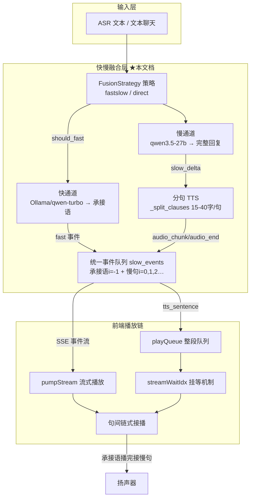
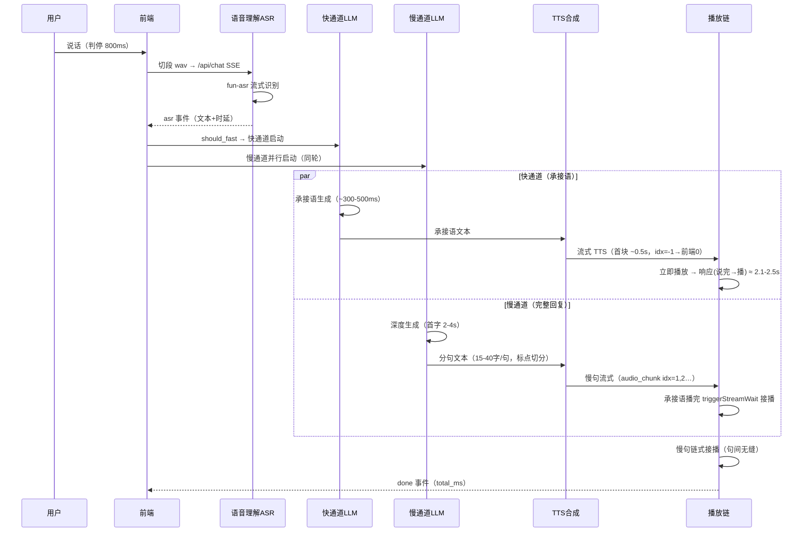
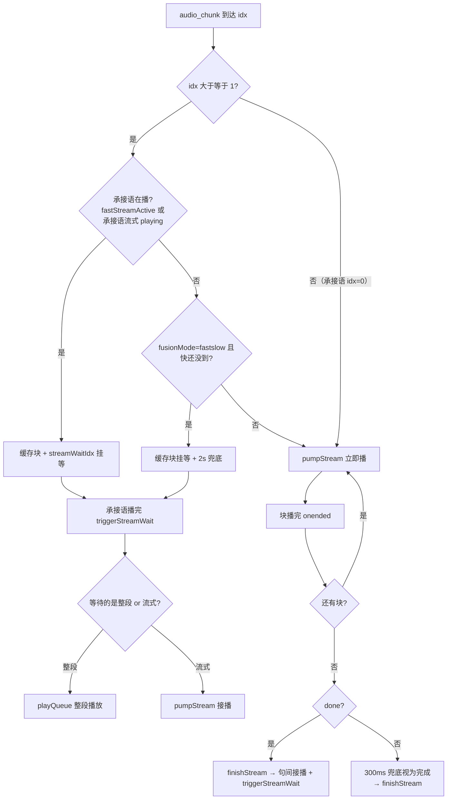

# duplex-voice 快慢融合设计

> 版本：v1.0（2026-08-26）
> 范围：聚焦**快慢融合**（快通道承接语 + 慢通道完整回复的并行生成与串行播放）的完整设计——架构、时序、状态机、算法原理、关键代码实现、实测数据。
> 代码：`~/duplex-voice/duplex_voice/adapter/fusion.py`（策略可插拔）+ `web/server.py`（chat 生成管线）+ `web/index.html`（前端播放链）。
> 本文档为**自包含深度设计**——允许与《软件设计.md》等总览文档内容重复，保障每一章独立可读、可验证。
> 对应分支：`feat/audio-vad-judge`（实验分支，未合并 main）。

---

## 1. 概览与定位

### 1.1 解决的问题

用户说完一句话到听到完整回复，中间隔着：**判停 → ASR → 慢 LLM 深度生成（2-4s）→ TTS 合成（2-10s）**。如果让用户干等慢通道全部完成才出声，响应时延 5-15s，体验无法接受。

**快慢融合**的核心思想：**用快通道先出一句"承接语"遮挡生成时延，慢通道在后台并行生成完整回复，承接语播完无缝接播慢回复**——用户感知的首次出声时延从"慢通道全链路"压缩到"快通道链路"（实测 2.1-2.5s）。

### 1.2 设计目标

1. **低感知时延**：说完 → 首次出声（承接语）控制在 2~3s（实测 2.1-2.5s）
2. **无缝衔接**：承接语播完 → 慢回复首句立即接上，**无空洞、无重叠**
3. **内容不重复**：承接语只给过渡语（"好的，正在为您查询…"），慢回复给完整结果——两通道内容分工
4. **可插拔**：快慢融合（fastslow）与慢回复直达（direct）两套策略独立切换，互不影响
5. **可观测**：快慢各自时延分列统计，播放链事件全链路可追踪

### 1.3 术语表

| 术语 | 含义 |
|------|------|
| 快通道 | 小模型（本地 Ollama / 云端 qwen-turbo）生成 6-10 字承接语，毫秒级 |
| 慢通道 | 大模型（qwen3.5-27b）生成完整回复，分句流式 |
| 承接语 | 快通道输出的过渡语（"好的，马上处理"）——遮挡生成时延 |
| fastslow | 快慢融合策略（默认）：有承接语 + 慢回复 |
| direct | 慢回复直达策略：无承接语，慢通道直接给结果 |
| slow_events | 快慢两通道的统一事件队列（server 端 asyncio.Queue） |
| idx | 句子索引：承接语 idx=0（流式内部 -1），慢句 idx=1,2,…（按 fast 偏移） |
| streamWaitIdx | 前端挂等标记：慢句等承接语播完再播 |
| fastStreamActive | 本轮存在承接语（fast 事件已到 / 承接语流式在播） |
| pumpStream | 前端流式 PCM 播放器（Web Audio BufferSource 链） |
| playQueue | 前端整段音频播放队列（Audio 对象链式接播） |

---

## 2. 总体架构

### 2.1 快慢融合在系统中的位置



**数据流**：ASR 文本 → 策略判定（是否发承接语）→ 快慢双通道并行生成 → 分句 TTS 并行合成 → 统一事件队列 → SSE 下发 → 前端播放链（承接语先播，慢句挂等接播）。

### 2.2 可插拔策略（FusionStrategy）

快慢融合的核心是**策略可插拔**（与 VadJudge 同一接缝模式）：

```python
class FusionStrategy:
    """融合策略抽象：慢通道提示词 + 是否启动快通道。"""
    name = "base"
    def slow_system_prompt(self) -> str: raise NotImplementedError
    def should_fast(self, text: str) -> bool: raise NotImplementedError

class FastSlowStrategy(FusionStrategy):   # 插上：承接语 + 慢回复
    name = "fastslow"
    def slow_system_prompt(self): return "…已用过渡语回应过…不要开头客套，首句15字内给结果…"
    def should_fast(self, text): return FusionPolicy.should_speak(text)   # 指令类才发承接语

class DirectStrategy(FusionStrategy):      # 拔下：慢回复直达，无承接语
    name = "direct"
    def slow_system_prompt(self): return "…首句直接给出核心结果…"
    def should_fast(self, text): return False   # 恒不调用 fast 模型（独立性保证）

STRATEGIES = {"fastslow": FastSlowStrategy(), "direct": DirectStrategy()}
def get_fusion_strategy(mode): return STRATEGIES.get(mode, STRATEGIES["fastslow"])
```

**切换路径**：`FUSION_MODE` 环境变量 / `POST /api/fusion_switch` / 前端 🎙 融合按钮（快慢/直达）——热生效，不重启。

**独立性保证**：direct 策略 `should_fast` 恒 False → fast 模型**零调用**（日志可验证 fast 段=0）→ 两套机制互不干扰。

### 2.3 快慢分工（内容不重复的关键）

| | 快通道承接语 | 慢通道完整回复 |
|------|------|------|
| 模型 | 本地 Ollama / 云端 qwen-turbo（小、快） | qwen3.5-27b（大、深） |
| 内容 | 6-10 字过渡语（"好的，马上处理"） | 完整结果（"客厅的灯已打开…"） |
| 提示词约束 | 不提指令具体内容（防与慢回复重复） | 不要开头客套（已回应过）、首句 15 字内给结果 |
| 生成时延 | ~300-500ms | 2-4s（首字） |
| TTS | 承接语流式（首块 ~0.5s） | 分句流式（每句首块 ~0.5s） |

**承接语长度铁律**（实测迭代）：6-10 字过渡语。太短（"收到"1-4 字）播放 0.5s 就没了，慢首句要 3-4.5s 才就绪 → 2-4s 死等空洞（实测 1 字承接语空洞 2.7s）；太长（14 字）压慢句首句（承接语每短 1 字，慢句首句早响 ~0.2s）。

---

## 3. 端到端时序（快慢融合单轮）



**关键并行点**：快慢两通道在 ASR 定稿后**同时启动**（`slow_task = create_task(run_slow())` 先行，fast 随后）——慢句生成时延被承接语播放完全遮挡。

---

## 4. server 端设计

### 4.1 生成管线（chat / chat_text 共用）

```
ASR 文本（或文本聊天输入）
  │
  ├─▶ [策略判定] fusion.should_fast(text)?
  │     ├─ 是（fastslow）：启动快通道 + 慢通道
  │     └─ 否（direct）：仅慢通道（fast 零调用）
  │
  ├─▶ slow_task = create_task(run_slow())      ← 慢通道先行
  │     └─ 慢 LLM 流式 → slow_delta 逐字入队
  │           └─ 标点边界 flush() → _split_clauses 拆句（15-40字）
  │                 ├─ TTS stream：_slow_stream 分句流式 → audio_chunk/audio_end
  │                 └─ TTS batch：_synth 整段并行（信号量2）→ tts_sentence
  │
  ├─▶ [fastslow] fast 通道
  │     └─ 承接语生成（fast_llm）→ fast 事件
  │           └─ 承接语流式 TTS → audio_chunk idx=-1（→前端0）
  │
  └─▶ 统一消费 slow_events（边生成边下发，不等完成）
        ├─ slow_first / slow_delta → 文字流
        ├─ audio_chunk / audio_end → 流式 PCM（idx 按 fast 偏移）
        ├─ tts_sentence → 整段 URL（idx 按 fast 偏移）
        └─ slow_done + fast_done → 结束
```

### 4.2 统一事件队列（slow_events）

**为什么需要统一队列**：承接语（流式 idx=-1）与慢句（流式 idx=0,1,2… 或整段）是**两路并行生成**——若各自独立下发，前端无法保证顺序（承接语必须先播）。统一队列保证**事件按播放顺序出队**：

| 事件 | 来源 | 内容 |
|------|------|------|
| `("slow_first", ms, silence_ms)` | 慢通道首字 | 慢 LLM 时延 |
| `("slow_delta", delta)` | 慢通道逐字 | 回复文字流 |
| `("audio_chunk", i, b64)` | 流式 TTS 块 | PCM（i=-1 承接语 / i≥0 慢句） |
| `("audio_end", i, first_ms)` | 流式句完成 | first_ms=文本→首块时延 |
| `("tts_sentence", i, url, ms, dl_ms)` | 整段合成 | 音频 URL（慢句/回退） |
| `("tts_sentence_fb", i, url, ms, dl_ms)` | 流式失败回退 | 整段 URL |
| `("fast_done",)` | 承接语流式完成 | 结束条件 |
| `("slow_done",)` / `("slow_error",)` | 慢通道完成/异常 | 结束条件 |

**结束条件**：`slow_done_evt and (not need_fast or fast_done_evt)`——慢通道完成 + （无流式承接语 或 承接语也完成）→ 退出消费循环。`slow_error` 按 done 处理（防 run_slow 异常卡死消费循环）。

### 4.3 分句 TTS（_split_clauses）

**为什么拆句**：200 字整段合成 10.6s（HTTP 整段），承接语播完 gap 7.6s 死等。拆成 15-40 字子句并行合成，每句 2-3s 就绪——合成快于播放（2.5s/句 < 5.6s/句）→ **流水线无缝**。

```python
def _split_clauses(text, max_len=40, min_len=15):
    # 强标点（。！？；）必切 → 超 max_len 按弱标点（，、）切
    # （加入前检查——每段 ≤max_len）；短段（<min_len）与尾残段并入上一段
```

**限流**：DashScope TTS **5 路并发实测 429 Too Many Requests** → 信号量限 **2 并发**（安全且首句 2.5s 就绪）。

### 4.4 关键代码（server 消费循环）

```python
while True:
    ev = await slow_events.get()
    if ev[0] == "slow_first": ...
    elif ev[0] == "slow_delta":
        slow_text += ev[1]
        yield 'data: {"type":"slow_delta","delta":%s}\n\n' % json.dumps(ev[1])
    elif ev[0] == "audio_chunk":
        got_slow_tts = True
        _, i, b64s = ev
        real_idx = i + (1 if fast_tts_url else 0)   # 承接语占 idx=0 → 慢句偏移
        yield 'data: {"type":"audio_chunk","idx":%d,"b64":%s}\n\n' % (real_idx, json.dumps(b64s))
    elif ev[0] == "audio_end": ...
    elif ev[0] == "tts_sentence":
        got_slow_tts = True
        _, i, u, ms, dl_ms = ev
        real_idx = i + (1 if fast_tts_url else 0)
        yield 'data: {"type":"tts_sentence","idx":%d,"channel":"slow",...}\n\n' % ...
    elif ev[0] == "slow_done": slow_done_evt = True
    elif ev[0] == "slow_error": slow_done_evt = True   # 异常按 done（防卡死）
    elif ev[0] == "fast_done": fast_done_evt = True
    if slow_done_evt and (not need_fast or fast_done_evt): break
```

**idx 偏移铁律**：`real_idx = i + (1 if fast_tts_url else 0)`——fastslow 模式承接语占 idx=0，慢句从 1 起；direct 模式无 fast → 偏移 0，慢句从 0 起。**前端无需感知策略**，idx 语义自洽。

---

## 5. 前端播放链设计

### 5.1 两套播放路径

| 路径 | 事件 | 实现 | 用途 |
|------|------|------|------|
| 流式 | audio_chunk / audio_end | pumpStream（Web Audio BufferSource 链） | 承接语（idx=-1→0）与慢句流式 |
| 整段 | tts_sentence | playQueue（Audio 对象链） | 慢句整段 / 流式失败回退 |

### 5.2 播放状态管理

```javascript
let playQueue = {};          // 整段队列：idx → Audio
let streamStates = {};       // 流式状态：idx → {chunks, done, playing, sources}
let streamWaitIdx = null;    // 挂等标记：慢句等承接语播完
let fastStreamActive = false;// 本轮存在承接语（fast 事件已到）
```

### 5.3 挂等机制（streamWaitIdx——防快慢重叠核心）

```javascript
// 慢句（idx≥1）到达时的播放决策：
if (!prev && (fastStreamActive || (st0 && st0.playing) || (stNeg && stNeg.playing))) {
  // 承接语在播（流式 idx=-1 / 整段 idx=0）→ 挂等
  isReplying = true; streamWaitIdx = idx;
} else if (!prev && fusionMode === 'fastslow') {
  // ⚠️ 慢句先就绪（快还没到）——fastslow 预期有承接语 → 也挂等（等快到达）
  // + 2s 超时兜底（快失败/direct 误判→直接播不卡死）
  isReplying = true; streamWaitIdx = idx;
  setTimeout(() => { if (streamWaitIdx === idx && !playing) { streamWaitIdx = null; playNow(); } }, 2000);
} else {
  // 无承接语（direct）→ 立即播
  playNow();
}
```

**triggerStreamWait**（承接语播完 → 接播慢句）：

```javascript
function triggerStreamWait() {
  if (streamWaitIdx != null && !streamStates[streamWaitIdx]?.playing) {
    const a = playQueue[streamWaitIdx];
    if (a) { a.play(); }                       // 整段慢句
    else if (streamStates[streamWaitIdx]?.chunks.length) { pumpStream(streamWaitIdx); }  // 流式慢句
    streamWaitIdx = null;
  }
}
```

> ⚠️ **绝不置 undefined**：`playQueue[streamWaitIdx]` 保留（置空会破坏链 → 后续句直接播 → 重叠）。

### 5.4 句间链式接播

- **流式**：`pumpStream` 每块播完 → `src.onended` → 有块继续 pump / done 则 finishStream；`finishStream(idx)` 检查 `streamFinished[idx-1]` 防乱序，播完触发 `pumpStream(idx+1)`。
- **整段**：`a.onended` → `playQueue[idx+1]` 若已到达未播 → 直接接播；全部播完 → `isReplying = false`。

### 5.5 前端 idx 映射（对齐 server 偏移）

```
server 内部 idx：承接语流式 = -1 | 慢句 = 0,1,2…
      ↓ real_idx = i + (1 if fast_tts_url else 0)
前端 idx：承接语 = 0 | 慢句 = 1,2,3…
```

- fastslow + 流式：承接语 audio_chunk idx=-1 → 前端 0；慢句 idx=0,1,2 → 前端 1,2,3
- direct：无 fast → 慢句 idx=0,1,2 → 前端 0,1,2

---

## 6. 流程图：完整播放决策



---

## 7. 实测数据

### 7.1 时延分项（rule 模式全链，qwen-turbo 快 + qwen3.5-27b 慢）

| 指标 | 实测 | 说明 |
|------|------|------|
| 快承接语 LLM | 316-533ms | qwen-turbo / 本地 Ollama |
| 慢 LLM 首字（slow_first） | 317-465ms | 禁思考后 |
| 承接语流式 TTS 首块 | ~444-500ms | qwen3-tts-realtime |
| 慢句分句流式首块 | 461/434ms | _split_clauses 后每句 |
| 响应（说完→开始播） | 2.1-2.5s | 快通道链路 |
| done（完整回复结束） | 12-13s | 慢通道全链路 |

### 7.2 关键改进实测（迭代历史）

| 问题 | 修复 | 效果 |
|------|------|------|
| 慢句整段 10.6s 卡顿 | _split_clauses 拆 15-40 字并行 | 首句 2.1s 就绪（快 5.4 倍） |
| 流式长句中间卡顿 | 分句流式（15-40 字/句） | 首块 3.2s→0.45s（7 倍） |
| 承接语太短空洞 | 6-10 字过渡语 | 空洞 <0.1s（1 字承接语空洞 2.7s） |
| 快慢重叠 | streamWaitIdx 挂等 + triggerStreamWait | 严格串行无重叠 |
| 慢句先就绪竞态 | fusionMode 跟踪 + 2s 兜底 | 时序竞态消除 |
| 承接语流式 idx=-1 卡 true | finishStream `idx===0 \|\| idx===-1` | 状态正确复位 |
| 流式慢句挂等不接播 | triggerStreamWait 支持 pumpStream | 流式慢句正常接播 |

---

## 8. 异常与边界处理

| 场景 | 处理 |
|------|------|
| 快通道失败 | FAST_ERR 日志 + 跳过承接语 → 慢句从 idx=0 起（direct 语义） |
| 慢通道异常 | slow_error 按 done → 消费循环退出 → 有承接语则播放承接语收尾 |
| 流式 TTS 失败 | 回退整段（tts_sentence_fb 事件，前端已兼容） |
| 快/慢均无音频 | 兜底整段合成 `_local_tts(reply_for_tts)` → tts_sentence idx=0 |
| 慢句先就绪等快 2s 未到 | 超时兜底直接播（快失败/direct 误判不卡死） |
| 承接语流式完成信号晚 10s+ | 300ms 兜底视为完成（不等 audio_end） |
| 跨轮残留播放 | sendAudio 开头 stopAllPlayback（清 playQueue/streamStates） |
| 模式切换（快慢↔直达） | 切换成功即 stopAllPlayback（防旧链残留重叠） |

---

## 9. 已知边界与演进

1. **慢通道仍是端到端瓶颈**：done 12-13s（生成+多句 TTS），承接语只遮挡首响。演进：慢句增量转述（P1 切句级接管——首句到达即播，后续句边生成边接）。
2. **承接语与慢回复内容协调靠提示词**：无结构化保证。演进：快通道带槽位（提取用户指令实体）→ 慢通道引用。
3. **TTS 限流 2 并发**：长回复多句时流水线靠"合成快于播放"掩盖。极端长文仍有 gap 风险。
4. **前端播放链双路径**（流式+整段）状态多（streamWaitIdx/fastStreamActive/streamFinished）——复杂度高，演进可统一为单路径（全流式）。

---

（完）
