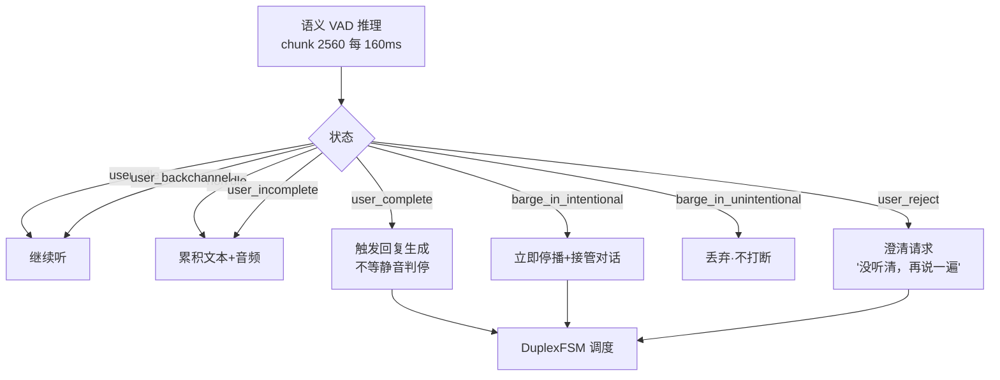
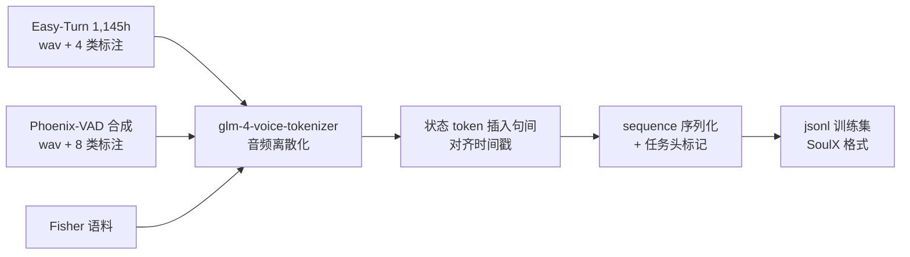
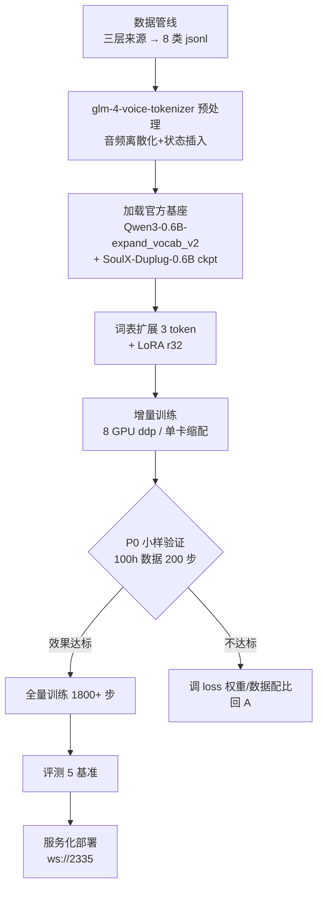
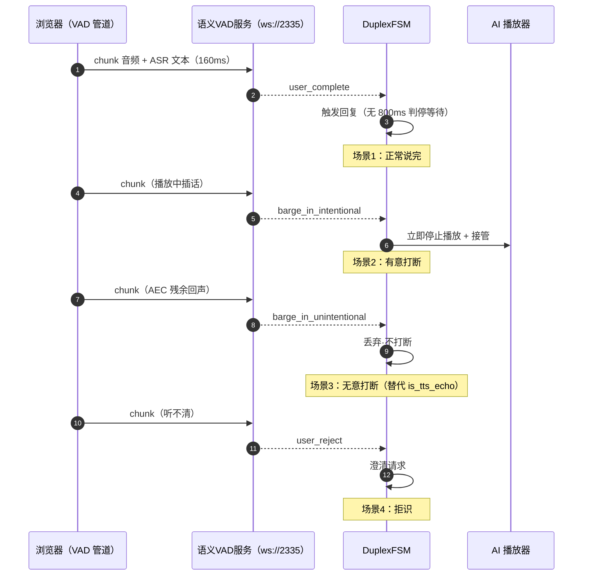

# 基于 SoulX-Duplug 的语义 VAD 训练方案（完整设计）

> 版本：v1.0
> 更新：2026-08-21
> 决策：**基于 SoulX-Duplug 增训**（放弃完全自研路线；Easy-Turn 降级为数据与基准参照）
> 依据：SoulX-Duplug training-code 分支实测（config/数据格式/训练配置全部拉取验证）+ 双模型对比（2026-08-21）
> 关联：`docs/语义VAD方案.md`（自研路线对照版）、`docs/软件设计.md` §10

---

## 1. 背景与选型结论

### 1.1 为什么基于 SoulX（对比结论摘要）

| 维度 | SoulX-Duplug | Easy-Turn | 结论 |
|------|--------------|-----------|------|
| 官方训练代码 | ✅ training-code 分支（finetune.py + config，2026-07-17 发布） | ❌ 仅推理包 | **选 SoulX** |
| token 空间契合 | 5 状态与我们 8 状态设计同源（前 5 个即继承自它） | 4 状态（wait 与需求不对齐） | **选 SoulX** |
| 骨干 | Qwen3-0.6B 扩展词表（与我们自研方案选的骨干一致） | 850MB 专用模型（架构耦合） | **选 SoulX** |
| 增训成本 | LoRA r32（官方配置直接可用） | 需自写训练循环 + 逆向架构 | **选 SoulX** |
| 数据资产 | Eval 集开源 + Fisher 示例 | **1,145h 训练集开源**（真实+合成） | Easy-Turn 数据可混用 |

### 1.2 与自研路线的关系

自研路线（Qwen3-0.6B + LoRA 从头训，`语义VAD方案.md`）与 SoulX 增训**共用同一骨干与 token 设计**——SoulX 已经把"数据管线 + 训练循环 + 评测集"三座大山开源，增训 = 官方基座 + 增量数据 + 3 个新 token，成本低一个量级。自研路线保留为备选（若 SoulX 训练代码不可用/增训效果不达标）。

---

## 2. SoulX-Duplug 基座分析（已验证事实）

### 2.1 模型架构（train_config.yaml 实测）

```
骨干：Qwen3-0.6B-expand_vocab_v2（扩展词表，lm_vocab_size 151936）
音频 tokenizer：glm-4-voice-tokenizer（GLM 语音离散化）
投影层：enable_projector=true（音频 token → LLM 向量）
微调：enable_lora=true, lora_r=32, lora_alpha=64, lora_dropout=0.1
```

- **text-guided streaming state prediction**（interleaved）：音频 token + 状态 token 交错成序列，LLM 逐 chunk 预测状态
- 推理时外部级联 ASR（paraformer 中文 / sensevoice 英文）提供文本——**与我们的"语义靠文本"认知一致**

### 2.2 状态 token（官方 5 类 + loss 权重表）

| token | 含义 | 官方 loss rate | 说明 |
|-------|------|---------------|------|
| `user_idle` | 静音 | 0.08-0.09 | 帧级背景 |
| `nonidle` | 有语音 | 0.09 | |
| `user_complete` | 句完成（EOT） | 0.24-0.26 | 最高权重（主任务） |
| `user_incomplete` | 句未完成 | 0.10-0.13 | |
| `user_backchannel` | 应声 | 0.006 | 最低（类稀少） |
| eos | 序列结束 | 0.05-0.08 | |
| text | ASR 文本 token | 0.45 | 文本预测 loss（引导语义） |

**关键设计**：类不平衡靠 **loss rate 权重**而非过采样（官方 7 类权重表，见上）——我们新增 3 类沿用同一机制。

### 2.3 训练配置基线（train_config.yaml 实测）

| 项 | 官方值 | 说明 |
|----|--------|------|
| total_steps | 1800 | 官方小规模基线（8 GPU） |
| learning_rate | 1e-4 / min 1e-6 | warmup 200 |
| precision | 16-mixed（bf16） | |
| strategy | ddp（8 GPU） | deepspeed_stage_2 备选 |
| accumulate_grad_batches | 72 | 等效 batch 72 |
| text_loss_rate 等 | 见 2.2 | 类不平衡权重 |
| enable_ema | false（train）/true（debug） | EMA 可选 |

### 2.4 数据格式（example_data_fisher.jsonl 实测）

```json
{"index": "fe_03_00001_a_0000_000",
 "sequence": "<|task_duplex_predict|><|punctuation_off|><|audio_5966|><|audio_6960|><|end_of_sentence|><|user_idle|><|audio_8520|>...<|user_complete|>..."}
```

- `audio_NNNN` = glm-4-voice-tokenizer 离散化音频 token（语音活动段）
- 状态 token 插入句间（idle/complete/incomplete/backchannel）
- 序列头部：`<|task_duplex_predict|>`（任务标记）+ `<|punctuation_off|>`

### 2.5 推理配置（infer_config.yaml 实测）

| 项 | 值 | 说明 |
|----|-----|------|
| chunk_size | 2560（160ms @16k） | 每 chunk 预测一次 |
| audio_back_size | 15360（960ms） | 历史上下文 |
| audio_ahead_size | 640（40ms） | 前瞻 |
| max_wait_num | 5 | incomplete 误判兜底（等 N chunk 无语音再响应） |
| max_mistake_num | 5 | 连续误判容忍 |
| ASR | sensevoice（英）/ paraformer（中） | 级联 |

---

## 3. 总体设计（8 状态 token）

### 3.1 token 全集与来源

| # | token | 来源 | 用途 |
|---|-------|------|------|
| 1 | `user_idle` | SoulX 保留 | 静音 |
| 2 | `nonidle` | SoulX 保留 | 有语音 |
| 3 | `user_incomplete` | SoulX 保留 | 句未完成 |
| 4 | `user_complete` | SoulX 保留 | 句完成（端点 EOT） |
| 5 | `user_backchannel` | SoulX 保留 | 应声（系统不应抢话） |
| 6 | **`barge_in_intentional`** | **新增** | 有意打断（用户有内容要插） |
| 7 | **`barge_in_unintentional`** | **新增** | 无意打断（AEC 残余回声/误触发） |
| 8 | **`user_reject`** | **新增** | 拒识（听不清/不理解 → 澄清） |

### 3.2 增量 token 的设计要点

- **词表扩展**：在 `Qwen3-0.6B-expand_vocab_v2` 的 151936 词表基础上加 3 个 token（embedding 随机初始化，LoRA 训练覆盖）——LLM 骨干的优势：新 token 即新词汇，无需改分类头
- **与 SoulX 原 5 状态的关系**：完全保留（idle/nonidle/incomplete/complete/backchannel 语义不变），新增 3 个是"打断/拒识"维度——**不是替换，是扩展**（避免破坏原模型已学到的 EOT/应声能力）
- **打断与 complete 的竞争**：用户在 AI 播放中说话，语义上可能是"完整指令"（打断+接管）也可能是"回声"（无意）——区分特征：与播放内容的重叠度（借鉴现有 `_is_tts_echo` 0.7 阈值作为**训练标签的辅助信号**，不参与推理）

### 3.3 推理状态映射与 DuplexFSM



---

## 4. 数据设计

### 4.1 数据来源（三层）

| 层 | 来源 | 状态标注 | 用途 |
|----|------|----------|------|
| A | **Easy-Turn 1,145h 训练集**（HF 开源，真实+合成） | 4 类（cp/incp/bc/wait） | 基础量：complete/incomplete/backchannel 增量样本 |
| B | **Phoenix-VAD 合成管线**（ChatGPT 文本 → 多说话人 TTS → 插静音/重叠/噪声） | 8 类全标注 | **新增 3 类（打断×2/拒识）的唯一来源** |
| C | SoulX 原始训练数据（Fisher 对话语料，格式参照 example_data_fisher.jsonl） | 5 类 | 保底基座数据（若可获取） |

### 4.2 数据格式转换（统一为 SoulX sequence）



- 音频统一 16k → glm-4-voice-tokenizer 离散化为 `audio_NNNN`
- 状态 token 按标注时间戳插入（complete 在句尾标点处；barge_in 在重叠起点；reject 在识别不确定段）
- 序列头 `<|task_duplex_predict|><|punctuation_off|>`

### 4.3 新增 3 类的合成规则（Phoenix-VAD 扩展）

| 类 | 合成规则 | 关键特征 |
|----|----------|----------|
| `barge_in_intentional` | AI 播放段上叠用户完整指令（"关灯！"），音量≥播放 | 语义完整 + 与播放内容无重叠 |
| `barge_in_unintentional` | AI 播放音频原样回放（模拟 AEC 残余回声） | 与播放内容**逐字重叠**（相似度 0.8-1.0） |
| `user_reject` | 听不清/噪声段 + 用户"嗯？""什么？""再说一遍" | ASR 低置信 + 请求重复语义 |

**标签辅助信号**（训练数据生成时）：用现有 `_is_tts_echo`（相似度 0.7 阈值）自动区分有意/无意打断候选——有意（低重叠）+ 无意（高重叠）——人工抽检校准。

### 4.4 类配比与 loss 权重（新增 3 类）

| token | 目标占比 | loss rate（延续官方权重风格） |
|-------|---------|------------------------------|
| text | - | 0.45（不变） |
| eos | - | 0.08（不变） |
| user_idle | 高 | 0.08 |
| nonidle | 高 | 0.09 |
| user_complete | 中高 | 0.22（从 0.24 略降给新类） |
| user_incomplete | 中 | 0.10 |
| user_backchannel | 低 | 0.006（不变） |
| **barge_in_intentional** | 低（事件稀疏） | **0.04**（新） |
| **barge_in_unintentional** | 低 | **0.04**（新） |
| **user_reject** | 极低 | **0.02**（新） |

设计原则：沿用官方"loss rate 权重"机制（`enable_switch_loss_rate` 双表切换保留），新增 3 类权重参考 backchannel（0.006）的量级上调——事件稀疏但重要性高，先 0.02-0.04 起步，P0 实验调。

---

## 5. 训练方案

### 5.1 训练策略（官方配置为基线）

```yaml
# 基于 train_config.yaml 的增量配置（标注 ★ 为我们的改动）
model_config:
  task: state_prediction
  glm_tokenizer_path: pretrained_models/glm-4-voice-tokenizer
  model_name: pretrained_models/Qwen3-0.6B-expand_vocab_v2   # 官方基座
  llm_dim: 1024
  lm_vocab_size: 151936
  enable_projector: true
  freeze_projector: true          # ★ 冻结投影层（增量训练只动 LoRA）
  enable_lora: true
  lora_r: 32
  lora_alpha: 64
  lora_dropout: 0.1
  init_ckpt_path_lora: pretrained_models/SoulX-Duplug-0.6B   # ★ 官方 checkpoint 为起点

dataset_config:
  train_data_path: data/soulx_vad_augmented.jsonl   # ★ 我们的 8 类数据集
  batch_size: 1
  split_size: 0.02

train_config:
  stage: train
  total_steps: 1800                 # ★ 基线；数据量增大后按需扩展
  learning_rate: 1e-4
  min_lr: 1e-6
  warmup_steps: 200
  accumulate_grad_batches: 72
  num_gpu_per_node: 8               # ★ 单卡可缩（accumulate 增大）
  num_node: 1
  strategy: ddp
  precision: 16-mixed
  # ★ 新增 3 类 loss rate（见 4.4）
```

**增量训练关键**：

1. **起点 = 官方 checkpoint**（SoulX-Duplug-0.6B），不是从零——保留已学 EOT/应声能力，增量只学 3 个新 token
2. **冻结 projector**（freeze_projector: true）——音频投影已训好，LoRA 只适配 LLM 层
3. **LoRA r32**（官方值）——可训练参数量 ~1.5%，单卡（H20/昇腾 910B）可跑；Mac M3 Pro 24GB 只能 P0 小样（fp16，MPS bf16 不完整）
4. **EMA 关闭**（train_config 官方默认 false）
5. **训练/推理一致性**：训练 GT 文本 teacher forcing（官方 interleaved 序列含文本 token）→ 推理外部 ASR 级联（与官方 infer_config 一致）

### 5.2 训练流程



### 5.3 硬件与时长估算

| 环境 | 配置 | 时长（1800 步基线） |
|------|------|---------------------|
| 昇腾 910B ×8 | ddp + 16-mixed | ~1-2 天 |
| H20 ×8 | 同上 | ~1-2 天 |
| H20 ×1 | accumulate 放大 | ~1 周（P0 验证够用） |
| Mac M3 Pro 24GB | fp16 单卡 | 仅 P0 小样（100h 数据） |

---

## 6. 评测方案

| 基准 | 覆盖 | 来源 | 用途 |
|------|------|------|------|
| SoulX-Duplug-Eval | EOT/应声/静音 | 官方开源 | 与官方基座对比（增训不退化） |
| **Easy-Turn Testset** | complete/incomplete/backchannel | 西工大开源 | 跨实现精度对照（Easy-Turn SOTA 96.3/97.7/91） |
| Full-Duplex-Bench v1.5 | 重叠语音 | 外部 | 系统级重叠场景 |
| **Reject-Bench（自建）** | user_reject | 自研 | 行业 0 覆盖，验收拒识 |
| **AR-Barge（自建）** | 阿语打断 | 自研 | 小语种扩展 |

**验收标准**：

- 原 5 类（idle/nonidle/complete/incomplete/backchannel）：SoulX-Duplug-Eval ≥ 官方基线（不退化）
- 新增 3 类：Reject-Bench / 自建打断集 F1 ≥ 0.85（对照 Phoenix-VAD 570h 自训的 0.9 目标略降——增量训练数据量小于全量自训）
- 系统级：打断后回复接管成功率（IHBench 风格）≥ 90%

---

## 7. 部署与集成（duplex-voice）

### 7.1 服务形态

```
ws://127.0.0.1:2335/v1/vad
请求：{chunk_audio: <16k PCM 2560>, asr_text: <流式文本>}
响应：{state: user_complete | barge_in_intentional | user_reject | ...}
```

- 改造官方 streaming server（infer_config.yaml 基线：chunk 2560 / back 15360 / ahead 640）
- 浏览器端复用现有 ScriptProcessor 16k 直采管道，chunk 转发语义 VAD 服务
- config.yaml 接缝已预留：`vad.judge: semantic` + `semantic_vad_url`

### 7.2 与 duplex-voice 集成



### 7.3 替换现有 rule VAD 组件

| 现状组件 | 语义 VAD 替代 |
|----------|---------------|
| 静音判停 800ms | user_complete（说完瞬间，零等待） |
| `_is_tts_echo` 文本比对（0.7） | barge_in_unintentional（打断前判定） |
| 三重判停（环境音/超长） | nonidle + 内容判断 |
| 快慢融合承接语 | **保留**（时延兜底，不依赖语义 VAD） |

---

## 8. 里程碑与风险

### 8.1 里程碑

| 阶段 | 内容 | 产出 | 依赖 |
|------|------|------|------|
| P0 | 环境搭建 + 官方模型推理复现 + 100h 数据 200 步小样 | 基座可用性验证 + 增量 token 可行性 | 昇腾/H20 单卡 |
| P1 | 全量数据（Easy-Turn 1145h + Phoenix-VAD 8 类）→ 1800+ 步训练 | 8 token 模型 | P0 |
| P2 | 5 基准评测 + 调参（loss 权重/配比） | 验收达标（§6） | P1 |
| P3 | 服务化 + duplex-voice 集成 + 真实语音微调 | 全双工演示（打断/应声/拒识） | P2 |
| P4 | 阿语（ASR 层）+ 端侧部署 | 小语种全双工 | P3 |

### 8.2 风险与应对

| 风险 | 说明 | 应对 |
|------|------|------|
| training-code 是新发布（2026-07，re-implemented） | 训练循环稳定性未充分验证 | P0 先小样跑通；对照论文流程核对 |
| 官方 checkpoint 与扩展词表对齐 | init_ckpt_path_lora 加载路径/尺寸 | P0 验证加载；必要时官方 issue |
| 增量训练遗忘原能力 | 新 3 类 loss 挤占原 5 类 | 保留原 5 类 loss 权重 + Eval 回归（§6 不退化门槛） |
| 打断/拒识数据质量 | 合成数据与真实差异 | 人工抽检 + P3 真实语音微调 |
| 重叠场景性能 | barge_in 在重叠音频上的判定 | FDB v1.5 + 自建重叠集专项验证 |
| 昇腾部署 | LoRA 推理算子兼容 | P1 验证；备选 GPU 部署 |

---

## 9. 附录：关键资源清单（已验证）

| 资源 | 地址 | 用途 |
|------|------|------|
| SoulX-Duplug 主仓库 | github.com/Soul-AILab/SoulX-Duplug（★299，Apache-2.0） | 推理服务 + 部署 |
| training-code 分支 | github.com/Soul-AILab/SoulX-Duplug/tree/training-code | finetune.py + config + 数据格式 |
| 官方模型 | huggingface.co/Soul-AILab/SoulX-Duplug-0.6B | 基座 checkpoint |
| Eval 集 | huggingface.co/datasets/Soul-AILab/SoulX-Duplug-Eval | 评测 |
| Easy-Turn 模型 | huggingface.co/ASLP-lab/Easy-Turn（850MB） | 精度对照 |
| Easy-Turn 训练集 | huggingface.co/datasets/ASLP-lab/Easy-Turn-Trainset（1,145h） | 数据混用 |
| Easy-Turn 测试集 | huggingface.co/datasets/ASLP-lab/Easy-Turn-Testset | 评测 |
| Easy-Turn 仓库 | github.com/ASLP-lab/Easy-Turn（★138，Apache-2.0） | 精度表参照 |
| 论文 | arxiv.org/abs/2603.14877 | SoulX-Duplug 方法细节 |
