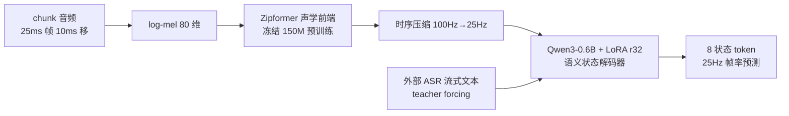
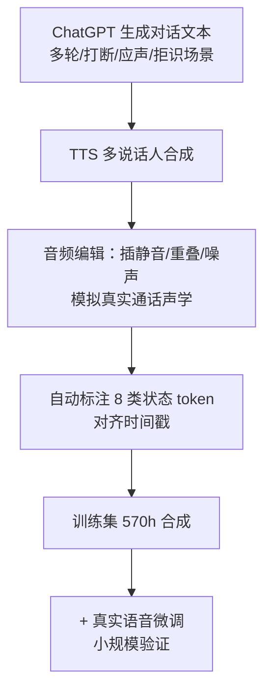
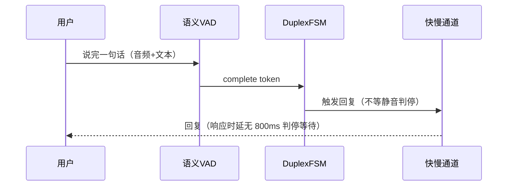
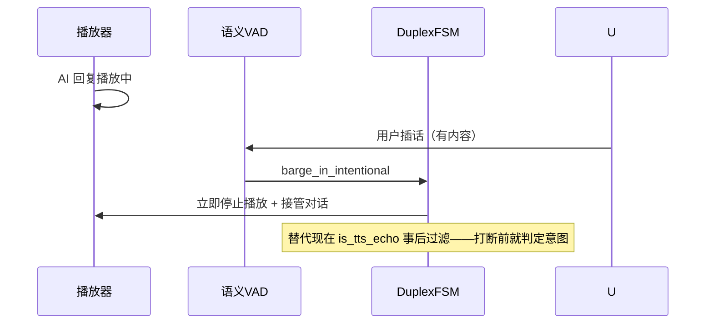

# 语义 VAD 方案设计

> 版本：v1.0
> 更新：2026-08-21
> 关联：`docs/软件设计.md` §10（已知边界与后续演进——本方案是其"根治方向"的具体设计）
> 依据：voice-agent-doc 31 篇论文调研 + 训练设计定稿（方案 A）+ SoulX-Duplug / LLM-Enhanced DM 实现

---

## 1. 背景与动机

### 1.1 rule VAD 的边界（现状问题域）

当前 duplex-voice 使用规则 VAD（Silero + 能量门限 + 投票滞回 + 三重判停），能可靠回答"**有没有声音**"，但回答不了三个交互关键问题：

| 问题 | rule VAD 的表现 | 代价 |
|------|-----------------|------|
| 用户说完了吗？ | 静音 800ms 判停 | 判停等待计入响应时延（说完→出声 2.5s 中占 800ms）；判停短则抢答（500ms 实测打断口语停顿） |
| 是插话还是回声？ | server `_is_tts_echo` 事后文本比对（阈值 0.7） | 打断先发生（AI 还是被自己打断一下）；阈值在临界区（重复指令 0.4-0.5 vs 真回声 0.8-1.0） |
| 环境音算语音吗？ | 三重判停兜底（15s 超长丢弃 + 冷却） | 音乐/电视人声持续误触发，靠丢弃+冷却缓解 |

语义 VAD 用**文本内容 + 语音活动**联合判定，直接回答上述问题——是规则 VAD 参数博弈（800ms 判停、0.7 阈值、三重判停）的根治方向。

### 1.2 核心认知：为什么叫"语义"

**语义判断靠 ASR 文本，不是纯音频**（SoulX-Duplug interleaved 预测验证，2026-08 调研）：

- 先做 chunk 级 ASR 文本 → 以**音频 + 文本**为条件预测状态 token
- 音频通道**只供韵律/停顿/语音活动/打断检测信号**（内容由 ASR 管）
- "这句话说完了没 / 是不是在打断 / 该不该回应"是**语义问题**——文本里才有答案

**推论（影响架构）**：

1. 音频表征选型与语言解耦——小语种（阿语）在 ASR 层解决（Whisper-large-v3 99 语），不需要多语言音频编码器
2. 语义 VAD 是**独立模块**（输入 chunk 音频 + ASR 文本，输出状态 token），不耦合具体 LLM 骨架
3. 与双工状态机（DuplexFSM）分层：语义 VAD 负责"用户侧端点检测"，状态机负责"系统侧说话决策"

---

## 2. 状态 token 设计（8 个，覆盖需求全集）

| token | 含义 | 系统行为 | 来源 |
|-------|------|----------|------|
| `idle` | 静音 | 继续听 | SoulX-Duplug |
| `nonidle` | 有语音 | 持续听并累积文本 | SoulX-Duplug |
| `incomplete` | 句未完成 | 不抢话，等说完 | SoulX-Duplug |
| `complete` | 句完成（端点 EOT） | 触发回复生成 | SoulX-Duplug |
| `backchannel` | 应声（"嗯""对"） | 系统**不应**抢话 | SoulX-Duplug |
| `barge_in_intentional` | **有意打断**（用户有内容要插） | 立即停止播放+接管 | LLM-Enhanced DM（arXiv:2502.14145） |
| `barge_in_unintentional` | **无意打断**（回声/误触发） | 丢弃，不打断 | LLM-Enhanced DM |
| `user_reject` | **拒识**（听不清/不理解） | 澄清请求（"没听清，再说一遍"） | **自研差异化点**（全行业 0 篇论文 0 个开源模型，2026-08 调研） |

**设计依据**：

- 前 5 个继承 SoulX-Duplug（业界语义 VAD 基准）
- 有意/无意打断拆分为 LLM-Enhanced DM 的 4 控制 token 之一——31 篇论文中**唯一**显式区分打断意图的实现——直接解决 duplex-voice 现存的"打断 vs 回声"问题
- `user_reject` 为自研：外部基准（FDB v1.5 / SoulX-Duplug-Eval）无拒识覆盖，行业空白

---

## 3. 模型架构

### 3.1 总体结构（推理）



### 3.2 音频表征选型：log-mel + Zipformer（优于 WhisperVQ）

| 方案 | 表征 | 优劣 | 结论 |
|------|------|------|------|
| A（定稿） | log-mel 80 维 + 冻结 Zipformer（WeNet 100k+h 预训练，150M） | 连续声学"照片"：保韵律/停顿、语言无关、昇腾标准算子、零训练 | ✅ |
| B（对照） | WhisperVQ token | 内容导向离散符号：保内容丢韵律、语言绑定、训练需 VQ 适配 | ❌ P0 对照 |

声学前端的作用 = **时序压缩（100Hz→25Hz）+ 时序建模 + 抗噪**，不是语言适配器。

### 3.3 训练/推理一致性（关键决策）

- **训练**：GT 文本 teacher forcing（不做 SoulX 的 interleaved 内部 ASR 联合预测）
- **推理**：外部级联 ASR（fun-asr）提供文本——训练/推理同路径，避免内部 ASR 未训练导致的分布偏移

---

## 4. 训练方案

### 4.1 骨干与算力

- 骨干：Qwen3-0.6B + LoRA（r=32），可训练参数量 ~1.5%
- 算力：昇腾 910B / H20 1-2 天全量；Mac M3 Pro 24GB 只能 P0 小样
- 精度：bf16（GPU）/ fp16（Mac——MPS 的 bf16 支持不完整；bitsandbytes 4bit 在 MPS 不可用）

### 4.2 数据管线（Phoenix-VAD 合成法）



- **570h 合成即可 F1>0.9**（Phoenix-VAD 报告数据）
- 8 类样本配比：idle/nonidle 大占比（语音活动基础）、complete/incomplete 中等、barge_in/backchannel/reject 过采样（事件稀疏类）
- 阿语 TTS 数据需 Whisper 转写校验（小语种在 ASR 层解决，不污染语义 VAD 训练）

### 4.3 评测体系

| 基准 | 覆盖 | 来源 |
|------|------|------|
| Full-Duplex-Bench v1.5 | 重叠语音场景 | 外部 |
| SoulX-Duplug-Eval | EOT/应声 | 外部 |
| 自建 AR-EOT / AR-Barge | 阿语端点/打断 | 自研（外部无阿语覆盖） |
| **Reject-Bench** | 拒识 | 自研（外部 0 覆盖） |
| IHBench | 打断恢复（系统级） | 外部 |

### 4.4 P0 对照实验

- log-mel+Zipformer（方案 A）vs WhisperVQ（方案 B），100h 小样比 EOT F1
- 目的：验证声学前端选型，避免重蹈"武断选 Qwen3-Omni 编码器被推翻"覆辙

---

## 5. 推理与 duplex-voice 集成

### 5.1 服务形态

```
语义 VAD 独立服务：ws://127.0.0.1:2335/v1/vad
请求：{chunk_audio: <16k PCM>, asr_text: <流式文本>}
响应：{state: complete | incomplete | barge_in_intentional | ...}
```

- config.yaml 已预留接缝：`vad.judge: rule | semantic`、`semantic_vad_url`
- 浏览器端复用现有 VAD 管道（ScriptProcessor 16k 直采 + 帧组织），chunk 音频转语义 VAD 服务

### 5.2 集成时序（三场景）

**场景 1：正常说完（complete）**



**场景 2：播放中插话（barge_in_intentional）**



**场景 3：回声/应声/拒识**

| 输入 | token | 行为 |
|------|-------|------|
| AEC 残余回声（播放内容的音频复制） | `barge_in_unintentional` | 丢弃，不打断 |
| 用户"嗯/对"（无新内容） | `backchannel` | 不应声，继续播 |
| 听不清/不理解 | `user_reject` | 澄清："没听清，再说一遍" |
| 音乐/电视人声 | `nonidle` + 内容判断 | 不触发回复 |

### 5.3 与现有架构的替换关系

| 现状组件 | 语义 VAD 替代为 |
|----------|-----------------|
| 静音判停 800ms | complete token（说完瞬间，零等待） |
| `_is_tts_echo` 文本比对（0.7） | barge_in_unintentional（打断前判定） |
| 三重判停（环境音/超长） | nonidle + 内容判断（音乐不是语音） |
| 快慢融合承接语 | 保留（时延仍靠流式 TTS + 过渡语兜底） |

---

## 6. 落地计划（里程碑）

| 阶段 | 内容 | 产出 | 依赖 |
|------|------|------|------|
| P0 | 100h 小样对照实验（方案 A vs B） | EOT F1 对比，定稿表征 | 昇腾/Mac 训练环境 |
| P1 | 570h 全量训练 + Reject-Bench 自建 | 8 类 token 模型 F1>0.9 | P0 通过 |
| P2 | 服务化（ws://2335）+ duplex-voice 集成 | 全双工演示（打断/应声/拒识） | P1 模型 |
| P3 | 阿语支持（ASR 层 Whisper-large-v3）+ 真实语音微调 | 小语种全双工 | P2 |

## 7. 风险与未决项

| 项 | 说明 | 状态 |
|----|------|------|
| 有意/无意打断边界 | 语义重叠但韵律不同——数据标注主观性强 | 需人工评测校准 |
| user_reject 数据 | 行业无公开数据，需自建场景（听不清/噪声/多任务） | 自研数据管线 |
| 合成数据真实性 | Phoenix-VAD 570h 为 TTS 合成，真实麦克风声学有 gap | P2 用真实语音微调 |
| 昇腾部署 | LoRA 推理在昇腾的算子兼容性 | P1 验证 |
| 与快慢融合配合 | complete 触发后仍走双通道（过渡语+完整回复）还是纯流式 | 产品决策（承接语 vs 自然度） |
