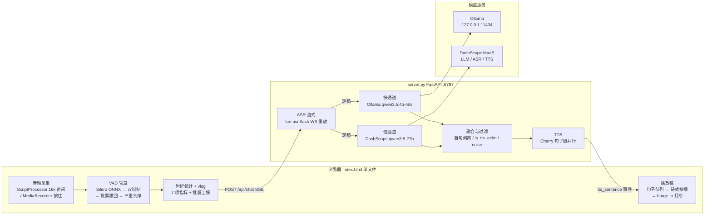
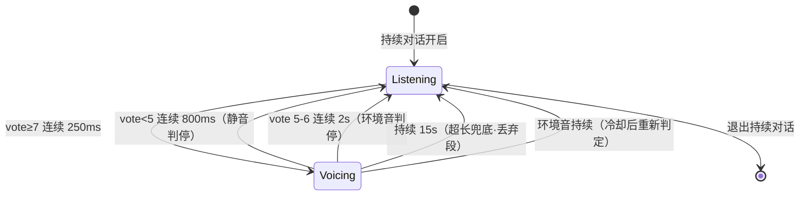
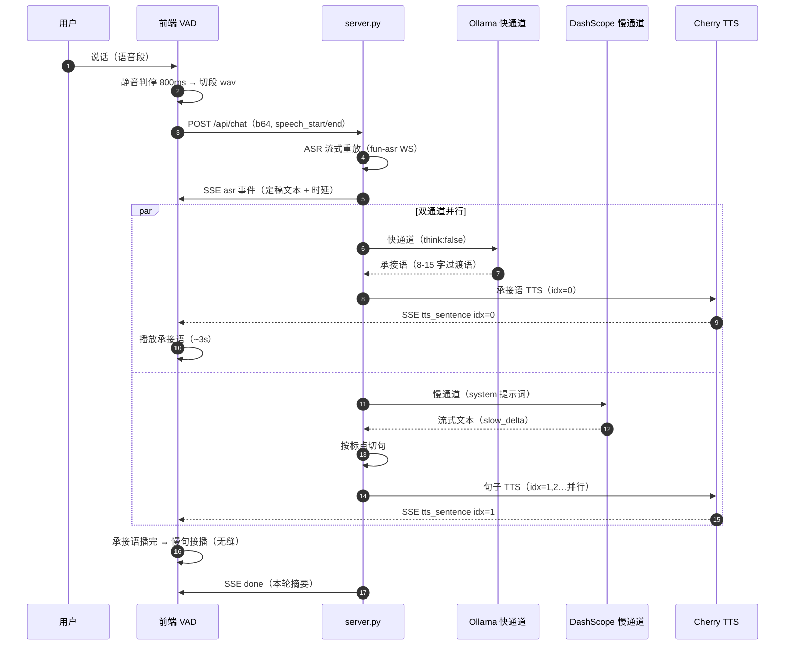
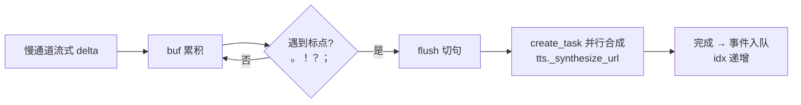
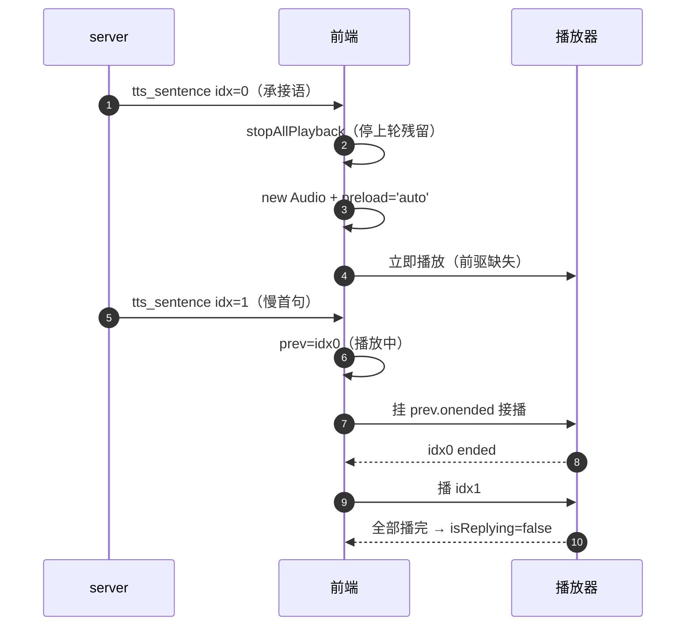
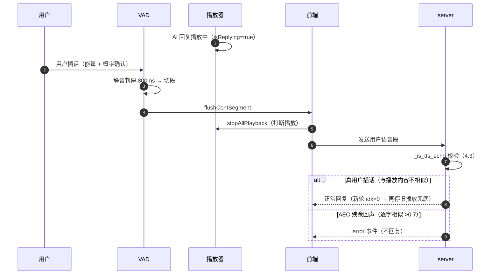
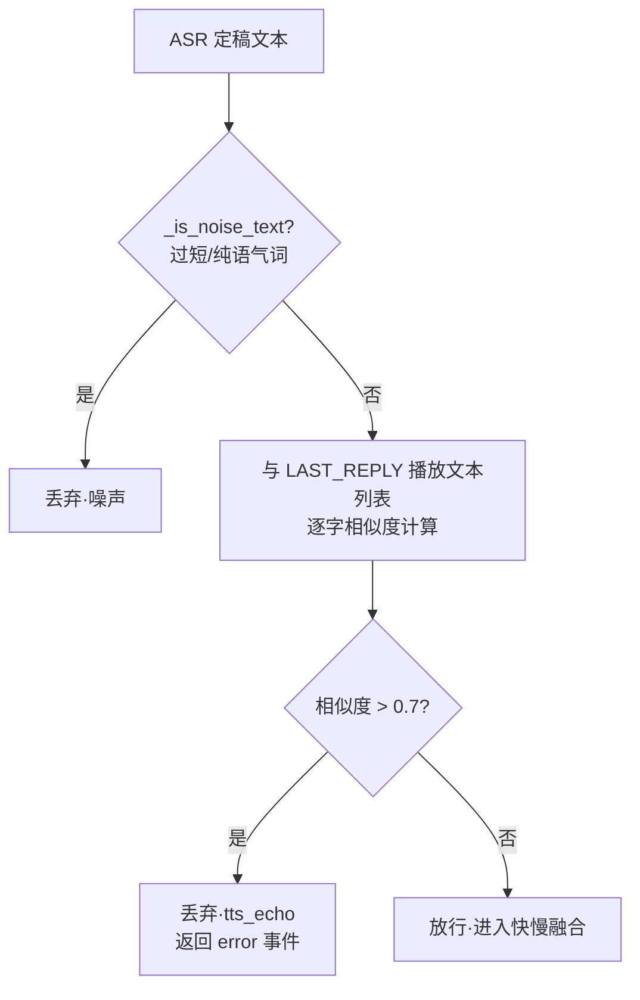
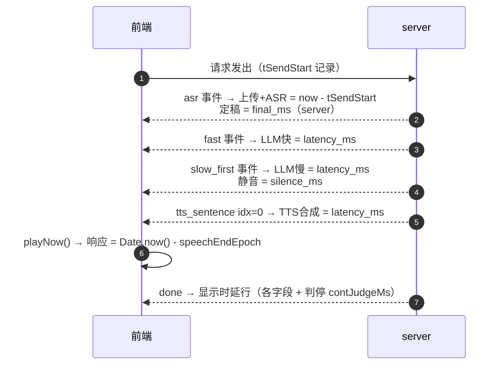
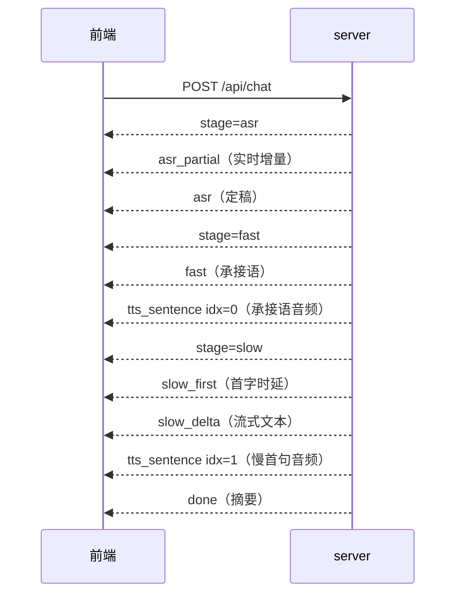

# duplex-voice 软件设计文档（详细版）

> 版本：v1.1（详细版，扩充流程图与数据流）
> 更新：2026-08-21
> 范围：Web 语音助手（快慢融合 + 持续对话 + 双通道 TTS 播放链）
> 关联实现：`web/server.py`、`web/index.html`、`duplex_voice/adapter/llm.py`

---

## 1. 系统总览

### 1.1 定位与目标

duplex-voice 是一个浏览器端语音助手演示系统：用户对着浏览器说话，系统实时识别并以"快慢融合"方式回复——快通道（本地小模型）先出简短过渡语让用户立即听到响应，慢通道（云端大模型）生成完整回复，句子级 TTS 合成后无缝接播。

设计目标（含实测基线，2026-08-20）：

| 目标 | 指标 | 实测 |
|------|------|------|
| 低感知时延 | 响应（说完→开始播）≤3s | 2.1~2.5s |
| 持续对话 | 一次唤醒多轮、免按键 | 10+ 轮稳定 |
| 无缝衔接 | 快慢内容不重复、播放不空洞 | 空洞 <0.5s |
| 可观测 | 全链路时延分阶段 + 双端日志 | 7 项指标 + /api/log 上报 |

### 1.2 架构分层



### 1.3 关键技术决策（含实测依据）

| # | 决策 | 依据（实测） |
|---|------|-------------|
| 1 | ScriptProcessorNode 采集，弃 MediaRecorder | MediaRecorder 48k webm 需解码且静音判定受容器影响；ScriptProcessor 直采 16k 免解码、说完即上传快 1-2s |
| 2 | 3:1 抽取重采样到 16k 喂 Silero | 48k 数据直喂 16k 模型概率 max 0.622（贴阈值），正确喂法 0.955 |
| 3 | `autoGainControl: false` | AGC 会把远场背景人声放大到与近场同能量，抹平能量门限的物理基础 |
| 4 | 快慢双通道并行（ASR 定稿即启动慢通道） | 慢首字 0.3-0.7s 与承接语合成重叠，实现说完→2s 内出声 |
| 5 | 承接语 8-15 字过渡语 | 1-4 字纯占位太短（播放 0.5s），慢首句就绪前产生 2-4s 空洞 |
| 6 | server 端 `_is_tts_echo` 阈值 0.7 | 真回声是播放音频逐字复制（0.8-1.0）；用户重复指令与上轮回复重叠仅 0.4-0.5 |
| 7 | 静音判停 800ms | 500ms 会打断中文口语停顿（实测 600ms 停顿被误判） |
| 8 | 占比过滤仅长段（≥50 帧） | 短指令（1-2 词）段占比 20-35% 波动，30 帧门槛误杀（实测 22-29% 被丢、36% 过线） |
| 9 | 段级能量用最大 50ms 块 | 整段平均被 pre-roll/尾静音稀释误杀（实测语音段平均 0.016 < 门限 0.02 被丢） |
| 10 | metrics 轮次隔离（turnId） | 残留播放链 done 后写入新 metrics → 下一轮显示假值时延（实测 5345ms 残留） |

---

## 2. 持续对话语音活动检测（VAD）

### 2.1 音频采集与重采样

**采集链路**：

```mermaid
flowchart LR
    A[麦克风 48k] --> B[ScriptProcessorNode<br/>bufferSize 4096]
    B -- onaudioprocess 回调<br/>不重叠取 PCM --> C[3:1 抽取重采样<br/>out[i]=ch[floor(i*3)]]
    C --> D1[contPcm<br/>录音累积 16k Float32]
    C --> D2[按 512 样本切帧<br/>每帧 32ms]
    D2 --> E[contVadQueue<br/>待推理队列]
    E --> F[contLoop rAF<br/>消费 + sileroProb]
```

- **采集**：ScriptProcessorNode（bufferSize 4096 = 85ms @48k），回调内不重叠取 `inputBuffer.getChannelData(0)`
- **重采样**：3:1 抽取，每回调产出 `floor(4096/3)=1365` 样本（16k）；丢弃尾部 3 个样本（0.06ms，无影响）
- **帧组织**：16k 样本按 512 样本/帧（32ms）切帧入队；`contVadQueue` 无上限（rAF 消费速率 > 推帧速率，实测不积压）
- **双缓冲**：`contPcm`（完整录音，切段时组装 wav）与 `contVadPcm`（VAD 帧源）同步累积

**每帧处理（32ms 固定 dt）**：

```javascript
// contLoop（rAF 驱动，消费 contVadQueue）
while (contVadQueue.length > 0) {
  const buf = contVadQueue.shift();          // 512 样本
  const prob = await sileroProb(buf);        // onnxruntime 推理（异步）
  const rms = Math.sqrt(sum(buf[i]^2) / 512); // 帧 RMS
  contNoiseFloor = Math.min(contNoiseFloor * 1.0002, rms);  // min 跟踪 + 极慢上升
  const energyOk = rms > Math.max(contNoiseFloor * ENERGY_RATIO, ENERGY_FLOOR_FRAME);
  contVoteWin.push((prob > 0.5 && energyOk) ? 1 : 0);       // 确认帧
  if (contVoteWin.length > 10) contVoteWin.shift();
  const vote = sum(contVoteWin);             // 10 帧窗口投票
  // → 状态机（2.4）
}
```

### 2.2 Silero 语音概率

- 模型：`silero_vad.onnx`（v6，16k 输入），onnxruntime-web（wasm-simd-threaded）推理
- 阈值：`SILERO_THRESHOLD = 0.5`（与桌面 RuleVadJudge 对齐）
- 状态：`state` 跨帧传递（2×128 Float32Array），切段后 `fill(0)` 重置（与桌面 `end_segment` 一致）
- **实测**：16k 正确喂法 37 帧 86% >0.5、max 0.997；48k 错误喂法 max 0.622、3.6% 超阈值

### 2.3 双钳制（能量门限 + 窗口投票）

Silero 对任何语音（含远场人声）都高概率，单靠概率无法区分"谁在说话"——叠加能量与投票双钳制（对齐桌面 RuleVadJudge）：

| 钳制 | 规则 | 作用 |
|------|------|------|
| 能量门限（帧级） | `rms > max(噪声底×4, 0.005)` | 挡远场衰减人声（近场语音 rms 通常 >4 倍噪声底） |
| 窗口投票 | 10 帧窗口内确认帧数（确认 = 概率>0.5 且能量过门限） | 挡断续背景人声（单帧误判被稀释） |

**实测数据**（浏览器真麦）：近场连续 25 帧触发；远场衰减 5 倍（-14dB）断续 8 帧不触发；/10 倍 3 帧、/20 倍 0 帧；静音 0 帧。

**噪声底自适应**：min 跟踪（`min(floor×1.0002, rms)`）——只吸收环境最低能量，上升极慢（1.0002/帧，从 0.005 升到 0.008 需 ~75s），防背景人声拉高门限。

### 2.4 投票滞回与状态机

| 状态 | 条件 | 说明 |
|------|------|------|
| 未激活 → 语音 | `vote >= 7`（70%）连续 250ms | 严格：防背景人声断续进入 |
| 语音中 → 静音 | `vote < 5`（50%）| 宽松：容忍 ≤300ms 句中停顿 |



触发（Listening→Voicing）时记录：

- `speechStartEpoch = Date.now()`（"人开始说话"基准）
- `contSegStart = contPcm.length - 8000`（pre-roll 250ms，防语音开头截断）
- `contVoiceSince`（超长兜底计时起点）

### 2.5 三重判停（切段条件）

| 判停 | 条件 | 用途 | 段处理 |
|------|------|------|--------|
| 静音判停 | `vote < 5` 连续 800ms | 正常说完 | 发送 |
| 环境音判停 | 语音中 `vote` 5-6 持续 2s | 用户说完后环境音不退（vote 卡 5-6） | 发送（段含用户语音） |
| 超长兜底 | 触发后持续 15s | 环境持续音（vote≥7 永不静音）防卡死 | **丢弃**（发出去会被 ASR 识别→回复→循环） |

判停后的统一动作：

1. `speechEndEpoch = Date.now()`（"人说完话"基准，时延计算 t0）
2. `contJudgeMs = Date.now() - contLastSpeechTs`（判停时长 = 语音结束→确认说完，显示用）
3. `contSilero.state.fill(0)`（VAD 状态重置）
4. 冷却：正常/环境音判停 2s、超长判停 10s（防环境音立即再触发循环）
5. 触发 5s 未判停 → 显示降级（"聆听中…"去掉"检测到语音"）

**判停检查位置关键**：超长兜底（forceCut）必须在 `isSpeech=true` 分支内检查——若只在静音分支检查，环境音 vote≥7 持续时永不进入静音分支 → 永不判停 → "聆听中"无限卡死（实测 bug，已修复）。

### 2.6 切段与发送（flushContSegment）

```mermaid
flowchart TD
    A[判停触发] --> B[segLen = contPcm.length - contSegStart]
    B --> C{segLen < 1600?<br/>100ms}
    C -- 是 --> D[丢弃·段过短]
    C -- 否 --> E{段长 ≥50 帧 且<br/>确认占比 < 35%?}
    E -- 是 --> F[丢弃·语音占比低<br/>背景人声断续段]
    E -- 否 --> G[段内最大 50ms 块 RMS]
    G --> H{segBest < max(floor×4, 0.012)?}
    H -- 是 --> I[丢弃·段能量低]
    H -- 否 --> J[slice 取段 → 16k WAV base64]
    J --> K{busy? 回复生成中}
    K -- 是 --> L[丢弃·半双工等待]
    K -- 否 --> M[发送 POST /api/chat]
    M --> N[30s AbortController 超时保护]
```

**关键细节**：

- 段 = `contPcm[contSegStart:]`——**从语音触发点取**，排除回复播放期累积的残留音频（否则 ASR 识别错，实测 28s 混合段 bug）
- 段级能量用**最大 50ms 块 RMS**（每 1600 样本一块取 max）——整段平均会被 pre-roll 250ms 静音 + 判停 800ms 尾静音稀释（实测用户语音段平均 0.016 被误杀）
- 占比过滤**仅长段**（≥50 帧 = 1.6s）：短指令（"关灯"1-2 词，段 32-35 帧）占比 20-35% 波动，过滤会临界误杀
- `contPcm.slice()`（普通数组无 `subarray`，用 subarray 会 TypeError 静默失败——实测 bug）
- 发送后 `contPcm = []`（清空，播放期残留不再累积）

---

## 3. 快慢融合对话

### 3.1 一次请求端到端时序



**实测时间线**（短指令"打开客厅的灯"，2026-08-20）：

```
0ms      人说完（判停 speech_end）
+0.01s   请求发出（REQ）
+0.5s    ASR 定稿（asr_ms 396-500ms）
+0.5s    快/慢通道并行启动
+0.5-1.2s 快通道承接语完成（FAST 500-700ms）
+1.3-2.5s 承接语 TTS 就绪（914-1364ms）
+2.1-2.5s ▶ 开始播放承接语（响应时延）
+2.9s    慢首字（LLM慢 335-720ms）
+3.5-5s  慢首句 TTS 就绪（813-2109ms）
~3.5s    承接语播完 → 慢句接播（无缝）
```

### 3.2 快通道（过渡语）

- 模型：Ollama `qwen3.5:4b-mlx`（原生 /api/chat，`think:false` 关思考直出；OpenAI 兼容端点默认开思考→content 空，已弃用）
- 提示词（FAST_SYSTEM，llm.py）：

```
你是语音助手的快通道。用户刚说完一句话，请生成一句 8-15 字的过渡语，
让用户知道系统正在处理（如"好的，马上为您处理""稍等，我来帮您看看"）。
要求：过渡语要有内容感（不能只有"好的""收到"这种单字——太短会造成播放停顿），
但绝对不要提用户指令的具体内容（不要说"正在为您打开""正在处理您的请求"这类
执行描述，慢通道会给出具体结果）。只输出过渡语。
```

- 演变历程（每代实测）：纯占位 1-4 字（"收到"，播放 0.5s → 空洞 2.7s）→ 8-15 字过渡语（播放 ~3s ≈ 慢首句就绪时间 → 空洞 0.1s）

### 3.3 慢通道（完整回复）

- 模型：DashScope `qwen3.5-27b`（OpenAI 兼容端点 `compatible-mode/v1/chat/completions`，流式）
- 系统提示词（server.py run_slow）：

```
你是智能家居语音助手，回复简洁口语化，不超过两句话。
注意：AI 已先用简短的过渡语（如"好的，马上为您处理"）回应过用户，你回复时
不要再说"好的""嗯""没问题"等开头客套，直接给出具体内容或结果。
要求首句尽量简短（15字内）直接给结果（首句短→TTS 合成快，避免播放停顿），
细节放第二句。
```

- 实测：首字 454ms 稳定（0.42-0.55s 分布）；qwen3.6-27b 冷实例首字 13s、qwen3.7-flash 5.1s 波动——均弃用（专属空间实例冷热差异极大，**换模型前必须实测分布**）

### 3.4 首句剥离（server 兜底）

模型不遵守提示词时，`_strip_leading_filler` 剥离开头客套：

```mermaid
flowchart TD
    A[慢回复首句文本] --> B[正则匹配开头客套<br/>好的|嗯|行|没问题|收到|可以|好嘞|好呀|好的呢|ok|OK|好|嗯嗯|稍等|稍候]
    B --> C{客套词后跟<br/>标点/空白/句尾?}
    C -- 否 --> D[不剥·原样返回<br/>'好的方面'不误剥]
    C -- 是 --> E{剥离后为空?<br/>整句都是客套}
    E -- 是 --> F[返回空串<br/>调用方跳过该句]
    E -- 否 --> G[返回剥离后文本<br/>'好的，正在为您打开' → '正在为您打开']
    D & G --> H[TTS 合成该句]
    F --> I[跳过·不合成]
```

- 仅对慢回复**首句**（sidx==0）执行；后续句不剥
- 与快通道配合：快通道播"好的，马上为您处理"→ 慢首句"客厅的灯已经打开啦"——无重复、无客套
- 剥离清单含"稍等/稍候"（防慢首句与过渡语重复）

### 3.5 句子级 TTS 与播放链

**切句与并行合成**（server 端）：



**前端播放链**：



**播放链关键机制**：

1. **stopAllPlayback()**：新轮 idx=0 到达即停上一轮全部残留播放、清空队列、复位 isReplying（防多轮音频重叠、onended 链错乱、isReplying 残留卡死）
2. **preload='auto'**：音频到达即预下载（默认 metadata 只载头部，play() 时才触发 OSS 下载——248KB 608ms 的感知卡顿）
3. **播放竞态处理**：慢句子晚到时承接语可能已播完——`addEventListener` 挂在已 ended 的 Audio 上永不触发（"有文字没声音"bug）——判断 `!prev || prev.ended || (prev.paused && prev.currentTime > 0)` 立即播
4. **30s AbortController 超时**：慢通道异常/网络卡死时强制恢复 busy（防永久卡死导致后续说话全被丢弃）
5. **播放失败解除抑制**：play() 失败 → isReplying=false（防卡死）
6. **isReplying 生命周期**：入队/播放→true；全部播完→false；stopAllPlayback 复位；stopContMode 重置

---

## 4. 播放中打断（barge-in）与回声防护

### 4.1 barge-in 流程



- 场景前提：用户戴耳机（无回声）——插话直接打断；外放场景由 server 回声过滤兜底
- 打断后新回复的 idx=0 会再次 stopAllPlayback（双保险，清已断播放的残留）

### 4.2 回声防护分层

| 层 | 机制 | 位置 | 作用 |
|----|------|------|------|
| 1 | 浏览器 AEC（echoCancellation） | getUserMedia | 消除大部分外放回声 |
| 2 | isReplying + barge-in | 前端 | 播放期检测语音 → 打断 + 发送（耳机无回声不误杀） |
| 3 | `_is_tts_echo` 阈值 0.7 | server | ASR 文本与播放内容逐字相似 → 丢弃（防 AEC 残余回声自打断循环） |

### 4.3 server `_is_tts_echo`（残余回声过滤）



- **阈值 0.7 依据**：真回声是播放音频的逐字复制（0.8-1.0）；用户重复指令与上轮回复仅部分重叠（实测 0.4-0.5）；5 轮实测轮 4 长句指令与 2 轮前回复重叠 0.43——0.45 阈值会误杀，0.7 完成分离
- 对比对象：`LAST_REPLY[client_id]` = 实际播放文本列表（承接语 + 完整回复，慢通道完成后追加）
- 历史只查最近 4 条（防跨轮误杀）

---

## 5. 时延指标体系

### 5.1 指标定义与采集点

| 指标 | 定义 | 采集点 | 实测 |
|------|------|--------|------|
| 上传+ASR | 请求发出 → ASR 定稿 | 前端 `tSendStart`（performance.now）→ asr 事件 | 489ms |
| 定稿 | 人说完（判停）→ ASR 定稿 | server `final_ms`（ASR final - speech_end） | 503ms |
| 判停 | 最后语音帧 → 确认说完 | 前端 `contJudgeMs`（contLastSpeechTs → 判停） | 800ms |
| LLM快 | 送本地 Ollama → 承接语完成 | server FAST 事件 `latency_ms` | 534ms |
| LLM慢 | 送云端 → 首字 | server slow_first 事件 `latency_ms` | 720ms |
| TTS合成 | TTS 收到文字 → 音频就绪 | server tts_sentence 事件 `latency_ms`（合成耗时） | 914ms |
| 响应 | 人说完 → 开始播放首个音频 | 前端 `playNow()` 时刻 - speechEndEpoch | 2.5s |

### 5.2 采集时序（前端事件流）



### 5.3 轮次隔离（metrics 生命周期）

```mermaid
flowchart LR
    A[sendAudio 开始<br/>metrics = {turn: ++turnId}] --> B[事件流写入本轮 metrics]
    B --> C[done 显示时延行<br/>（不重置 metrics）]
    C --> D[残留播放链 playNow<br/>turn === turnId 校验]
    D -- 匹配但 tts_play 已设 --> E[不重算]
    D -- 不匹配（下一轮已重建） --> F[不写入]
    A --> G[下一轮 sendAudio<br/>重建新 metrics]
```

- **问题**（实测）：慢句 idx=1 在 done **之后**播放 → playNow 写入重置后的新 metrics → 下一轮承接语看到 tts_play 非 null 不重算 → done 显示残留假值（5345ms）
- **修复**：sendAudio 开头重建 `metrics = { turn: ++turnId }`；playNow 加 `metrics.turn === turnId` 校验；done 不再重置

### 5.4 显示格式

```
⏱ 上传+ASR 489ms · 定稿 503ms · 判停 800ms · LLM快 534ms · LLM慢 720ms · TTS合成 914ms · 响应(说完→开始播) 2.5s
```

- 指标互不重叠、可相加（并行环节除外：TTS 与 LLM 并行，响应 ≠ 各阶段线性之和）
- `fmt()`：null → "-"（如按住模式无判停显示）

---

## 6. 接口设计

### 6.1 POST /api/chat（SSE 事件流）

请求：

```json
{
  "audio_b64": "<16k WAV base64>",
  "client_id": "c_xxx",
  "speech_start_ms": 1787234457658,
  "speech_end_ms": 1787234458694
}
```

SSE 事件序列：



| 事件 | 字段 | 说明 |
|------|------|------|
| `stage` | stage | asr / fast / slow / synthesizing |
| `asr_partial` | text | ASR 实时增量（边说边出） |
| `asr` | text, latency_ms, partial_first_ms, final_ms | 定稿 + 时延 |
| `fast` | text, latency_ms | 快通道过渡语 |
| `slow_first` | latency_ms, silence_ms | 慢首字 + 静音时延 |
| `slow_delta` | delta | 慢回复流式增量 |
| `tts_sentence` | idx, channel, url, latency_ms | 句子音频就绪 |
| `done` | total_ms, slow_text | 本轮完成摘要 |
| `error` | msg | 过滤/异常 |

### 6.2 日志上报

| 接口 | 方法 | 说明 |
|------|------|------|
| `/api/log` | POST `{lines: [...]}` | 前端 vlog 批量上报（2s 一批合并，环形缓冲 3000 条） |
| `/api/logs?n=200` | GET | 读取前端日志（定位问题） |
| `/api/health` | GET | 健康检查 + 模型配置 |

### 6.3 会话状态（内存）

| 结构 | 键 | 内容 |
|------|-----|------|
| `HISTORIES` | client_id | 最近 10 轮对话历史（`[-10:]`） |
| `LAST_REPLY` | client_id | 实际播放文本列表 [承接语, 完整回复]（回声过滤对比） |
| `FRONTEND_LOGS` | - | deque(maxlen=3000) 前端上报日志 |

---

## 7. 日志与可观测性

### 7.1 server 日志（统一时间戳，与 uvicorn 同格式）

```
REQ cid=xxx audio=1.19s speech_start=1787234457658 speech_end=1787234458694
ASR cid=xxx partial=1 text='打开客厅的灯。' asr_ms=396 final_ms=1917
FILTER cid=xxx reason=tts_echo text='...' last=['承接语', '完整回复']
FAST cid=xxx text='好的，马上为您处理' ms=534
TTS cid=xxx idx=0 fast ms=914
SLOW_FIRST cid=xxx latency_ms=720 silence_ms=503
DONE cid=xxx total=3672ms slow_text='...' fast_tts=True slow_tts=True hist=20
CHAT_ERR cid=xxx err=<traceback>
```

### 7.2 前端 vlog

- console + 环形缓冲 500 条 + 批量上报（2s 一批 POST /api/log）
- `window.exportVoiceLog()` 手动导出
- 打点覆盖：VAD 状态秒级摘要（prob/rms/floor/vote/energyOk）、语音开始/判停（含 reason）、FLUSH 丢弃明细（原因/segBest/floor）、SEND 请求、PLAY 首个音频播放（idx/ts/speechEndEpoch/tts_play）、EVT done 时延摘要、MODE 开关

### 7.3 问题定位工作流

```
用户反馈问题 → curl /api/logs 看前端 VAD/FLUSH/PLAY 数据
              → grep "[voice]" /tmp/voice_web.log 看 server 阶段日志
              → 两侧时间线对齐 → 定位丢弃/异常环节
```

---

## 8. 配置与部署

| 配置 | 位置 | 值 |
|------|------|-----|
| 快通道模型 | server.py `FAST_MODEL` | qwen3.5:4b-mlx（Ollama 127.0.0.1:11434） |
| 慢通道模型 | server.py `SLOW_MODEL` | qwen3.5-27b（DashScope MaaS） |
| TTS | `tts._synthesize_url` | Cherry 音色 |
| API Key | `~/.zshrc` `DASHSCOPE_API_KEY` | 启动时注入（代码不含密钥） |
| 端口 | server.py | 8787 |
| 前端缓存 | `/` 响应 | `Cache-Control: no-store`（页面迭代频繁，防旧页面缓存导致定位误判） |

**部署**：

```bash
cd duplex-voice/web
export DASHSCOPE_API_KEY=$(grep '^export DASHSCOPE_API_KEY' ~/.zshrc | sed 's/.*="\(.*\)"/\1/')
python3 server.py 2>&1 | tee /tmp/voice_web.log
```

**测试**：`python3 -m pytest tests/ -q`（23 passed，含 FusionPolicy 单元/FSM/过滤）

---

## 9. 关键参数表（调参入口）

| 参数 | 值 | 位置 | 影响 |
|------|-----|------|------|
| `CONT_MIN_SPEECH_MS` | 250 | index.html | 触发最短语音（对齐桌面 min_speech_ms） |
| `CONT_SILENCE_MS` | 800 | index.html | 静音判停（抢答 vs 响应时延权衡；500ms 实测抢答） |
| `CONT_VOTE_MIN / EXIT` | 7 / 5 | index.html | 投票滞回（背景人声 vs 句中停顿） |
| `ENERGY_RATIO` | 4.0 | index.html | 帧能量门限（噪声底倍数） |
| `ENERGY_FLOOR_FRAME` | 0.005 | index.html | 帧级绝对下限（轻声可触发） |
| `ENERGY_FLOOR_SEG` | 0.012 | index.html | 段级绝对下限（背景人声 0.008 被挡） |
| `SEG_SPEECH_MIN_RATIO` | 0.35 | index.html | 占比过滤（仅段长 ≥50 帧） |
| 冷却 | 2s / 10s | index.html | 判停后防循环触发 |
| 超长兜底 | 15s | index.html | 环境持续音防卡死（段丢弃） |
| `_is_tts_echo` 阈值 | 0.7 | server.py | 回声过滤（真回声 0.8+，重复指令 0.4-0.5） |
| 历史条数 | 4 / 10 | server.py | 回声对比 / 对话上下文 |

---

## 10. 已知边界与后续演进

1. **半双工限制**：barge-in 打断后需等回复生成完才能继续说（busy 期间段被丢弃）——后续可用语义 VAD（检测用户语音与播放内容的关系）区分打断与回声，实现全双工
2. **外放场景**：AEC 不完美时可能出现"AI 被自己声音打断"——可加"打断需明显高于播放音量"的能量门槛
3. **环境音持续**：音乐/电视人声（Silero 概率高）会被误判为语音——超长判停丢弃 + 冷却缓解，语义 VAD 是根治方向
4. **多客户端隔离**：HISTORIES/LAST_REPLY 按 client_id 内存隔离，重启即失（适合演示，生产需持久化）
5. **慢模型选择**：专属空间实例冷热差异大（qwen3.6-27b 冷实例首字 13s vs 热 0.4s）——换模型必须实测分布
6. **会话持久化**：sessions.jsonl 设计存在但 Web 版未启用（对话历史在内存，重启丢失）
