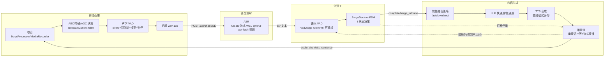
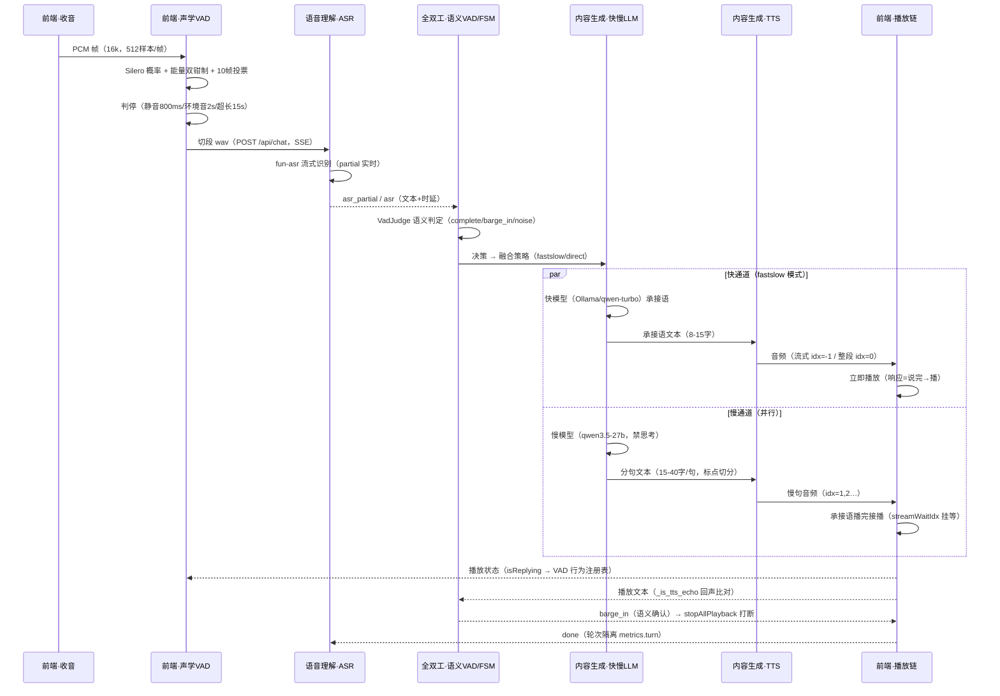
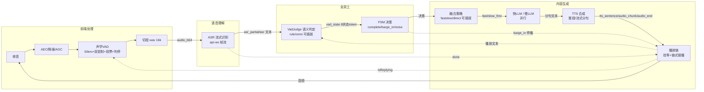
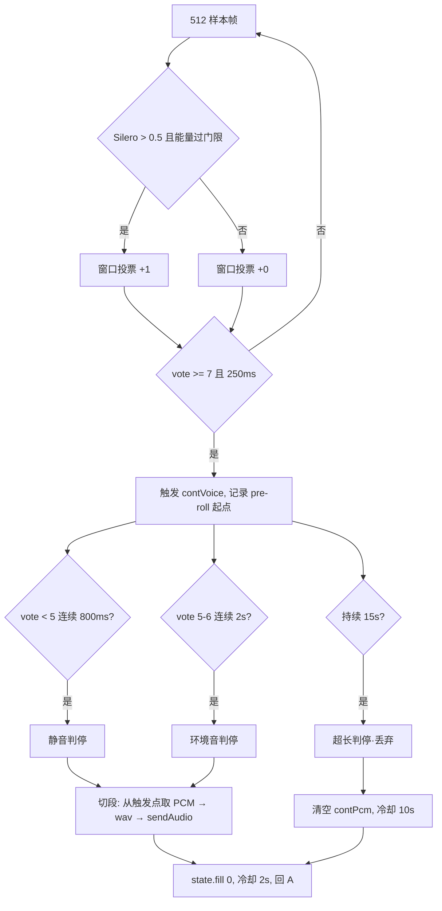
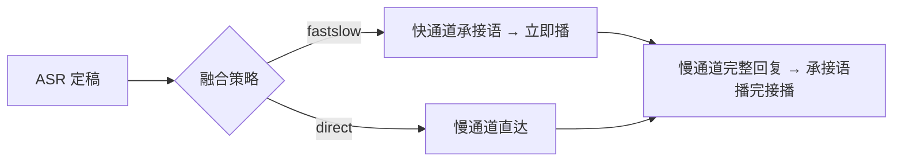
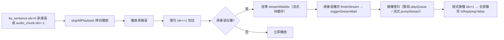

# duplex-voice 软件设计文档

> 版本：v1.9.0（文档按五大模块重构——2026-08-24）
> 更新：2026-08-24
> 范围：Web 语音助手（前端处理 / 语音理解 / 内容生成 / 全双工 / 系统架构五模块）
> 维护：成品仓 ~/duplex-voice（对应 git tag `voice-web-v1.8.0` 稳定版实现）

---

## 1. 系统架构（级联流式管线设计）

### 1.1 定位与目标

duplex-voice 是一个浏览器端**全双工语音助手**：用户对着浏览器说话，系统边听边理解边回复——快慢融合（快通道先出过渡语、慢通道生成完整回复）实现低感知时延，语义 VAD + 状态机实现"可被打断"的自然对话。

设计目标：

1. **低感知时延**：说完话到听到第一个声音（响应时延）控制在 2~3s（实测 2.1~2.5s）
2. **全双工**：一次唤醒多轮、免按键、可打断（VAD 自动切段 + 语义判断打断）
3. **无缝衔接**：快慢两通道内容不重复、播放不空洞（承接语挂等 + 链式接播）
4. **可观测**：全链路时延分阶段统计（实时显示）+ 双端日志，问题定位靠数据不靠猜

### 1.2 级联流式管线（五模块串联）

整个系统是一条**级联流式管线**：声学数据逐级向上流动为语义，决策逐级向下驱动表达；打断/回声通过反馈回路反向作用。



**数据流**（正向）：收音 → AEC/声学 VAD → 切段 wav → ASR 文本 → 语义 VAD/FSM 决策 → 快慢融合 → LLM → TTS → 播放
**反馈流**（反向）：播放状态（isReplying/播放文本）→ 声学 VAD（播放期检测策略）与语义 VAD（回声比对）；打断决策 → 停播

### 1.2.1 端到端时序（单轮对话完整链路）



### 1.2.2 级联事件流转（模块间 SSE 事件管道）



### 1.2.3 反馈回环（反向作用）

| 回环 | 路径 | 作用 |
|------|------|------|
| 播放状态回环 | 播放链 → 声学 VAD（isReplying） | 播放期 VAD 检测策略切换（headset 打断 / speaker 缓判防自声） |
| 回声比对回环 | 播放链 → 全双工（播放文本） | `_is_tts_echo` 逐字比对（阈值 0.7）——播放期检测到的语音判回声 |
| 打断回环 | 全双工 → 播放链（barge_in） | 语义确认打断 → stopAllPlayback（backchannel 应声不打断） |
| 轮次隔离回环 | 语音理解 → 播放链（done） | `metrics.turn` 校验——done 后残留播放链不污染下一轮 |

### 1.3 模块边界与接口

| 模块 | 职责 | 输入 | 输出 | 关键接口 |
|------|------|------|------|---------|
| **前端处理**（§2） | 收音/AEC/声学 VAD/切段/播放 | 麦克风流 | 16k wav base64 | `sendAudio(b64)` |
| **语音理解**（§3） | ASR 识别 | 16k wav（帧流/整段） | asr_partial/asr 文本+时延 | SSE `asr_partial`/`asr` |
| **全双工**（§4） | 语义 VAD + 打断状态机 | ASR 文本 + 播放状态 | complete/barge_in/noise 决策 | SSE `vad_state`；`/api/vad_switch` |
| **内容生成**（§5） | 快慢融合 + LLM + TTS + 播放链 | 决策 + 用户指令 | fast/slow_delta/tts 事件 + 音频 | SSE `fast`/`slow_delta`/`tts_sentence`/`audio_chunk`/`audio_end` |
| **系统级联**（§1） | 管线编排 + 会话状态 + 时延统计 | 各模块事件 | done 汇总 + 时延显示 | `/api/chat` SSE；config 热生效 |

### 1.4 关键技术决策（含依据）

| # | 决策 | 依据（实测） |
|---|------|-------------|
| 1 | ScriptProcessorNode 采集，弃 MediaRecorder（持续模式） | MediaRecorder 48k webm 需解码且静音判定受容器影响；ScriptProcessor 直采 16k 免解码、说完即上传快 1-2s（按住模式保留 MediaRecorder） |
| 2 | 重采样到 16k 喂 Silero（`ratio = audioCtx.sampleRate/16000` 自适应） | 48k 数据直喂 16k 模型概率 max 0.622（贴阈值），正确喂法 0.955；本机 Chrome 44.1k 实测 |
| 3 | `autoGainControl: false` | AGC 会把远场背景人声放大到与近场同能量，抹平能量门限的物理基础 |
| 4 | 快慢双通道并行（ASR 定稿即启动慢通道） | 慢首字 0.3-0.7s 与承接语合成重叠，实现说完→2s 内出声 |
| 5 | 承接语 8-15 字过渡语 | 1-4 字纯占位太短（播放 0.5s），慢首句就绪前产生 2-4s 空洞 |
| 6 | server 端 `_is_tts_echo` 阈值 0.7 | 真回声是播放音频逐字复制（0.8-1.0）；用户重复指令与上轮回复重叠仅 0.4-0.5 |
| 7 | 静音判停 800ms | 500ms 会打断中文口语停顿（实测 600ms 停顿被误判） |
| 8 | 占比过滤仅长段（≥50 帧） | 短指令（1-2 词）段占比 20-35% 波动，30 帧门槛误杀（22-29% 被丢） |
| 9 | host 端点可配（config server.host） | 专属空间模型（fun-asr-flash-2026-06-15 等）在老端点不可用；老端点 Fun-ASR 模型名 = fun-asr-realtime（实测识别 ✅）；WS 与 compatible-mode URL 全参数化跟随 |
| 10 | 慢 LLM `enable_thinking: false` | 老端点 qwen3.5-27b 默认思考链（1138 块 reasoning_content 40s+）→ 禁思考 1s 直接内容（专属空间无副作用） |
| 11 | TTS 流式模式慢句分句流式 | 整段合成 2-3s/句 → realtime WS 分句流式首块 ~0.45s（7 倍）；整段模式保留（分句并行合成） |
| 12 | 慢句流式块挂等承接语播完 | 老端点+流式+快慢融合声音重叠：audio_chunk 无挂等检查直接 pumpStream → 加 streamWaitIdx 挂等 + triggerStreamWait 流式接播 |
| 13 | 新轮 sendAudio 无条件停旧播放 | 第二轮起 TTS 异常：第一轮慢句 done 后仍在播（busy=false）→ 第二轮与残留混播 → sendAudio 开头 stopAllPlayback()（系统审计发现调用点 0 处） |
| 14 | API key 读 config.yaml（不读环境变量） | 用户要求；config.yaml 空 key 模板入仓（key 不入 public 仓库——误提交已历史重写清除） |
| 15 | 语义 VAD 可插拔（VadJudge 接缝） | rule 规则 / omni 模型双实现 + 组合 + 失败回退——backchannel 应声不砍播放、语义确认才打断 |
| 16 | 快慢融合可插拔（FusionStrategy 注册表） | fastslow/direct 独立实现（提示词/行为独立）——新策略按接口接入，不硬编码 |

---

## 2. 前端处理（收音 / AEC / 声学 VAD）

前端是声学入口与表达出口：收音决定"听见什么"，声学 VAD 决定"何时切段"，播放链决定"怎么接话"。

### 2.1 收音（双模式）

| 模式 | 采集 | 输出 | 用途 |
|------|------|------|------|
| 持续模式 | ScriptProcessorNode（bufferSize 4096）不重叠取 PCM | 16k PCM 直采（免解码） | 免按键多轮对话（默认） |
| 按住模式 | MediaRecorder（webm/mp4）→ decodeAudioData | 16k WAV（解码后重采样） | 单次指令（松开发送） |

- **重采样**：`ratio = audioCtx.sampleRate / 16000` 抽取（48k→3:1；44.1k→2.756:1——自适应浏览器实际采样率，本机 Chrome 44.1k 实测），`out[i] = ch[Math.floor(i * ratio)]`
- **帧组织**：16k 样本按 512 样本/帧（32ms）切帧入队（`contVadQueue`），rAF 循环消费
- **按住模式解码**：`decodeAudioData` 按解码实际采样率重采样；解码失败明确报错提示（跨浏览器 webm/mp4 支持差异，v1.8.0 加错误处理）

### 2.2 声学预处理（AEC/降噪/AGC 决策）

```javascript
// MIC_OPTS（L1102）
const MIC_OPTS = { audio: { noiseSuppression: true, echoCancellation: true, autoGainControl: false } };
```

| 开关 | 值 | 决策依据 |
|------|-----|---------|
| noiseSuppression | true | 浏览器降噪（不影响增益关系） |
| echoCancellation | true | 浏览器 AEC（外放回声基础抑制） |
| autoGainControl | **false** | AGC 会放大远场背景人声到近场同能量，抹平能量门限物理基础 |

- **ScriptProcessor 输出静音**：`e.outputBuffer.getChannelData(0).fill(0)`——防麦克风回授
- **播放期检测策略**（VAD 行为注册表）：headset（戴耳机）=isReplying 时检测到语音立即打断（无回声）；speaker（外放）=播放期检测缓判（防 AI 自声触发）

### 2.3 声学 VAD（Silero + 双钳制 + 投票滞回 + 三重判停）

#### 2.3.1 Silero 语音概率

- 模型：`silero_vad.onnx`（v6，16k），onnxruntime-web 推理
- 阈值：`SILERO_THRESHOLD = 0.5`（与桌面 RuleVadJudge 对齐）
- 状态：`state` 跨帧传递，切段后 `fill(0)` 重置（与桌面 `end_segment` 一致）

#### 2.3.2 双钳制（能量门限 + 窗口投票）

Silero 对任何语音（含远场人声）都高概率，单靠概率无法区分"谁在说话"——叠加能量与投票双钳制（对齐桌面 RuleVadJudge）：

```javascript
// 帧级能量门限（帧 RMS > max(噪声底 × 4, 0.005)）
const energyOk = rms > Math.max(contNoiseFloor * ENERGY_RATIO, ENERGY_FLOOR_FRAME);
// 确认帧 = Silero 概率 > 0.5 且能量过门限
contVoteWin.push((prob > SILERO_THRESHOLD && energyOk) ? 1 : 0);
// 10 帧窗口投票
const vote = sum(contVoteWin);   // 窗口滑动
```

- 噪声底 `contNoiseFloor`：min 跟踪 + 极慢上升（×1.0002/帧），防背景人声拉高门限
- 能量比 `ENERGY_RATIO = 4`：近场语音 rms 通常 >4 倍噪声底，远场人声衰减后不过门限

**实测数据**（浏览器真麦）：近场连续 25 帧触发；远场衰减 5 倍断续 8 帧不触发；/10 倍 3 帧、/20 倍 0 帧。

#### 2.3.3 投票滞回（防句中停顿中断）

| 状态 | 条件 | 说明 |
|------|------|------|
| 未激活 → 语音 | `vote >= 7`（70%）连续 250ms | 严格：防背景人声断续进入 |
| 语音中 → 静音 | `vote < 5`（50%）| 宽松：容忍 ≤300ms 句中停顿 |

触发后 `contVoice = true`，记录 `contSegStart = contPcm.length - 8000`（pre-roll 250ms，防语音开头截断）。

#### 2.3.4 三重判停（切段条件）

| 判停 | 条件 | 用途 |
|------|------|------|
| 静音判停 | `vote < 5` 连续 800ms | 正常说完 |
| 环境音判停 | 语音中 `vote` 5-6 持续 2s | 用户说完后环境音不退（vote 卡在 5-6） |
| 超长兜底 | 触发后持续 15s | 环境持续音（vote≥7 永不静音）防卡死 |

判停后：

- `speechEndEpoch = Date.now()`（"人说完话"基准时刻）
- 冷却：正常判停 2s、超长判停 10s 内不重新触发（防环境音循环）
- 超长段直接丢弃（15s 段发出去会被 ASR 识别→回复→播放→再触发循环；用户正常指令 <15s）
- 触发 5s 未判停 → 显示降级（环境音场景不一直误导显示"检测到语音"）



### 2.4 切段与发送

- 段 = `contPcm[contSegStart:]`（语音触发点 → 判停，排除播放期残留音频）
- 段级过滤（flushContSegment）按序：
  1. 段长 < 100ms（1600 样本）→ 丢弃
  2. 语音占比过滤：**仅段长 ≥50 帧（1.6s）** 且确认占比 < 35% → 丢弃（背景人声断续段）
  3. 段级能量：**段内最大 50ms 块 RMS** < max(噪声底×4, 0.012) → 丢弃（整段平均会被 pre-roll/尾静音稀释误杀，实测 0.016 被丢）
- 通过后组装 16k WAV base64 → `sendAudio(b64)`（POST /api/chat）
- **busy 期语音不静默丢弃**：回复生成中检测到的真实语音段缓存（pendingBusy），回复完成后作为新指令发送（追问/打断如"快一点"）

---

## 3. 语音理解（ASR）

### 3.1 双模式架构

ASR 由 config `server.asr.mode` 控制（⚙️ 面板可切，热生效）：

| 模式 | Provider | 模型 | 特点 |
|------|----------|------|------|
| stream（默认） | FunASRStreamProvider | fun-asr-flash-2026-06-15（专属空间）/ fun-asr-realtime（老端点） | api-ws 真流式，partial 实时出字 |
| batch | Qwen3ASRProvider | qwen3-asr-flash | compatible-mode HTTP 整段识别，无 partial |

### 3.2 流式识别协议（fun-asr，api-ws）

与 SDK Recognition 完全一致（源码级实测）：

```
run-task:  header{streaming:duplex, task_id, action:run-task}
           payload{model, parameters{sample_rate,format,stream}, input:{},
                   task:"asr", task_group:"audio", function:"recognition"}
音频帧:    裸二进制 PCM 块（12800 字节 = 400ms @16k——SDK 块大小）
收尾:      finish-task + payload{input:{}}
结果:      result-generated → output.sentence{sentence_id,begin_time,end_time,
           text,sentence_end} —— sentence_end=False=partial / True=final
```

- 实测：帧流 → 流式返回句子（"打开客厅的灯。" 时间戳 [120-1350]）
- 输入兼容：Frame/bytes/np 三输入（batch 模式 WAV 字节切片 zero-dim 修复——`np.concatenate` 对 bytes 崩溃）
- 启动失败（ModelNotFound/task-failed）→ asr.error 事件 → 前端显示识别失败

### 3.3 端点联动（host 可配）

- config `server.host`：专属空间 `llm-5ienv5iasbci5bt7.cn-beijing.maas.aliyuncs.com` ｜ 老公共端点 `dashscope.aliyuncs.com`
- **WS URL 参数化**：`wss://{host}/api-ws/v1/inference`（ASR）/ `wss://{host}/api-ws/v1/realtime?model={model}`（TTS 流式）
- **compatible-mode URL 参数化**：`https://{host}/compatible-mode/v1/chat/completions`（LLM/非流式 ASR）
- **host 切换联动**（⚙️ 下拉框）：ASR 六项配置全跟随（provider/model/mode/ws_endpoint/sample_rate/task）——老端点自动 `fun-asr-realtime`（专属空间版本化名称 fun-asr-flash-2026-06-15 老端点不可用——ModelNotFound 实测）
- 热生效：`_apply_config` 重建 asr/asr_stream/fast_llm/slow_llm/tts/tts_stream/vad_judge（v1.8.0 补 asr_stream 重建——此前切 host/model 流式 ASR 实例不更新）

### 3.4 识别结果与时延

| 事件 | 字段 | 说明 |
|------|------|------|
| `asr_partial` | text | 实时增量（边说边出——sentence_end=False） |
| `asr` | text, latency_ms, partial_first_ms, final_ms | 定稿 + 时延（asr_ms=处理时延；partial_first_ms=人开始说话→首字；final_ms=人说完→定稿） |

---

## 4. 全双工（语义 VAD + 状态机——可插拔）

全双工模块整体以**可插拔接缝**组织：语义 VAD（VadJudge 抽象）与打断决策（BargeDecisionFSM）都是注册机制——新实现按接口接入、配置切换，不硬编码。

### 4.1 语义 VAD（VadJudge 可插拔接缝）

声学 VAD 只回答"有没有人说话"；**语义 VAD** 回答"这段语音该不该打断/该不该回复"——区分 backchannel 应声（"嗯""好"）、真实打断（"等一下"）、环境噪声。通过 **VadJudge 抽象接缝**可插拔：

```python
# VadJudge 接口（duplex_voice/judge/）——实现 → 注册 → SEMANTIC_VAD 切换
class VadJudge(ABC):
    @abstractmethod
    async def judge(self, ctx: VadContext) -> VadDecision: ...   # 8 状态 token
# 注册表：VAD_JUDGE = {"rule": RuleVadJudge, "omni": OmniVadJudge}（config/vad_mode 切换）
```

| 实现 | 判定方式 | 特点 |
|------|---------|------|
| rule | 规则（长度/内容/播放状态） | 零成本、确定性 |
| omni | qwen3.5-omni-flash 模型判断 | 语义理解（默认；`SEMANTIC_VAD=omni` 启动） |
| 组合+回退 | rule/omni 组合策略 + 失败重试回退 | 稳定性 |

- **接入方式**：实现 `VadJudge.judge()` → 注册进 VAD_JUDGE 注册表 → `SEMANTIC_VAD` 环境变量 / `/api/vad_mode` / 🧠 面板开关切换——**新语义 VAD 实现（如接入服务端 VAD turn_detection）零改动接入**
- 8 状态 token：`vad_active / user_speech / vad_judging / complete / barge_in / noise / silence / incomplete`——通过 SSE `vad_state` 事件推送
- 判断时延显示（`vad_state.latency_ms`——omni 模式）
- 服务端可插拔：`SEMANTIC_VAD` 环境变量 + config `server.omni`（模型/prompt）

### 4.2 全双工状态机（BargeDecisionFSM——决策接缝）

**模型只管语义，打断由播放状态决定**（解耦设计）——FSM 本身是决策接缝：语义判定（来自 VadJudge 的 state token）+ 播放状态（isReplying）组合出最终动作（continue/打断/丢弃），动作策略可配（VAD 行为注册表 headset/speaker/semantic/immediate）：

```
输入（用户文本 + vad_state） → BargeDecisionFSM：
  ├─ 语义判定 complete（正常说完）→ 走回复管线
  ├─ 语义判定 barge_in（真实打断）→ isReplying 且用户语音显著 → 停播打断
  ├─ 语义判定 noise（噪声/回声）→ 丢弃（环境对话 → noise；拿不准 → noise）
  └─ backchannel（应声——"嗯""好的"）→ 永不打断播放（应声不该砍回复）
```

- **backchannel 永不打断**：应声期间播放继续——用户确认"嗯"不打断 AI 回复（核心体验决策）
- **is_replying 决定打断**：模型输出语义，FSM 结合播放状态（isReplying）决定是否实际停播
- **播放中插话**：语义 VAD 短判停 300ms 快速发送等语义判断（VAD 行为注册表 semantic 模式）

### 4.3 回声过滤（server `_is_tts_echo`）

```python
def _is_tts_echo(text, history, last_replies) -> bool:
    # 文本逐字相似度 > 0.7 → 判定为回声（与最近实际播放内容比对）
```

- **阈值 0.7**：真回声是播放音频的逐字复制（0.8-1.0）；用户重复指令与上轮回复仅部分重叠（实测 0.4-0.5）
- 对比对象：`LAST_REPLY[client_id]` = 实际播放文本列表（承接语 + 完整回复，慢通道完成后追加）
- 历史只查最近 4 条（防跨轮误杀）
- 过滤后返回 SSE error 事件（"未识别到有效语音（环境噪声）"）

### 4.4 噪声文本过滤

```python
def _is_noise_text(text):
    # 过短（<2 字符）或纯语气词（嗯/啊/哦…）→ 噪声
```

---

## 5. 内容生成（TTS 合成 / 快慢融合）

### 5.1 快慢融合策略（FusionStrategy 可插拔注册表）

快慢融合以 **FusionStrategy 注册表**组织（`_STRATS`）——每个策略独立实现（提示词/行为/播放决策），`config server.fusion.mode`（🎙 面板切换，热生效）：

```python
# FusionStrategy 注册表（duplex_voice/strategy/）——实现 → 注册 → fusion_mode 切换
_STRATS = {
    "fastslow": FastSlowStrategy,   # 快通道承接语先播 + 慢通道完整回复接播（默认）
    "direct":   DirectStrategy,     # 无承接语，慢回复就绪直接播
}
# 各策略独立配置：custom_slow_prompt / 承接语开关 / 播放决策——新策略按接口接入
```

| 策略 | 行为 | 场景 |
|------|------|------|
| fastslow（默认） | 快通道承接语先播 + 慢通道完整回复接播 | 低感知时延 |
| direct（慢直达） | 无承接语，慢回复就绪直接播 | 简单指令/极简回复 |

**接入方式**：实现 FusionStrategy 接口（生成/决策逻辑）→ 注册进 `_STRATS` → `/api/fusion_mode` / 🎙 切换——**新融合策略（如"快慢并行同播"）零改动接入**；每策略独立 prompt 与慢通道行为（direct 用 prompt_direct）



### 5.2 快通道（过渡语）

- 模型：**FAST_PROVIDER 可配**——Ollama `qwen3.5:4b-mlx`（本地原生 /api/chat，`think:false`）或 云端 `qwen-turbo`（DashScope，实测可用）
- 提示词（FAST_SYSTEM）：生成 **8-15 字过渡语**（"好的，马上为您处理"），要求有内容感（太短造成播放停顿）、**不提指令具体内容**（慢通道给结果，防重复）
- 承接语播放时长 ≈ 慢首句就绪时间——无缝接播
- **TTS 流式模式**：承接语走 realtime WS（idx=-1）首块 ~444ms（整段模式走 idx=0 整段）

### 5.3 慢通道（完整回复）

- 模型：DashScope `qwen3.5-27b`（OpenAI 兼容端点，实测首字 0.3-0.7s；**enable_thinking: false**——老端点默认思考链 40s+ 卡死，禁思考 1s 直出）
- 系统提示词要点：
  1. 回复简洁口语化，不超过两句话
  2. **不再重复开头客套**（已播过过渡语）
  3. **首句 ≤15 字直接给结果**（首句短→TTS 合成快→无播放空洞），细节放第二句
- 按标点切句（`_split_clauses`：强标点。！？；必切 / 超 40 字弱标点，、再切 / 短段 <15 字并入上一段——每段 15-40 字）
- **首句剥离**（server 兜底）：`_strip_leading_filler` 剥离开头客套（"好的/嗯/行/没问题…"后跟标点才剥）——仅慢回复首句——剥离后为空则跳过该句

### 5.4 TTS 合成（整段 / 流式双模式）

config `server.tts.mode`（🎵 面板切换，热生效）：

| 模式 | 承接语 | 慢句 | 首响 |
|------|--------|------|------|
| batch（整段） | 整段合成（tts_sentence idx=0） | 分句并行整段合成（15-40 字/句，Semaphore 2 限流防 429） | 承接语 ~640ms |
| stream（流式） | realtime WS（audio_chunk idx=-1，首块 ~444ms） | **分句流式**（每句 realtime WS，首块 ~450ms——v1.8.0：整段 2-3s/句 → 7 倍提升；失败回退整段） | 承接语 ~444ms |

- TTS 模型：qwen3-tts（batch 24kHz 输出）/ qwen3-tts-realtime（WS PCM 流式 24k 16bit mono）
- 本地缓存 `tts_cache/`（server 代下载，前端播放不走公网——缓存命中 ms=0/dl=0）

### 5.5 播放链（双通道播放状态机）



关键机制（v1.8.0 播放链状态机）：

1. **双通道播放**：整段模式=tts_sentence（idx 递增，Audio 队列）；流式模式=audio_chunk/audio_end（PCM 块 Web Audio 边收边播）
2. **承接语挂等（防重叠）**：慢句流式块（idx>=1）到达时承接语（idx=-1）在播 → 块缓存挂等（streamWaitIdx）不 pumpStream——承接语播完（finishStream idx=0/-1 → fastStreamActive=false）→ triggerStreamWait 接播（整段 playQueue[idx].play() / 流式 pumpStream(idx)）
3. **新轮无条件停旧播放**：sendAudio 开头 stopAllPlayback()（第一轮慢句 done 后仍在播——busy=false 但 source 未停——第二轮混播重叠的系统性根因——sendAudio 曾无停播调用）
4. **barge-in**：播放中检测到用户语音 → 切段 → 打断播放 + 发送（回声由 server `_is_tts_echo` 兜底）
5. **承接语 idx=-1 状态跟踪**：finishStream `idx===0 || idx===-1` 都重置 fastStreamActive（流式承接语播完必须复位——原 bug 卡 true 致后续挂等错误）
6. **30s AbortController 超时**：慢通道异常时强制恢复 busy（防永久卡死）


---

## 6. 接口设计

### 6.1 POST /api/chat（SSE 事件流）

请求：

```json
{
  "audio_b64": "<16k WAV base64>",
  "client_id": "c_xxx",
  "speech_start_ms": 1787234457658,
  "speech_end_ms": 1787234458694
}
```

响应：`text/event-stream`，事件序列（按模块）：

| 事件 | 字段 | 模块 | 说明 |
|------|------|------|------|
| `stage` | stage | 系统级联 | 阶段提示（asr/fast/slow/synthesizing） |
| `asr_partial` | text | 语音理解 | ASR 实时增量（边说边出） |
| `asr` | text, latency_ms, partial_first_ms, final_ms | 语音理解 | ASR 定稿 + 时延 |
| `vad_state` | state, latency_ms | 全双工 | 语义 VAD 状态（complete/barge_in/noise…）+ 判断时延 |
| `fast` | text, latency_ms, provider, model | 内容生成 | 快通道承接语（Ollama/dashscope 可配） |
| `slow_first` | latency_ms, silence_ms | 内容生成 | 慢通道首字 + 静音时延 |
| `slow_delta` | delta | 内容生成 | 慢回复流式增量 |
| `tts_sentence` | idx, channel, url, latency_ms | 内容生成 | 句子音频就绪（整段模式——承接语 idx=0） |
| `audio_chunk` | idx, b64 | 内容生成 | 流式 TTS PCM 块（承接语 idx=-1 / 慢句 idx>=1） |
| `audio_end` | idx, first_ms | 内容生成 | 流式句子完成（first_ms=文本→首块时延） |
| `done` | total_ms, slow_text | 系统级联 | 本轮完成摘要 |
| `error` | msg | 系统级联 | 过滤/异常 |

### 6.2 配置与切换接口

| 接口 | 方法 | 说明 |
|------|------|------|
| `/api/config` | GET/POST | 配置读写（⚙️ 面板——模型/参数/提示词/前端/VAD 5 tab 热生效） |
| `/api/config/reset` | POST | 恢复默认配置 |
| `/api/vad_mode` | GET/POST | 语义 VAD 模式（rule/omni）切换 |
| `/api/fusion_mode` | GET/POST | 融合策略（fastslow/direct）切换 |
| `/api/tts_mode` | GET/POST | TTS 模式（stream/batch）切换 |
| `/api/vad_switch` | POST | 语义 VAD 面板开关（🧠） |

### 6.3 日志与健康

| 接口 | 方法 | 说明 |
|------|------|------|
| `/api/log` | POST `{lines: [...]}` | 前端 vlog 批量上报（2s 一批，环形缓冲 3000 条） |
| `/api/logs?n=200` | GET | 读取前端日志（定位问题） |
| `/api/health` | GET | 健康检查（含模型配置） |

### 6.4 会话状态

- `HISTORIES[client_id]`：最近 10 轮对话历史（内存）
- `LAST_REPLY[client_id]`：最近实际播放文本列表（回声过滤对比）

---

## 7. 时延指标体系

所有指标以**用户可感知**为语义，互不重叠、可相加（v1.8.0 双指标口径定稿——用户 4 次纠正后）：

| 指标 | 定义 | 采集点 | 模块 |
|------|------|--------|------|
| 上传+ASR | 请求发出 → ASR 定稿 | 前端 `tSendStart` → asr 事件 | 语音理解 |
| 定稿 | 人说完（判停）→ ASR 定稿 | server `final_ms` | 语音理解 |
| 判停 | 最后语音帧 → 确认说完 | 前端 `contJudgeMs`——**不计入响应、单独显示** | 前端处理 |
| 语义VAD | omni 语义判断时延 | server vad_state 事件 `latency_ms`（rule 模式不显示） | 全双工 |
| LLM快 | 送快模型 → 承接语完成 | server FAST 事件 `latency_ms` | 内容生成 |
| LLM慢 | 送云端 → 首字 | server slow_first 事件 `latency_ms` | 内容生成 |
| TTS合成 | **ASR 文本 → 开始播放**（快融合=承接语播放时延；慢直达=慢句播放时延） | 前端 `tts_play` 时刻 - `asrFinalEpoch` | 内容生成 |
| 公网下载 | 云端音频下载 | server `dl_ms`（缓存命中=0） | 内容生成 |
| 响应 | **用户说完 → 开始播放**（含判停+ASR+LLM+TTS 全链路） | 前端 `playNow()` - `speechRealEndEpoch`（最后一次语音帧） | 系统级联 |

显示（**实时更新——有结果即显示，不等播放完**）：

`⏱ 上传+ASR 448ms · 定稿 426ms · 判停 736ms · 语义VAD 476ms · LLM快 - · LLM慢 289ms · TTS合成 439ms·公网下载 - · 响应(说完→开始播) 2.5s`

**实现要点**：

- **updateLatency() 实时刷新**：asr/vad_state/fast/slow_first/audio_end/tts_sentence/playNow/done 8 处事件赋值后调用——latRow 每轮一个（sendAudio 重置）——detached 创建 + AI 气泡 innerHTML 后重新挂载（不挂 user/不迁移——innerHTML 覆盖会丢）
- **轮次隔离**：`metrics = { turn: ++turnId }`（sendAudio 开头重建）+ playNow `metrics.turn === turnId` 校验——done 后残留播放链的 playNow 不污染下一轮
- **判停不计入响应**（用户裁定）：speechRealEndEpoch=最后一次语音帧（判停前）——判停单独显示（曾实现判停计入后按用户口径回退）

**典型时序**（短指令，实测）：

```
人说完(判停) ──800ms──→ 请求发出 ──1.2s──→ ASR 定稿 ──→ 送 LLM（并行）
                                              ├─→ LLM快 534ms → 承接语 TTS ~640ms → 开始播（响应 ~2.2s）
                                              └─→ LLM慢 720ms → 首句 TTS → 承接语播完接播（无缝）
```

---

## 8. 配置与部署

| 配置 | 位置 | 值 |
|------|------|-----|
| 调用端点（host） | config.json `server.host` | 专属空间 `llm-5ienv5iasbci5bt7.cn-beijing.maas.aliyuncs.com` ｜ 老公共端点 `dashscope.aliyuncs.com`（⚙️ 下拉框，ASR 六项配置全跟随） |
| ASR | config.json `server.asr` | provider/model/mode（stream 流式 fun-asr / batch 非流式 qwen3-asr-flash）/ws_endpoint/sample_rate/task——老端点自动 fun-asr-realtime |
| 快通道 | config.json `server.fast_llm` | Ollama qwen3.5:4b-mlx 或 云端 qwen-turbo（FAST_PROVIDER 注册表） |
| 慢通道 | config.json `server.slow_llm` | qwen3.5-27b（enable_thinking:false；换模型前必须实测首字分布） |
| TTS | config.json `server.tts` | Cherry 音色；`server.tts_stream`（realtime WS）；TTS 模式 stream/batch（🎵） |
| 语义 VAD | config.json `server.omni` | qwen3.5-omni-flash + prompt（🧠 开关，rule/omni） |
| 融合策略 | config.json `server.fusion` | fastslow 快慢融合 / direct 慢直达（🎙） |
| API Key | `config.yaml` `model.dashscope_api_key` | **读配置不读环境变量**（v1.8.0 用户要求）；空 key 模板入仓，key 不入 public 仓库 |
| 端口 | server.py | 8787 |
| 前端缓存 | `/` 响应 | `Cache-Control: no-store` |

**部署**（跨平台三件套）：

```bash
./start.sh            # macOS/Linux（薄封装 → python3 start.py）
start.bat             # Windows
python start.py       # 通用（依赖检查→自动安装→config.yaml key 校验→启动）
```

start.py 逻辑：Python 3.10+ 检查 → 依赖检查（缺失自动 pip install）→ config.yaml key 读取（空则从 ~/.zshrc 提取写入——迁移友好）→ SEMANTIC_VAD 启动。详见 RUNNING.md。

**测试**：`python3 -m pytest tests/ -q`（**53 passed**）

---

## 9. 关键参数表（调参入口）

| 参数 | 值 | 影响 |
|------|-----|------|
| `CONT_MIN_SPEECH_MS` | 250 | 触发最短语音 |
| `CONT_SILENCE_MS` | 800 | 静音判停（抢答/响应时延权衡） |
| `CONT_VOTE_MIN / EXIT` | 7 / 5 | 投票滞回（背景人声 vs 句中停顿） |
| `ENERGY_RATIO` | 4.0 | 帧能量门限（噪声底倍数） |
| `ENERGY_FLOOR_FRAME` | 0.005 | 帧级绝对下限（轻声可触发） |
| `ENERGY_FLOOR_SEG` | 0.012 | 段级绝对下限（背景人声） |
| `SEG_SPEECH_MIN_RATIO` | 0.35 | 占比过滤（仅段长 ≥50 帧） |
| 冷却 | 2s / 10s | 判停后防循环触发 |
| `_is_tts_echo` 阈值 | 0.7 | 回声过滤（真回声 0.8+，重复指令 0.4-0.5） |
| 历史条数 | 4 / 10 | 回声对比 / 对话上下文 |
| VAD 行为注册表 | headset/speaker | 场景参数表（静音判停/能量门限/回声抑制开关）——面板 VAD tab 热生效 |
| 语义 VAD | rule/omni | VadJudge 可插拔接缝：rule 规则 / omni 模型判断（含组合+失败回退）——8 状态 token + SSE vad_state |
| 慢句 TTS | 整段/流式 | 整段=分句并行合成（15-40 字/句，Semaphore 2）；流式=分句 realtime WS（首块 ~0.45s，失败回退整段） |

---

## 10. 已知边界与后续演进

1. **外放场景**：AEC 不完美时可能出现"AI 被自己声音打断"——可加"打断需明显高于播放音量"的能量门槛
2. **环境音持续**：音乐/电视人声（Silero 概率高）会被误判为语音——超长判停丢弃 + 冷却缓解，语义 VAD 判 noise 兜底
3. **多客户端隔离**：HISTORIES/LAST_REPLY 按 client_id 内存隔离，重启即失（适合演示，生产需持久化）
4. **慢模型选择**：专属空间实例冷热差异大（qwen3.6-27b 冷实例首字 13s vs 热 0.4s）——换模型必须实测分布
5. **老端点模型差异**：专属空间模型（fun-asr-flash-2026-06-15 等）老端点不可用——host 下拉框已联动 ASR 模型；慢 LLM 禁思考兼容
6. **key 安全**：config.yaml 空 key 模板入仓，真实 key 仅本地（误提交 key 曾历史重写清除）——轮换 key 改本地 config.yaml 重启即可
7. **语义 VAD 边界**：omni 模型判断依赖 prompt 与模型能力——环境对话判 noise（强化 prompt）；拿不准判 noise（防误打断）
