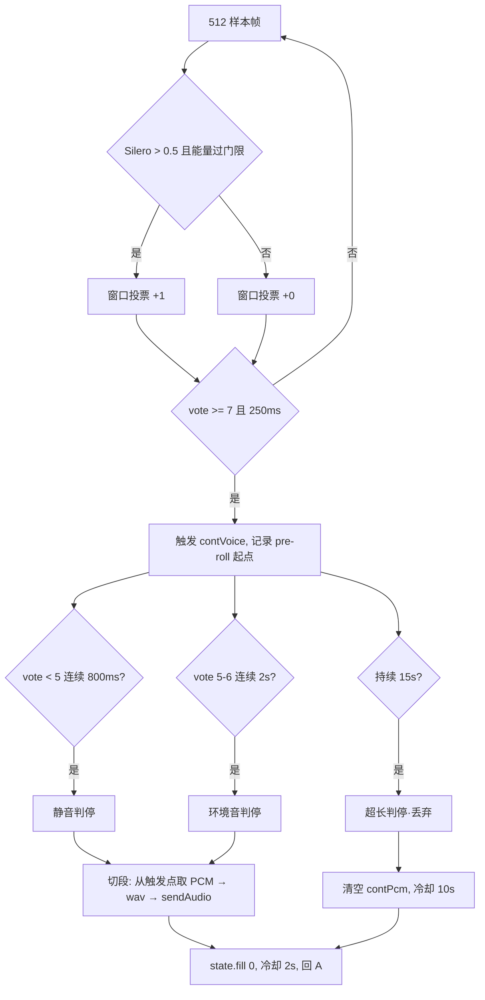
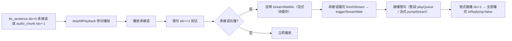

# duplex-voice 软件设计文档

> 版本：v1.8.0（对应 git tag `voice-web-v1.8.0`——2026-08-24 稳定可用版）
> 更新：2026-08-24
> 范围：Web 语音助手（快慢融合 + 持续对话 + 双通道 TTS 播放链 + 端点/模型全配置化）
> 维护：此后仅在成品仓 ~/duplex-voice 开发（voice-agent-doc 的 duplex-voice 子目录停更）

---

## 1. 系统总览

### 1.1 定位与目标

duplex-voice 是一个浏览器端语音助手演示系统：用户对着浏览器说话，系统实时识别并以"快慢融合"方式回复——快通道（本地小模型）先出简短过渡语让用户立即听到响应，慢通道（云端大模型）生成完整回复，句子级 TTS 合成后无缝接播。

设计目标：

1. **低感知时延**：说完话到听到第一个声音（响应时延）控制在 2~3s（实测 2.1~2.5s）
2. **持续对话**：一次唤醒多轮，免按键，VAD 自动切段
3. **无缝衔接**：快慢两通道内容不重复、播放不空洞
4. **可观测**：全链路时延分阶段统计 + 双端日志，问题定位靠数据不靠猜

### 1.2 架构分层

```
┌───────────────────────────── 浏览器（前端） ─────────────────────────────┐
│ index.html（单文件）                                                      │
│  ├─ 音频采集：ScriptProcessor 16k 直采（持续）/ MediaRecorder（按住）       │
│  ├─ VAD 管道：Silero ONNX → 双钳制 → 投票滞回 → 三重判停 → 切段 wav        │
│  ├─ 播放链：流式/整段双通道 → 链式接播 → 承接语挂等 → 新轮停旧播放          │
│  ├─ 时延统计：实时显示（有结果即显）响应=说完→播 / TTS=ASR文本→播          │
│  ├─ 配置：⚙️ 面板 5 tab（模型/参数/提示词/前端/VAD）热生效                 │
│  └─ 日志：vlog 环形缓冲 + 批量自动上报 /api/log                            │
└──────────────────────────────┬────────────────────────────────────────────┘
                               │ POST /api/chat（SSE 事件流）
┌──────────────────────────────▼────────────────────────────────────────────┐
│ server.py（FastAPI，端口 8787）                                             │
│  ├─ ASR：流式/非流式可配（fun-asr 真流式 WS partial｜qwen3-asr-flash 整段）  │
│  ├─ 端点：host 可配（专属空间 llm-5ienv…｜老公共端点 dashscope.aliyuncs.com）│
│  ├─ 快通道：Ollama 本地 或 云端 qwen-turbo（FAST_PROVIDER 可配）            │
│  ├─ 慢通道：qwen3.5-27b（enable_thinking:false 禁思考，兼容老端点）         │
│  ├─ 融合：首句剥离 _strip_leading_filler + 承接语占位                       │
│  ├─ TTS：整段/流式双模式（分句并行合成｜realtime WS 分句流式）              │
│  ├─ 过滤：_is_noise_text + _is_tts_echo（阈值 0.7，对比播放文本列表）        │
│  └─ 日志：REQ/ASR/FILTER/FAST/TTS/SLOW_FIRST/DONE/CHAT_ERR                  │
└──────────────────────────────┬────────────────────────────────────────────┘
                    ┌──────────┴──────────┐
                    ▼                     ▼
            Ollama 127.0.0.1:11434   DashScope MaaS（compatible-mode + api-ws）
            qwen3.5:4b-mlx          qwen3.5-27b / qwen-turbo / Cherry TTS / fun-asr
```

### 1.3 关键技术决策（含依据）

| # | 决策 | 依据（实测） |
|---|------|-------------|
| 1 | ScriptProcessorNode 采集，弃 MediaRecorder | MediaRecorder 48k webm 需解码且静音判定受容器影响；ScriptProcessor 直采 16k 免解码、说完即上传快 1-2s |
| 2 | 3:1 抽取重采样到 16k 喂 Silero | 48k 数据直喂 16k 模型概率 max 0.622（贴阈值），正确喂法 0.955 |
| 3 | `autoGainControl: false` | AGC 会把远场背景人声放大到与近场同能量，抹平能量门限的物理基础 |
| 4 | 快慢双通道并行（ASR 定稿即启动慢通道） | 慢首字 0.3-0.7s 与承接语合成重叠，实现说完→2s 内出声 |
| 5 | 承接语 8-15 字过渡语 | 1-4 字纯占位太短（播放 0.5s），慢首句就绪前产生 2-4s 空洞 |
| 6 | server 端 `_is_tts_echo` 阈值 0.7 | 真回声是播放音频逐字复制（0.8-1.0）；用户重复指令与上轮回复重叠仅 0.4-0.5 |
| 7 | 静音判停 800ms | 500ms 会打断中文口语停顿（实测 600ms 停顿被误判） |
| 8 | 占比过滤仅长段（≥50 帧） | 短指令（1-2 词）段占比 20-35% 波动，30 帧门槛误杀（22-29% 被丢） |
| 9 | host 端点可配（config server.host） | 专属空间模型（fun-asr-flash-2026-06-15 等）在老端点不可用；老端点 Fun-ASR 模型名 = fun-asr-realtime（实测识别 ✅）；WS 与 compatible-mode URL 全参数化跟随 |
| 10 | 慢 LLM `enable_thinking: false` | 老端点 qwen3.5-27b 默认思考链（1138 块 reasoning_content 40s+）→ 禁思考 1s 直接内容（专属空间无副作用） |
| 11 | TTS 流式模式慢句分句流式 | 整段合成 2-3s/句 → realtime WS 分句流式首块 ~0.45s（7 倍）；整段模式保留（分句并行合成） |
| 12 | 慢句流式块挂等承接语播完 | 老端点+流式+快慢融合声音重叠：audio_chunk 无挂等检查直接 pumpStream → 加 streamWaitIdx 挂等 + triggerStreamWait 流式接播 |
| 13 | 新轮 sendAudio 无条件停旧播放 | 第二轮起 TTS 异常：第一轮慢句 done 后仍在播（busy=false）→ 第二轮与残留混播 → sendAudio 开头 stopAllPlayback()（系统审计发现调用点 0 处） |
| 14 | API key 读 config.yaml（不读环境变量） | 用户要求；config.yaml 空 key 模板入仓（key 不入 public 仓库——误提交已历史重写清除） |
| 15 | 时延口径双指标 | 响应=说完→开始播（含判停）；TTS合成=ASR 文本→开始播放（快融合=承接语/慢直达=慢句）；实时显示不等播放完 |

---

## 2. 持续对话语音活动检测（VAD）

### 2.1 音频采集与重采样

- **采集**：ScriptProcessorNode（bufferSize 4096）回调不重叠取 PCM
- **重采样**：`ratio = audioCtx.sampleRate / 16000` 抽取（48k→3:1；44.1k→2.756:1——**自适应浏览器实际采样率**，本机 Chrome 44.1k 实测），`out[i] = ch[Math.floor(i * ratio)]`，每回调产出 1486（44.1k）样本
- **帧组织**：16k 样本按 512 样本/帧（32ms）切帧入队（`contVadQueue`），rAF 循环消费
- **按住模式**：MediaRecorder（webm/mp4）→ `decodeAudioData` → 按解码实际采样率重采样 16k（解码失败明确报错提示——跨浏览器支持差异，v1.8.0 加错误处理）

```
onaudioprocess (4096 样本 48k)
   │  3:1 抽取 → 1365 样本 16k
   ▼
contPcm（录音累积，切段时组装 wav）
   │  同时按 512 切帧
   ▼
contVadQueue → contLoop (rAF) → sileroProb(512 帧) → 状态机
```

### 2.2 Silero 语音概率

- 模型：`silero_vad.onnx`（v6，16k），onnxruntime-web 推理
- 阈值：`SILERO_THRESHOLD = 0.5`（与桌面 RuleVadJudge 对齐）
- 状态：`state` 跨帧传递，切段后 `fill(0)` 重置（与桌面 `end_segment` 一致）

### 2.3 双钳制（能量门限 + 窗口投票）

Silero 对任何语音（含远场人声）都高概率，单靠概率无法区分"谁在说话"——叠加能量与投票双钳制（对齐桌面 RuleVadJudge）：

```javascript
// 帧级能量门限（帧 RMS > max(噪声底 × 4, 0.005)）
const energyOk = rms > Math.max(contNoiseFloor * ENERGY_RATIO, ENERGY_FLOOR_FRAME);
// 确认帧 = Silero 概率 > 0.5 且能量过门限
contVoteWin.push((prob > SILERO_THRESHOLD && energyOk) ? 1 : 0);
// 10 帧窗口投票
const vote = sum(contVoteWin);   // 窗口滑动
```

- 噪声底 `contNoiseFloor`：min 跟踪 + 极慢上升（×1.0002/帧），防背景人声拉高门限
- 能量比 `ENERGY_RATIO = 4`：近场语音 rms 通常 >4 倍噪声底，远场人声衰减后不过门限

**实测数据**（浏览器真麦）：近场连续 25 帧触发；远场衰减 5 倍断续 8 帧不触发；/10 倍 3 帧、/20 倍 0 帧。

### 2.4 投票滞回（防句中停顿中断）

| 状态 | 条件 | 说明 |
|------|------|------|
| 未激活 → 语音 | `vote >= 7`（70%）连续 250ms | 严格：防背景人声断续进入 |
| 语音中 → 静音 | `vote < 5`（50%）| 宽松：容忍 ≤300ms 句中停顿 |

触发后 `contVoice = true`，记录 `contSegStart = contPcm.length - 8000`（pre-roll 250ms，防语音开头截断）。

### 2.5 三重判停（切段条件）

| 判停 | 条件 | 用途 |
|------|------|------|
| 静音判停 | `vote < 5` 连续 800ms | 正常说完 |
| 环境音判停 | 语音中 `vote` 5-6 持续 2s | 用户说完后环境音不退（vote 卡在 5-6） |
| 超长兜底 | 触发后持续 15s | 环境持续音（vote≥7 永不静音）防卡死 |

判停后：

- `speechEndEpoch = Date.now()`（"人说完话"基准时刻）
- 冷却：正常判停 2s、超长判停 10s 内不重新触发（防环境音循环）
- 超长段直接丢弃（15s 段发出去会被 ASR 识别→回复→播放→再触发循环；用户正常指令 <15s）
- 触发 5s 未判停 → 显示降级（环境音场景不一直误导显示"检测到语音"）



### 2.6 切段与发送

- 段 = `contPcm[contSegStart:]`（语音触发点 → 判停，排除播放期残留音频）
- 段级过滤（flushContSegment）按序：
  1. 段长 < 100ms（1600 样本）→ 丢弃
  2. 语音占比过滤：**仅段长 ≥50 帧（1.6s）** 且确认占比 < 35% → 丢弃（背景人声断续段）
  3. 段级能量：**段内最大 50ms 块 RMS** < max(噪声底×4, 0.012) → 丢弃（整段平均会被 pre-roll/尾静音稀释误杀，实测 0.016 被丢）
- 通过后组装 16k WAV base64 → `sendAudio(b64)`（POST /api/chat）

---

## 3. 快慢融合对话

### 3.1 双通道并行

```
ASR 定稿（final）──┬─→ 快通道（Ollama 本地 或 云端 qwen-turbo）──→ 承接语 TTS（idx=-1 流式）──→ 立即播放
                   └─→ 慢通道（云端 qwen3.5-27b，禁思考）──→ 分句 TTS（idx=1,2…）──→ 承接语播完接播
```

- 慢通道在 `create_task(run_slow())` 中于 ASR 定稿后**立即并行启动**（不等承接语）
- 承接语播放期间慢回复持续生成，按句子切分合成，就绪即入队

### 3.2 快通道（过渡语）

- 模型：**FAST_PROVIDER 可配**——Ollama `qwen3.5:4b-mlx`（本地原生 /api/chat，`think:false`）或 云端 `qwen-turbo`（DashScope，实测可用）
- 提示词（FAST_SYSTEM）：生成 **8-15 字过渡语**（"好的，马上为您处理"），要求有内容感（太短造成播放停顿）、**不提指令具体内容**（慢通道给结果，防重复）
- 承接语播放时长 ≈ 慢首句就绪时间——无缝接播
- **TTS 流式模式**：承接语走 realtime WS（idx=-1）首块 ~444ms（整段模式走 idx=0 整段）

### 3.3 慢通道（完整回复）

- 模型：DashScope `qwen3.5-27b`（OpenAI 兼容端点，实测首字 0.3-0.7s；**enable_thinking: false**——老端点默认思考链 40s+ 卡死，禁思考 1s 直出）
- 系统提示词要点：
  1. 回复简洁口语化，不超过两句话
  2. **不再重复开头客套**（已播过过渡语）
  3. **首句 ≤15 字直接给结果**（首句短→TTS 合成快→无播放空洞），细节放第二句
- 按标点切句（`flush()`），每句独立 TTS 并行合成

### 3.4 首句剥离（server 兜底）

模型不遵守提示词时，`_strip_leading_filler` 剥离开头客套：

```python
# 客套词后必须跟标点/空白/句尾（"好的方面"不误剥）
re.match(r'^(好的|嗯|行|没问题|收到|可以|好嘞|好呀|好的呢|ok|OK|好|嗯嗯|稍等|稍候)(?:[，,、\s]|$)', text)
```

- 仅对**慢回复首句**（sidx==0）执行；剥离后为空（整句客套）→ 跳过该句
- 实测：fast="收到" → slow="客厅的灯已经打开啦。需要调节亮度或色温吗？"（无重复无空洞）

### 3.5 TTS 与播放链（整段/流式双模式）



关键机制（v1.8.0 播放链状态机）：

1. **双通道播放**：整段模式=tts_sentence（idx 递增，Audio 队列）；流式模式=audio_chunk/audio_end（PCM 块 Web Audio 边收边播）
2. **承接语挂等（防重叠）**：慢句流式块（idx>=1）到达时承接语（idx=-1）在播 → 块缓存挂等（streamWaitIdx）不 pumpStream——承接语播完（finishStream idx=0/-1 → fastStreamActive=false）→ triggerStreamWait 接播（整段 playQueue[idx].play() / 流式 pumpStream(idx)）
3. **新轮无条件停旧播放**：sendAudio 开头 stopAllPlayback()（第一轮慢句 done 后仍在播——busy=false 但 source 未停——第二轮混播重叠的系统性根因——sendAudio 曾无停播调用）
4. **barge-in**：播放中检测到用户语音 → 切段 → 打断播放 + 发送（回声由 server `_is_tts_echo` 兜底）
5. **承接语 idx=-1 状态跟踪**：finishStream `idx===0 || idx===-1` 都重置 fastStreamActive（流式承接语播完必须复位——原 bug 卡 true 致后续挂等错误）
6. **30s AbortController 超时**：慢通道异常时强制恢复 busy（防永久卡死）

---

## 4. 回声与噪声过滤

### 4.1 前端 isReplying 抑制

- 播放中 VAD 检测到的语音**可能是 AI 自己的声音**（AEC 不完美的外放场景）
- 切段时 `isReplying` → **barge-in 打断**（用户插话，戴耳机无回声）——回声防护移交 server

### 4.2 server `_is_tts_echo`（残余回声过滤）

```python
def _is_tts_echo(text, history, last_replies) -> bool:
    # 文本逐字相似度 > 0.7 → 判定为回声（与最近实际播放内容比对）
```

- **阈值 0.7**：真回声是播放音频的逐字复制（0.8-1.0）；用户重复指令与上轮回复仅部分重叠（实测 0.4-0.5）
- 对比对象：`LAST_REPLY[client_id]` = 实际播放文本列表（承接语 + 完整回复，慢通道完成后追加）
- 历史只查最近 4 条（防跨轮误杀）
- 过滤后返回 SSE error 事件（"未识别到有效语音（环境噪声）"）

### 4.3 噪声文本过滤

```python
def _is_noise_text(text):
    # 过短（<2 字符）或纯语气词（嗯/啊/哦…）→ 噪声
```

---

## 5. 时延指标体系

所有指标以**用户可感知**为语义，互不重叠、可相加（v1.8.0 双指标口径定稿——用户 4 次纠正后）：

| 指标 | 定义 | 采集点 |
|------|------|--------|
| 上传+ASR | 请求发出 → ASR 定稿 | 前端 `tSendStart`（performance.now）→ asr 事件 |
| 定稿 | 人说完（判停）→ ASR 定稿 | server `final_ms`（ASR final - speech_end） |
| 判停 | 最后语音帧 → 确认说完 | 前端 `contJudgeMs`（contLastSpeechTs → 判停）——**不计入响应、单独显示** |
| 语义VAD | omni 语义判断时延 | server vad_state 事件 `latency_ms`（rule 模式不显示） |
| LLM快 | 送快模型 → 承接语完成 | server FAST 事件 `latency_ms` |
| LLM慢 | 送云端 → 首字 | server slow_first 事件 `latency_ms` |
| TTS合成 | **ASR 文本 → 开始播放**（快融合=承接语播放时延；慢直达=慢句播放时延） | 前端 `tts_play` 时刻 - `asrFinalEpoch`（asr 事件定稿时刻） |
| 公网下载 | 云端音频下载 | server `dl_ms`（缓存命中=0） |
| 响应 | **用户说完 → 开始播放**（含判停+ASR+LLM+TTS 全链路） | 前端 `playNow()` 时刻 - `speechRealEndEpoch`（最后一次语音帧） |

显示（实时更新——有结果即显示，不等播放完）：`⏱ 上传+ASR 448ms · 定稿 426ms · 判停 736ms · 语义VAD 476ms · LLM快 - · LLM慢 289ms · TTS合成 439ms·公网下载 - · 响应(说完→开始播) 2.5s`

**实现要点**：
- **updateLatency() 实时刷新**：asr/vad_state/fast/slow_first/audio_end/tts_sentence/playNow/done 8 处事件赋值后调用——latRow 每轮一个（sendAudio 重置）——detached 创建 + AI 气泡 innerHTML 后重新挂载（不挂 user/不迁移——innerHTML 覆盖会丢）
- **轮次隔离**：`metrics = { turn: ++turnId }`（sendAudio 开头重建）+ playNow `metrics.turn === turnId` 校验——done 后残留播放链的 playNow 不污染下一轮
- **判停不计入响应**（用户裁定）：speechRealEndEpoch=最后一次语音帧（判停前）——判停单独显示（曾实现判停计入后按用户口径回退）

**典型时序**（短指令，实测）：

```
人说完(判停) ──800ms──→ 请求发出 ──1.2s──→ ASR 定稿 ──→ 送 LLM（并行）
                                              ├─→ LLM快 534ms → 承接语 TTS ~640ms → 开始播（响应 ~2.2s）
                                              └─→ LLM慢 720ms → 首句 TTS → 承接语播完接播（无缝）
```

---

## 6. 接口设计

### 6.1 POST /api/chat（SSE 事件流）

请求：

```json
{
  "audio_b64": "<16k WAV base64>",
  "client_id": "c_xxx",
  "speech_start_ms": 1787234457658,
  "speech_end_ms": 1787234458694
}
```

响应：`text/event-stream`，事件序列：

| 事件 | 字段 | 说明 |
|------|------|------|
| `stage` | stage | 阶段提示（asr/fast/slow/synthesizing） |
| `asr_partial` | text | ASR 实时增量（边说边出） |
| `asr` | text, latency_ms, partial_first_ms, final_ms | ASR 定稿 + 时延 |
| `vad_state` | state, latency_ms | 语义 VAD 状态（complete/barge_in/noise…——rule/omni 可插拔）+ 判断时延 |
| `fast` | text, latency_ms, provider, model | 快通道承接语（Ollama/dashscope 可配） |
| `slow_first` | latency_ms, silence_ms | 慢通道首字 + 静音时延 |
| `slow_delta` | delta | 慢回复流式增量 |
| `tts_sentence` | idx, channel, url, latency_ms | 句子音频就绪（整段模式——承接语 idx=0） |
| `audio_chunk` | idx, b64 | 流式 TTS PCM 块（承接语 idx=-1 / 慢句 idx>=1） |
| `audio_end` | idx, first_ms | 流式句子完成（first_ms=文本→首块时延） |
| `done` | total_ms, slow_text | 本轮完成摘要 |
| `error` | msg | 过滤/异常 |

### 6.2 日志上报

| 接口 | 方法 | 说明 |
|------|------|------|
| `/api/log` | POST `{lines: [...]}` | 前端 vlog 批量上报（2s 一批，环形缓冲 3000 条） |
| `/api/logs?n=200` | GET | 读取前端日志（定位问题） |
| `/api/health` | GET | 健康检查（含模型配置） |
| `/api/config` | GET/POST | 配置读写（⚙️ 面板——模型/参数/提示词/前端/VAD 5 tab 热生效） |
| `/api/config/reset` | POST | 恢复默认配置 |
| `/api/vad_mode` | GET/POST | 语义 VAD 模式（rule/omni）切换 |
| `/api/fusion_mode` | GET/POST | 融合策略（fastslow/direct）切换 |
| `/api/tts_mode` | GET/POST | TTS 模式（stream/batch）切换 |
| `/api/vad_switch` | POST | 语义 VAD 面板开关（🧠） |

### 6.3 会话状态

- `HISTORIES[client_id]`：最近 10 轮对话历史（内存）
- `LAST_REPLY[client_id]`：最近实际播放文本列表（回声过滤对比）

---

## 7. 日志与可观测性

**server 日志**（统一时间戳，与 uvicorn 同格式）：

```
REQ cid=xxx audio=1.19s speech_start=... speech_end=...
ASR cid=xxx partial=1 text='打开客厅的灯。' asr_ms=396 final_ms=1917
FILTER cid=xxx reason=tts_echo text=... last=...
FAST cid=xxx text='好的，马上为您处理' ms=534
TTS cid=xxx idx=0 fast ms=914
SLOW_FIRST cid=xxx latency_ms=720 silence_ms=503
DONE cid=xxx total=3672ms slow_text=... fast_tts=True slow_tts=True hist=20
CHAT_ERR cid=xxx err=...（完整 traceback）
```

**前端日志**（vlog）：console + 环形缓冲 500 条 + 批量上报 `/api/log`；`window.exportVoiceLog()` 手动导出；打点覆盖 VAD 状态秒级摘要（prob/rms/vote/energyOk）、切段原因、丢弃明细、PLAY 播放、EVT done 时延摘要。

---

## 8. 配置与部署

| 配置 | 位置 | 值 |
|------|------|-----|
| 调用端点（host） | config.json `server.host` | 专属空间 `llm-5ienv5iasbci5bt7.cn-beijing.maas.aliyuncs.com` ｜ 老公共端点 `dashscope.aliyuncs.com`（⚙️ 下拉框，ASR 六项配置全跟随） |
| ASR | config.json `server.asr` | provider/model/mode（stream 流式 fun-asr / batch 非流式 qwen3-asr-flash）/ws_endpoint/sample_rate/task——老端点自动 fun-asr-realtime |
| 快通道 | config.json `server.fast_llm` | Ollama qwen3.5:4b-mlx 或 云端 qwen-turbo（FAST_PROVIDER 注册表） |
| 慢通道 | config.json `server.slow_llm` | qwen3.5-27b（enable_thinking:false；换模型前必须实测首字分布） |
| TTS | config.json `server.tts` | Cherry 音色；`server.tts_stream`（realtime WS）；TTS 模式 stream/batch（🎵） |
| 语义 VAD | config.json `server.omni` | qwen3.5-omni-flash + prompt（🧠 开关，rule/omni） |
| 融合策略 | config.json `server.fusion` | fastslow 快慢融合 / direct 慢直达（🎙） |
| API Key | `config.yaml` `model.dashscope_api_key` | **读配置不读环境变量**（v1.8.0 用户要求）；空 key 模板入仓，key 不入 public 仓库 |
| 端口 | server.py | 8787 |
| 前端缓存 | `/` 响应 | `Cache-Control: no-store` |

**部署**（跨平台三件套）：

```bash
./start.sh            # macOS/Linux（薄封装 → python3 start.py）
start.bat             # Windows
python start.py       # 通用（依赖检查→自动安装→config.yaml key 校验→启动）
```

start.py 逻辑：Python 3.10+ 检查 → 依赖检查（缺失自动 pip install）→ config.yaml key 读取（空则从 ~/.zshrc 提取写入——迁移友好）→ SEMANTIC_VAD 启动。详见 RUNNING.md。

**测试**：`python3 -m pytest tests/ -q`（**53 passed**）

---

## 9. 关键参数表（调参入口）

| 参数 | 值 | 影响 |
|------|-----|------|
| `CONT_MIN_SPEECH_MS` | 250 | 触发最短语音 |
| `CONT_SILENCE_MS` | 800 | 静音判停（抢答/响应时延权衡） |
| `CONT_VOTE_MIN / EXIT` | 7 / 5 | 投票滞回（背景人声 vs 句中停顿） |
| `ENERGY_RATIO` | 4.0 | 帧能量门限（噪声底倍数） |
| `ENERGY_FLOOR_FRAME` | 0.005 | 帧级绝对下限（轻声可触发） |
| `ENERGY_FLOOR_SEG` | 0.012 | 段级绝对下限（背景人声） |
| `SEG_SPEECH_MIN_RATIO` | 0.35 | 占比过滤（仅段长 ≥50 帧） |
| 冷却 | 2s / 10s | 判停后防循环触发 |
| `_is_tts_echo` 阈值 | 0.7 | 回声过滤（真回声 0.8+，重复指令 0.4-0.5） |
| 历史条数 | 4 / 10 | 回声对比 / 对话上下文 |
| VAD 行为注册表 | headset/speaker | 场景参数表（静音判停/能量门限/回声抑制开关）——面板 VAD tab 热生效 |
| 语义 VAD | rule/omni | VadJudge 可插拔接缝：rule 规则 / omni 模型判断（含组合+失败回退）——8 状态 token + SSE vad_state |
| 慢句 TTS | 整段/流式 | 整段=分句并行合成（15-40 字/句，Semaphore 2）；流式=分句 realtime WS（首块 ~0.45s，失败回退整段） |

---

## 10. 已知边界与后续演进

1. ~~半双工限制~~ **已缓解**：语义 VAD（rule/omni 可插拔——VadJudge 接缝）区分打断/回声/噪声——backchannel 应声不砍播放；语义确认 complete/barge_in 才停播
2. **外放场景**：AEC 不完美时可能出现"AI 被自己声音打断"——可加"打断需明显高于播放音量"的能量门槛
3. **环境音持续**：音乐/电视人声（Silero 概率高）会被误判为语音——超长判停丢弃 + 冷却缓解，语义 VAD 判 noise 兜底
4. **多客户端隔离**：HISTORIES/LAST_REPLY 按 client_id 内存隔离，重启即失（适合演示，生产需持久化）
5. **慢模型选择**：专属空间实例冷热差异大（qwen3.6-27b 冷实例首字 13s vs 热 0.4s）——换模型必须实测分布
6. **老端点模型差异**：专属空间模型（fun-asr-flash-2026-06-15 等）老端点不可用——host 下拉框已联动 ASR 模型；慢 LLM 禁思考兼容
7. **key 安全**：config.yaml 空 key 模板入仓，真实 key 仅本地（误提交 key 曾历史重写清除）——轮换 key 改本地 config.yaml 重启即可
