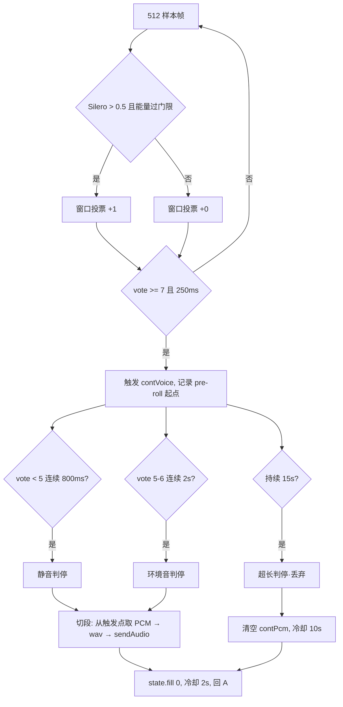
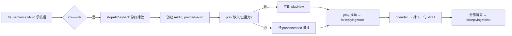

# duplex-voice 软件设计文档

> 版本：v1.0（对应 git tag `voice-web-v1.1.0` 之后的实现）
> 更新：2026-08-20
> 范围：Web 语音助手（快慢融合 + 持续对话 + 双通道 TTS 播放链）

---

## 1. 系统总览

### 1.1 定位与目标

duplex-voice 是一个浏览器端语音助手演示系统：用户对着浏览器说话，系统实时识别并以"快慢融合"方式回复——快通道（本地小模型）先出简短过渡语让用户立即听到响应，慢通道（云端大模型）生成完整回复，句子级 TTS 合成后无缝接播。

设计目标：

1. **低感知时延**：说完话到听到第一个声音（响应时延）控制在 2~3s（实测 2.1~2.5s）
2. **持续对话**：一次唤醒多轮，免按键，VAD 自动切段
3. **无缝衔接**：快慢两通道内容不重复、播放不空洞
4. **可观测**：全链路时延分阶段统计 + 双端日志，问题定位靠数据不靠猜

### 1.2 架构分层

```
┌───────────────────────────── 浏览器（前端） ─────────────────────────────┐
│ index.html（单文件）                                                      │
│  ├─ 音频采集：ScriptProcessor 16k 直采（持续）/ MediaRecorder（按住）       │
│  ├─ VAD 管道：Silero ONNX → 双钳制 → 投票滞回 → 三重判停 → 切段 wav        │
│  ├─ 播放链：句子级 TTS 队列 → 链式接播 → barge-in 打断                     │
│  ├─ 时延统计：上传+ASR/定稿/判停/LLM快/LLM慢/TTS合成/响应                   │
│  └─ 日志：vlog 环形缓冲 + 批量自动上报 /api/log                            │
└──────────────────────────────┬────────────────────────────────────────────┘
                               │ POST /api/chat（SSE 事件流）
┌──────────────────────────────▼────────────────────────────────────────────┐
│ server.py（FastAPI，端口 8787）                                             │
│  ├─ ASR：fun-asr-flash 真流式 WS（16k wav 重放，partial + final）           │
│  ├─ 快通道：Ollama qwen3.5:4b-mlx（本地，承接语/过渡语）                    │
│  ├─ 慢通道：DashScope qwen3.5-27b（云端，完整回复，与快通道并行）            │
│  ├─ 融合：首句剥离 _strip_leading_filler + 承接语占位                       │
│  ├─ TTS：Cherry（句子级并行合成，idx 递增）                                 │
│  ├─ 过滤：_is_noise_text + _is_tts_echo（阈值 0.7，对比播放文本列表）        │
│  └─ 日志：REQ/ASR/FILTER/FAST/TTS/SLOW_FIRST/DONE/CHAT_ERR                  │
└──────────────────────────────┬────────────────────────────────────────────┘
                    ┌──────────┴──────────┐
                    ▼                     ▼
            Ollama 127.0.0.1:11434   DashScope MaaS（兼容 OpenAI 协议）
            qwen3.5:4b-mlx          qwen3.5-27b / Cherry TTS / fun-asr
```

### 1.3 关键技术决策（含依据）

| # | 决策 | 依据（实测） |
|---|------|-------------|
| 1 | ScriptProcessorNode 采集，弃 MediaRecorder | MediaRecorder 48k webm 需解码且静音判定受容器影响；ScriptProcessor 直采 16k 免解码、说完即上传快 1-2s |
| 2 | 3:1 抽取重采样到 16k 喂 Silero | 48k 数据直喂 16k 模型概率 max 0.622（贴阈值），正确喂法 0.955 |
| 3 | `autoGainControl: false` | AGC 会把远场背景人声放大到与近场同能量，抹平能量门限的物理基础 |
| 4 | 快慢双通道并行（ASR 定稿即启动慢通道） | 慢首字 0.3-0.7s 与承接语合成重叠，实现说完→2s 内出声 |
| 5 | 承接语 8-15 字过渡语 | 1-4 字纯占位太短（播放 0.5s），慢首句就绪前产生 2-4s 空洞 |
| 6 | server 端 `_is_tts_echo` 阈值 0.7 | 真回声是播放音频逐字复制（0.8-1.0）；用户重复指令与上轮回复重叠仅 0.4-0.5 |
| 7 | 静音判停 800ms | 500ms 会打断中文口语停顿（实测 600ms 停顿被误判） |
| 8 | 占比过滤仅长段（≥50 帧） | 短指令（1-2 词）段占比 20-35% 波动，30 帧门槛误杀（22-29% 被丢） |

---

## 2. 持续对话语音活动检测（VAD）

### 2.1 音频采集与重采样

- **采集**：ScriptProcessorNode（bufferSize 4096）回调不重叠取 PCM
- **重采样**：3:1 抽取（48k→16k），`out[i] = ch[Math.floor(i * ratio)]`，每回调产出 1365 样本
- **帧组织**：16k 样本按 512 样本/帧（32ms）切帧入队（`contVadQueue`），rAF 循环消费

```
onaudioprocess (4096 样本 48k)
   │  3:1 抽取 → 1365 样本 16k
   ▼
contPcm（录音累积，切段时组装 wav）
   │  同时按 512 切帧
   ▼
contVadQueue → contLoop (rAF) → sileroProb(512 帧) → 状态机
```

### 2.2 Silero 语音概率

- 模型：`silero_vad.onnx`（v6，16k），onnxruntime-web 推理
- 阈值：`SILERO_THRESHOLD = 0.5`（与桌面 RuleVadJudge 对齐）
- 状态：`state` 跨帧传递，切段后 `fill(0)` 重置（与桌面 `end_segment` 一致）

### 2.3 双钳制（能量门限 + 窗口投票）

Silero 对任何语音（含远场人声）都高概率，单靠概率无法区分"谁在说话"——叠加能量与投票双钳制（对齐桌面 RuleVadJudge）：

```javascript
// 帧级能量门限（帧 RMS > max(噪声底 × 4, 0.005)）
const energyOk = rms > Math.max(contNoiseFloor * ENERGY_RATIO, ENERGY_FLOOR_FRAME);
// 确认帧 = Silero 概率 > 0.5 且能量过门限
contVoteWin.push((prob > SILERO_THRESHOLD && energyOk) ? 1 : 0);
// 10 帧窗口投票
const vote = sum(contVoteWin);   // 窗口滑动
```

- 噪声底 `contNoiseFloor`：min 跟踪 + 极慢上升（×1.0002/帧），防背景人声拉高门限
- 能量比 `ENERGY_RATIO = 4`：近场语音 rms 通常 >4 倍噪声底，远场人声衰减后不过门限

**实测数据**（浏览器真麦）：近场连续 25 帧触发；远场衰减 5 倍断续 8 帧不触发；/10 倍 3 帧、/20 倍 0 帧。

### 2.4 投票滞回（防句中停顿中断）

| 状态 | 条件 | 说明 |
|------|------|------|
| 未激活 → 语音 | `vote >= 7`（70%）连续 250ms | 严格：防背景人声断续进入 |
| 语音中 → 静音 | `vote < 5`（50%）| 宽松：容忍 ≤300ms 句中停顿 |

触发后 `contVoice = true`，记录 `contSegStart = contPcm.length - 8000`（pre-roll 250ms，防语音开头截断）。

### 2.5 三重判停（切段条件）

| 判停 | 条件 | 用途 |
|------|------|------|
| 静音判停 | `vote < 5` 连续 800ms | 正常说完 |
| 环境音判停 | 语音中 `vote` 5-6 持续 2s | 用户说完后环境音不退（vote 卡在 5-6） |
| 超长兜底 | 触发后持续 15s | 环境持续音（vote≥7 永不静音）防卡死 |

判停后：

- `speechEndEpoch = Date.now()`（"人说完话"基准时刻）
- 冷却：正常判停 2s、超长判停 10s 内不重新触发（防环境音循环）
- 超长段直接丢弃（15s 段发出去会被 ASR 识别→回复→播放→再触发循环；用户正常指令 <15s）
- 触发 5s 未判停 → 显示降级（环境音场景不一直误导显示"检测到语音"）



### 2.6 切段与发送

- 段 = `contPcm[contSegStart:]`（语音触发点 → 判停，排除播放期残留音频）
- 段级过滤（flushContSegment）按序：
  1. 段长 < 100ms（1600 样本）→ 丢弃
  2. 语音占比过滤：**仅段长 ≥50 帧（1.6s）** 且确认占比 < 35% → 丢弃（背景人声断续段）
  3. 段级能量：**段内最大 50ms 块 RMS** < max(噪声底×4, 0.012) → 丢弃（整段平均会被 pre-roll/尾静音稀释误杀，实测 0.016 被丢）
- 通过后组装 16k WAV base64 → `sendAudio(b64)`（POST /api/chat）

---

## 3. 快慢融合对话

### 3.1 双通道并行

```
ASR 定稿（final）──┬─→ 快通道（本地 Ollama）──→ 承接语 TTS（idx=0）──→ 立即播放
                   └─→ 慢通道（云端 qwen3.5-27b）──→ 句子级 TTS（idx=1,2…）──→ 接播
```

- 慢通道在 `create_task(run_slow())` 中于 ASR 定稿后**立即并行启动**（不等承接语）
- 承接语播放期间慢回复持续生成，按句子切分合成，就绪即入队

### 3.2 快通道（过渡语）

- 模型：Ollama `qwen3.5:4b-mlx`（原生 /api/chat，`think:false` 关思考直出）
- 提示词（FAST_SYSTEM）：生成 **8-15 字过渡语**（"好的，马上为您处理"），要求有内容感（太短造成播放停顿）、**不提指令具体内容**（慢通道给结果，防重复）
- 承接语播放时长（~3s）≈ 慢首句就绪时间（首字 0.4s + 首句生成 + 首句 TTS）——无缝接播

### 3.3 慢通道（完整回复）

- 模型：DashScope `qwen3.5-27b`（OpenAI 兼容端点，实测首字 0.3-0.7s）
- 系统提示词要点：
  1. 回复简洁口语化，不超过两句话
  2. **不再重复开头客套**（已播过过渡语）
  3. **首句 ≤15 字直接给结果**（首句短→TTS 合成快→无播放空洞），细节放第二句
- 按标点切句（`flush()`），每句独立 TTS 并行合成

### 3.4 首句剥离（server 兜底）

模型不遵守提示词时，`_strip_leading_filler` 剥离开头客套：

```python
# 客套词后必须跟标点/空白/句尾（"好的方面"不误剥）
re.match(r'^(好的|嗯|行|没问题|收到|可以|好嘞|好呀|好的呢|ok|OK|好|嗯嗯|稍等|稍候)(?:[，,、\s]|$)', text)
```

- 仅对**慢回复首句**（sidx==0）执行；剥离后为空（整句客套）→ 跳过该句
- 实测：fast="收到" → slow="客厅的灯已经打开啦。需要调节亮度或色温吗？"（无重复无空洞）

### 3.5 句子级 TTS 与播放链



关键机制：

1. **stopAllPlayback()**：新轮 idx=0 到达即停上一轮全部残留播放、清空队列、复位 isReplying（防多轮音频重叠、onended 链错乱）
2. **barge-in**：播放中检测到用户语音 → 切段 → 打断播放 + 发送（回声由 server `_is_tts_echo` 兜底——戴耳机场景无回声，插话不误杀）
3. **preload='auto'**：音频到达即预下载（默认 metadata 只载头部，play() 时才下载 → 承接语播完后的感知卡顿）
4. **30s AbortController 超时**：慢通道异常时强制恢复 busy（防永久卡死）
5. **播放失败解除抑制**：play() 失败 → isReplying=false（防卡死导致后续段全被丢弃）

---

## 4. 回声与噪声过滤

### 4.1 前端 isReplying 抑制

- 播放中 VAD 检测到的语音**可能是 AI 自己的声音**（AEC 不完美的外放场景）
- 切段时 `isReplying` → **barge-in 打断**（用户插话，戴耳机无回声）——回声防护移交 server

### 4.2 server `_is_tts_echo`（残余回声过滤）

```python
def _is_tts_echo(text, history, last_replies) -> bool:
    # 文本逐字相似度 > 0.7 → 判定为回声（与最近实际播放内容比对）
```

- **阈值 0.7**：真回声是播放音频的逐字复制（0.8-1.0）；用户重复指令与上轮回复仅部分重叠（实测 0.4-0.5）
- 对比对象：`LAST_REPLY[client_id]` = 实际播放文本列表（承接语 + 完整回复，慢通道完成后追加）
- 历史只查最近 4 条（防跨轮误杀）
- 过滤后返回 SSE error 事件（"未识别到有效语音（环境噪声）"）

### 4.3 噪声文本过滤

```python
def _is_noise_text(text):
    # 过短（<2 字符）或纯语气词（嗯/啊/哦…）→ 噪声
```

---

## 5. 时延指标体系

所有指标以**用户可感知**为语义，互不重叠、可相加：

| 指标 | 定义 | 采集点 |
|------|------|--------|
| 上传+ASR | 请求发出 → ASR 定稿 | 前端 `tSendStart`（performance.now）→ asr 事件 |
| 定稿 | 人说完（判停）→ ASR 定稿 | server `final_ms`（ASR final - speech_end） |
| 判停 | 最后语音帧 → 确认说完 | 前端 `contJudgeMs`（contLastSpeechTs → 判停） |
| LLM快 | 送本地 Ollama → 承接语完成 | server FAST 事件 `latency_ms` |
| LLM慢 | 送云端 → 首字 | server slow_first 事件 `latency_ms` |
| TTS合成 | TTS 收到文字 → 音频就绪 | server tts_sentence 事件 `latency_ms`（合成耗时） |
| 响应 | 人说完 → 开始播放首个音频 | 前端 `playNow()` 时刻 - speechEndEpoch |

显示：`⏱ 上传+ASR 1.2s · 定稿 350ms · 判停 800ms · LLM快 534ms · LLM慢 720ms · TTS合成 914ms · 响应(说完→开始播) 2.5s`

**轮次隔离**（实测修复）：`metrics = { turn: ++turnId }`（sendAudio 开头重建）+ playNow `metrics.turn === turnId` 校验——done 后残留播放链（慢句 done 后播放）的 playNow 写入不污染下一轮（旧逻辑：轮2 慢句值残留到轮3 done，显示 5345 假值时延）。

**典型时序**（短指令，实测）：

```
人说完(判停) ──800ms──→ 请求发出 ──1.2s──→ ASR 定稿 ──→ 送 LLM（并行）
                                              ├─→ LLM快 534ms → 承接语 TTS 914ms → 开始播（响应 ~2.5s）
                                              └─→ LLM慢 720ms → 首句 TTS → 接播（无缝）
```

---

## 6. 接口设计

### 6.1 POST /api/chat（SSE 事件流）

请求：

```json
{
  "audio_b64": "<16k WAV base64>",
  "client_id": "c_xxx",
  "speech_start_ms": 1787234457658,
  "speech_end_ms": 1787234458694
}
```

响应：`text/event-stream`，事件序列：

| 事件 | 字段 | 说明 |
|------|------|------|
| `stage` | stage | 阶段提示（asr/fast/slow/synthesizing） |
| `asr_partial` | text | ASR 实时增量（边说边出） |
| `asr` | text, latency_ms, partial_first_ms, final_ms | ASR 定稿 + 时延 |
| `fast` | text, latency_ms | 快通道承接语（过渡语） |
| `slow_first` | latency_ms, silence_ms | 慢通道首字 + 静音时延 |
| `slow_delta` | delta | 慢回复流式增量 |
| `tts_sentence` | idx, channel, url, latency_ms | 句子音频就绪（idx 递增，承接语=0） |
| `done` | total_ms, slow_text | 本轮完成摘要 |
| `error` | msg | 过滤/异常 |

### 6.2 日志上报

| 接口 | 方法 | 说明 |
|------|------|------|
| `/api/log` | POST `{lines: [...]}` | 前端 vlog 批量上报（2s 一批，环形缓冲 3000 条） |
| `/api/logs?n=200` | GET | 读取前端日志（定位问题） |
| `/api/health` | GET | 健康检查（含模型配置） |

### 6.3 会话状态

- `HISTORIES[client_id]`：最近 10 轮对话历史（内存）
- `LAST_REPLY[client_id]`：最近实际播放文本列表（回声过滤对比）

---

## 7. 日志与可观测性

**server 日志**（统一时间戳，与 uvicorn 同格式）：

```
REQ cid=xxx audio=1.19s speech_start=... speech_end=...
ASR cid=xxx partial=1 text='打开客厅的灯。' asr_ms=396 final_ms=1917
FILTER cid=xxx reason=tts_echo text=... last=...
FAST cid=xxx text='好的，马上为您处理' ms=534
TTS cid=xxx idx=0 fast ms=914
SLOW_FIRST cid=xxx latency_ms=720 silence_ms=503
DONE cid=xxx total=3672ms slow_text=... fast_tts=True slow_tts=True hist=20
CHAT_ERR cid=xxx err=...（完整 traceback）
```

**前端日志**（vlog）：console + 环形缓冲 500 条 + 批量上报 `/api/log`；`window.exportVoiceLog()` 手动导出；打点覆盖 VAD 状态秒级摘要（prob/rms/vote/energyOk）、切段原因、丢弃明细、PLAY 播放、EVT done 时延摘要。

---

## 8. 配置与部署

| 配置 | 位置 | 值 |
|------|------|-----|
| 快通道模型 | server.py `FAST_MODEL` | qwen3.5:4b-mlx（Ollama 127.0.0.1:11434） |
| 慢通道模型 | server.py `SLOW_MODEL` | qwen3.5-27b（DashScope MaaS，换模型前必须实测首字分布） |
| TTS | `tts._synthesize_url` | Cherry 音色 |
| API Key | `~/.zshrc` `DASHSCOPE_API_KEY` | 启动时注入 |
| 端口 | server.py | 8787 |
| 前端缓存 | `/` 响应 | `Cache-Control: no-store`（页面迭代频繁，防旧页面缓存） |

**部署**：

```bash
cd duplex-voice/web
export DASHSCOPE_API_KEY=$(grep '^export DASHSCOPE_API_KEY' ~/.zshrc | sed 's/.*="\(.*\)"/\1/')
python3 server.py 2>&1 | tee /tmp/voice_web.log
```

**测试**：`python3 -m pytest tests/ -q`（23 passed）

---

## 9. 关键参数表（调参入口）

| 参数 | 值 | 影响 |
|------|-----|------|
| `CONT_MIN_SPEECH_MS` | 250 | 触发最短语音 |
| `CONT_SILENCE_MS` | 800 | 静音判停（抢答/响应时延权衡） |
| `CONT_VOTE_MIN / EXIT` | 7 / 5 | 投票滞回（背景人声 vs 句中停顿） |
| `ENERGY_RATIO` | 4.0 | 帧能量门限（噪声底倍数） |
| `ENERGY_FLOOR_FRAME` | 0.005 | 帧级绝对下限（轻声可触发） |
| `ENERGY_FLOOR_SEG` | 0.012 | 段级绝对下限（背景人声） |
| `SEG_SPEECH_MIN_RATIO` | 0.35 | 占比过滤（仅段长 ≥50 帧） |
| 冷却 | 2s / 10s | 判停后防循环触发 |
| `_is_tts_echo` 阈值 | 0.7 | 回声过滤（真回声 0.8+，重复指令 0.4-0.5） |
| 历史条数 | 4 / 10 | 回声对比 / 对话上下文 |

---

## 10. 已知边界与后续演进

1. **半双工限制**：barge-in 打断后需等回复生成完才能继续说（busy 期间段被丢弃）——后续可用语义 VAD（检测用户语音与播放内容的关系）区分打断与回声
2. **外放场景**：AEC 不完美时可能出现"AI 被自己声音打断"——可加"打断需明显高于播放音量"的能量门槛
3. **环境音持续**：音乐/电视人声（Silero 概率高）会被误判为语音——超长判停丢弃 + 冷却缓解，语义 VAD 是根治方向
4. **多客户端隔离**：HISTORIES/LAST_REPLY 按 client_id 内存隔离，重启即失（适合演示，生产需持久化）
5. **慢模型选择**：专属空间实例冷热差异大（qwen3.6-27b 冷实例首字 13s vs 热 0.4s）——换模型必须实测分布
